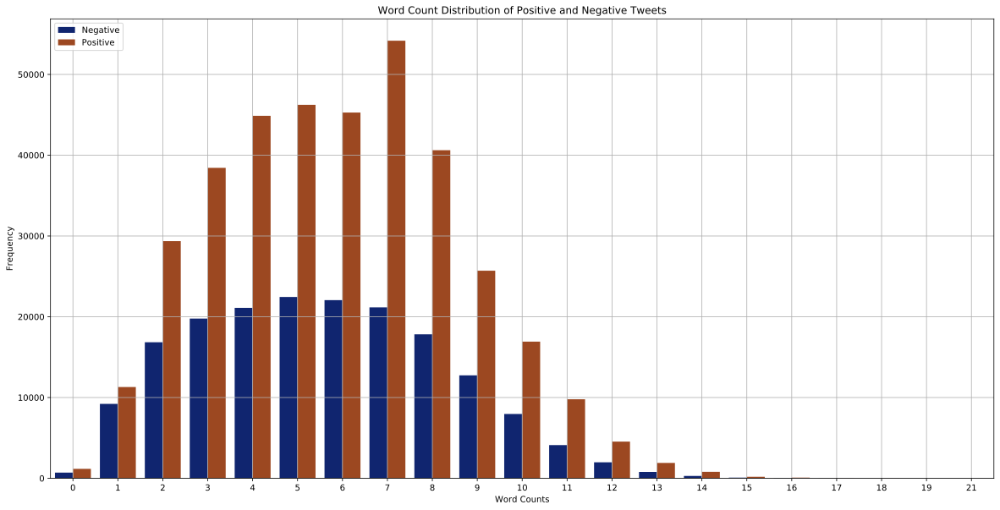
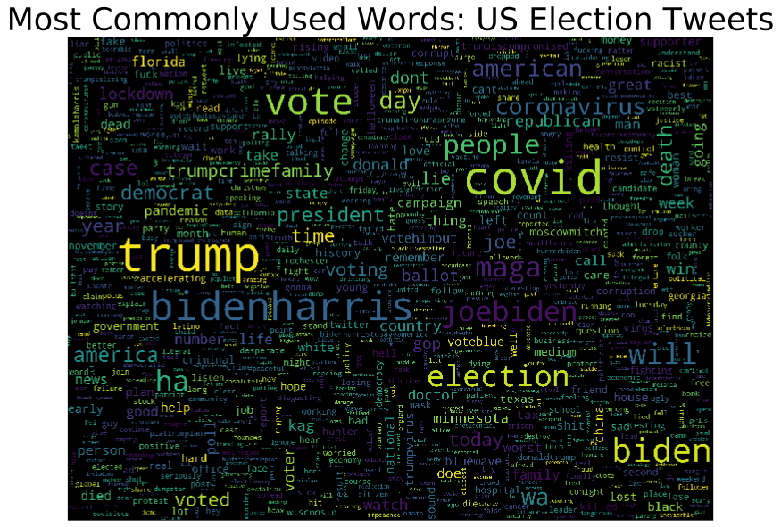
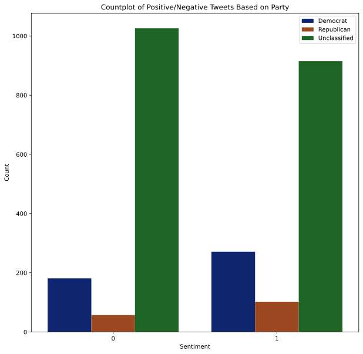
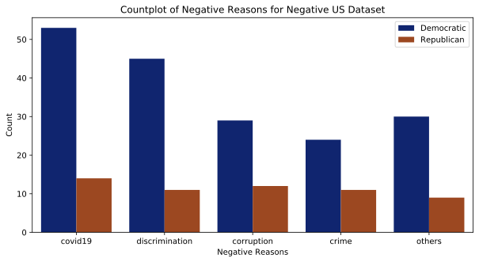

```python
import pandas as pd
import numpy as np
import matplotlib.pyplot as plt
import re
!pip install nltk
import nltk
import string
import seaborn as sns
from html.parser import HTMLParser
!pip install wordcloud
from wordcloud import WordCloud
from sklearn.preprocessing import StandardScaler
from sklearn.linear_model import LogisticRegression
from sklearn.model_selection import train_test_split
from sklearn.model_selection import KFold
from sklearn.metrics import make_scorer, confusion_matrix
from sklearn.model_selection import learning_curve
from sklearn.feature_extraction.text import CountVectorizer
from sklearn.feature_extraction.text import TfidfVectorizer
from sklearn.neighbors import KNeighborsClassifier
from sklearn.naive_bayes import GaussianNB
from sklearn.svm import SVC, LinearSVC
from sklearn.tree import DecisionTreeClassifier
from sklearn.ensemble import RandomForestClassifier
from sklearn.ensemble import GradientBoostingClassifier
from sklearn.utils.random import sample_without_replacement
nltk.download('wordnet')
```

    Requirement already satisfied: nltk in /home/jupyterlab/conda/envs/python/lib/python3.6/site-packages (3.5)
    Requirement already satisfied: regex in /home/jupyterlab/conda/envs/python/lib/python3.6/site-packages (from nltk) (2020.11.13)
    Requirement already satisfied: joblib in /home/jupyterlab/conda/envs/python/lib/python3.6/site-packages (from nltk) (0.17.0)
    Requirement already satisfied: tqdm in /home/jupyterlab/conda/envs/python/lib/python3.6/site-packages (from nltk) (4.53.0)
    Requirement already satisfied: click in /home/jupyterlab/conda/envs/python/lib/python3.6/site-packages (from nltk) (7.1.2)
    Collecting wordcloud
    [?25l  Downloading https://files.pythonhosted.org/packages/05/e7/52e4bef8e2e3499f6e96cc8ff7e0902a40b95014143b062acde4ff8b9fc8/wordcloud-1.8.1-cp36-cp36m-manylinux1_x86_64.whl (366kB)
         |████████████████████████████████| 368kB 7.6MB/s eta 0:00:01
    [?25hRequirement already satisfied: numpy>=1.6.1 in /home/jupyterlab/conda/envs/python/lib/python3.6/site-packages (from wordcloud) (1.19.2)
    Requirement already satisfied: matplotlib in /home/jupyterlab/conda/envs/python/lib/python3.6/site-packages (from wordcloud) (3.3.2)
    Requirement already satisfied: pillow in /home/jupyterlab/conda/envs/python/lib/python3.6/site-packages (from wordcloud) (8.0.1)
    Requirement already satisfied: python-dateutil>=2.1 in /home/jupyterlab/conda/envs/python/lib/python3.6/site-packages (from matplotlib->wordcloud) (2.8.1)
    Requirement already satisfied: cycler>=0.10 in /home/jupyterlab/conda/envs/python/lib/python3.6/site-packages (from matplotlib->wordcloud) (0.10.0)
    Requirement already satisfied: kiwisolver>=1.0.1 in /home/jupyterlab/conda/envs/python/lib/python3.6/site-packages (from matplotlib->wordcloud) (1.2.0)
    Requirement already satisfied: certifi>=2020.06.20 in /home/jupyterlab/conda/envs/python/lib/python3.6/site-packages (from matplotlib->wordcloud) (2020.6.20)
    Requirement already satisfied: pyparsing!=2.0.4,!=2.1.2,!=2.1.6,>=2.0.3 in /home/jupyterlab/conda/envs/python/lib/python3.6/site-packages (from matplotlib->wordcloud) (2.4.7)
    Requirement already satisfied: six>=1.5 in /home/jupyterlab/conda/envs/python/lib/python3.6/site-packages (from python-dateutil>=2.1->matplotlib->wordcloud) (1.15.0)
    Installing collected packages: wordcloud
    Successfully installed wordcloud-1.8.1
    

    [nltk_data] Downloading package wordnet to
    [nltk_data]     /home/jupyterlab/nltk_data...
    [nltk_data]   Unzipping corpora/wordnet.zip.
    


    True


# Data Cleaning
After loading the data, we must clean the data such that it can be presented in a form that the models understand. We cannot simply pass in strings or words to the models. We must pass in columns with numbers that capture the meaning of the sentences presented by the dataset. To create a clean dataset, we execute the following:

## 1. Parse the Stop Words Dataset
- Add and remove stop words that were not recognized or incorrectly identified by the given stop words dataset


```python
# loading data
data_path = "data/"
sa_df = pd.read_csv(data_path + "sentiment_analysis.csv", names=["ID", "text", "label"], low_memory=False)
sa_df = sa_df[1:]

us_df = pd.read_csv(data_path + "US_Elections_2020.csv", names=["text", "sentiment", "negative_reason"], low_memory=False)
us_df = us_df[1:]

stop_words_file = open(data_path + "stop_words.txt")
stop_words_set = set()

index = 0
stop_words_error_set = set([249, 495])
for line in stop_words_file:
    if index in stop_words_error_set:
        index += 1
        continue
    stop_words_set.add(line.replace("\n", ""))
    index += 1

# removing some stop words
stop_words_set.remove("w")
stop_words_set.remove("l")

# adding stop words that were incorrectly parsed in .txt file
stop_words_set.add("keep")
stop_words_set.add("keeps")
stop_words_set.add("sure")
stop_words_set.add("t")

# adding additional slang stop words
stop_words_set.add("ur")

# 2477 lines in corpus.txt
corpus_file_len = 2477
corpus_file = open(data_path + "corpus.txt")
corpus_words = np.array([" " for _ in range(corpus_file_len)], dtype=object)
corpus_counts = np.zeros((corpus_file_len,))

index = 0

def sum_line_array(line_array_splice):
    string = ""
    for word in line_array_splice:
        string += word + " "
    return string[:-1]

for line in corpus_file:
    line_array = line.split()
    corpus_words[index], corpus_counts[index] = sum_line_array(line_array[:-1]), line_array[-1]
    index += 1

corpus_df_dict = {"word": pd.Series(corpus_words), "count": pd.Series(corpus_counts)}
corpus_df = pd.DataFrame(corpus_df_dict)
```


```python
print("Shape of sentiment analysis DataFrame:", sa_df.shape)
print("Shape of US elections DataFrame:", us_df.shape)
print("Shape of corpus DataFrame:", corpus_df.shape)
print("Length of stop words set:", len(stop_words_set))
```

    Shape of sentiment analysis DataFrame: (550391, 3)
    Shape of US elections DataFrame: (2552, 3)
    Shape of corpus DataFrame: (2477, 2)
    Length of stop words set: 666
    


```python
print("df.head of sentiment analysis DataFrame:", sa_df.head())
print("\ndf.head of US elections DataFrame:", us_df.head())
print("\ndf.head of corpus DataFrame:", corpus_df.head())
```

    df.head of sentiment analysis DataFrame:             ID                                               text label
    1  7.68098E+17  Josh Jenkins is looking forward to TAB Breeder...     1
    2  7.68098E+17  RT @MianUsmanJaved: Congratulations Pakistan o...     1
    3  7.68098E+17  RT @PEPalerts: This September, @YESmag is taki...     1
    4  7.68098E+17  RT @david_gaibis: Newly painted walls, thanks ...     1
    5  7.68098E+17  RT @CedricFeschotte: Excited to announce: as o...     1
    
    df.head of US elections DataFrame:                                                 text sentiment negative_reason
    1  b'@robreiner so afraid of Nov, Dec, and Jan! E...         0         covid19
    2  b"RT @SueC00K: Lord Sumption launches Recovery...         0          others
    3  b'RT @WalidPhares: Uber Timing: after #Biden a...         0         covid19
    4  b'Every 107 seconds an American is dying from ...         1             NaN
    5  b'RT @thewebbix: The #Democrats embrace #Diver...         1             NaN
    
    df.head of corpus DataFrame:         word  count
    0    abandon   -2.0
    1  abandoned   -2.0
    2   abandons   -2.0
    3   abducted   -2.0
    4  abduction   -2.0
    

## 2. Clean the Tweet Data
- Remove urls
- Remove the 'b' character at the front of each sentence
- Remove "'" and '"' at the beginning of all tweets
- Remove 'RT'
- Remove mentions and handles
- Replace new lines with spaces
- Replace all HTML tags and attributes
- Replace all HTML character codes using HTML parser
- Remove all of the emojis
- Change the text to lowercase text
- Remove all punctuation

## 3. Tokenize the Tweet Data
- Change each tweet from a sentence "make america great again" into a list of word tokens using the TweetTokenizer ["make", "america", "great", "again"]

## 4. Lemmatize the tokens
- Change each token into a lemmatized form "has" -> "have", "running" -> "run", etc.

## 5. Remove Stop Words and Numbers
- All numbers except for the specified numbers that may convey meaning were removed
- Stop words present in the stop words dataset parsed in step 1 were removed


```python
# cleaning tweet data
tweet_tokenizer = nltk.tokenize.TweetTokenizer(strip_handles=True, reduce_len=True)
token_lemmatizer = nltk.stem.WordNetLemmatizer()

def map_text(tweet):
    input_tweet = tweet
    # removing URLs
    tweet = re.sub(r'(https|http)?:\/\/(\w|\.|\/|\?|\=|\&|\%)*\b', '', tweet, flags=re.MULTILINE)

    # removing "b" at beginning of all US elections tweets
    tweet = re.sub(r'^b', '', tweet)
 
    # removing "'" and '"' at beginning of all US elections tweets
    tweet = re.sub(r'^[\'"]', '', tweet)

    # removing 'RT'
    tweet = re.sub(r'^RT ', '', tweet)

    # removing mentions and handles
    tweet = re.sub(r'@\S* ?', '', tweet)

    # replacing new lines with spaces
    tweet = re.sub(r'\\n', ' ', tweet)

    # replacing html tags & attributes (/<[^>]+>\) + hashtags (#)
    unwanted_html_elements = "\/<[^>]+>#"    
    for unwanted_element in unwanted_html_elements:
        tweet = tweet.replace(unwanted_element, "")

    
    # replacing html character codes (&...)
    h = HTMLParser()
    tweet = h.unescape(tweet)

    # removing emojis
    tweet = tweet.encode('ascii', 'ignore').decode('ascii')

    # changing text to lowercase
    tweet = tweet.lower()

    # replacing "," and "." with spaces
    tweet = re.sub(r'[,.]', ' ', tweet)

    # removing punctuation
    tweet = re.sub(r'['+string.punctuation+']+s?', '', tweet)

    # tokenizing tweet
    tokenized_tweet = tweet_tokenizer.tokenize(tweet)

    # lemmatizing tokens
    for i in range(len(tokenized_tweet)):
        tokenized_tweet[i] = token_lemmatizer.lemmatize(tokenized_tweet[i])

    # removing stop words & numbers
    clean_tweet = []
    kept_dates = set(["2008", "2016", "2017", "2018", "2019", "2020", "2021"])
    for word in tokenized_tweet:
        if word not in stop_words_set:
            if word in kept_dates or not re.match(r'[0-9]', word): 
                clean_tweet.append(word)

    return clean_tweet


example_tweet_1 = 'b"RT @GayHopper_com: I\'m happy! \n\n#booyah https://t.co/fKXbN3Zhtd"'
print(map_text(example_tweet_1))

example_tweet_2 = "b'@JoeBiden JOE BIDEN IS TOTALLY AND COMPLETELY COMPROMISED BY CHINA.\n\nJoe Biden is a corrupt politician. He wants https://t.co/wuUCpVzOo6'"
print(map_text(example_tweet_2))

example_tweet_3 = "b'#COVID19 #coronavirus #coronavirusuk #COVID #UKlockdown \nIf there is a National Lockdown Next Week \nShould We https://t.co/A7h6gAD2cz'"
print(map_text(example_tweet_3))

example_tweet_4 = "b\"RT @MelissaTweets: I didn't think all the freak out was about control in the beginning of \#Covid.\n\nNow, it's clear that's ALL it's'"
print(map_text(example_tweet_4))

example_tweet_5 = "b'RT @DennisClend23: @amyisfedtfup @GOP @IvankaTrump I wish 90,000 Americans been infected &amp; 900+ died yesterday, along with the 2019 virus"
print(map_text(example_tweet_5))

example_tweet_6 = "b'Share, we need to change this!\n#CHANGES \n#WomensMarch2020 \n#BidenHarris2020 https://t.co/8S90buAjxY'"
print(map_text(example_tweet_6))

example_tweet_7 = "b'RT @TimFaulkner81: @realDonaldTrump Voting ends November 3rd. Then we count ALL VOTES.\n\nYou sound really desperate, Donny.\n\n#BidenHarris2020'"
print(map_text(example_tweet_7))

# applying mapping
sa_df["clean_text"] = sa_df["text"].map(map_text)
us_df["clean_text"] = us_df["text"].map(map_text)
```

    /home/jupyterlab/conda/envs/python/lib/python3.6/site-packages/ipykernel_launcher.py:33: DeprecationWarning: The unescape method is deprecated and will be removed in 3.5, use html.unescape() instead.
    

    ['happy', 'booyah']
    ['joe', 'biden', 'totally', 'completely', 'compromised', 'china', 'joe', 'biden', 'corrupt', 'politician']
    ['covid', 'coronavirus', 'coronavirusuk', 'covid', 'uklockdown', 'national', 'lockdown', 'week']
    ['didnt', 'freak', 'wa', 'control', 'covid', 'clear']
    ['american', 'infected', 'died', 'yesterday', '2019', 'virus']
    ['share', 'change', 'change', 'womensmarch', '2020', 'bidenharris', '2020']
    ['voting', 'november', 'count', 'vote', 'sound', 'desperate', 'donny', 'bidenharris', '2020']
    

The above shows examples of how each tweet was parsed and tokenized into a more simple and understandable form. The following tweet:

```
"b'@JoeBiden JOE BIDEN IS TOTALLY AND COMPLETELY COMPROMISED BY CHINA.\n\nJoe Biden is a corrupt politician. 
He wants https://t.co/wuUCpVzOo6'"
```

Was transformed into:

```
['joe', 'biden', 'totally', 'completely', 'compromised', 'china', 'joe', 'biden', 'corrupt', 'politician']
```

Notice that the newline characters, additional punctuation, links, and twitter lingo were all taken care of. The remaining list of words can be vectorized using a vectorizer and then fed into a model. The following are some more examples taken from the general tweet dataset:


```python
for i in range(1, 300):
    print("\nOriginal Text:\n", sa_df["text"][i])
    print("\nClean Text:\n", sa_df["clean_text"][i])
```

    
    Original Text:
     Josh Jenkins is looking forward to TAB Breeders Crown Super Sunday https://t.co/antImqAo4Y https://t.co/ejnA78Sks0
    
    Clean Text:
     ['josh', 'jenkins', 'forward', 'tab', 'breeder', 'crown', 'super', 'sunday']
    
    Original Text:
     RT @MianUsmanJaved: Congratulations Pakistan on becoming #No1TestTeam in the world against all odds! #JI_PakZindabadRallies https://t.co/1o…
    
    Clean Text:
     ['congratulation', 'pakistan', 'no1testteam', 'odds', 'jipakzindabadrallies']
    
    Original Text:
     RT @PEPalerts: This September, @YESmag is taking you to Maine Mendoza’s surprise thanksgiving party she threw for her fans! https://t.co/oX…
    
    Clean Text:
     ['september', 'maine', 'mendozas', 'surprise', 'thanksgiving', 'party', 'threw', 'fan']
    
    Original Text:
     RT @david_gaibis: Newly painted walls, thanks a million to our custodial painters this summer.  Great job ladies!!!#EC_proud https://t.co/…
    
    Clean Text:
     ['newly', 'painted', 'wall', 'custodial', 'painter', 'summer', 'great', 'job', 'ladiesecproud']
    
    Original Text:
     RT @CedricFeschotte: Excited to announce: as of July 2017 Feschotte lab will be relocating to @Cornell MBG https://t.co/dd0FG7BRx3
    
    Clean Text:
     ['excited', 'july', '2017', 'feschotte', 'lab', 'will', 'relocating', 'mbg']
    
    Original Text:
     RT @SH4WNSMILE: -Who is excited for illuminate !? -.... https://t.co/AKnIVEGUOe
    
    Clean Text:
     ['excited', 'illuminate']
    
    Original Text:
     RT @KendallHuntRPD: The #firstdayofschool for students &amp; teachers. Good luck and have a Successful 2016-17 School Year #EducationMatters ht…
    
    Clean Text:
     ['firstdayofschool', 'student', 'teacher', 'good', 'luck', 'successful', 'school', 'year', 'educationmatters', 'ht']
    
    Original Text:
     RT @BantySrkian: #SRK and kajol in the making of DDLJ song .. Both are greatest ever 🙏🙏🙏 https://t.co/Aa7fAvvtNE
    
    Clean Text:
     ['srk', 'kajol', 'making', 'ddlj', 'song', 'greatest']
    
    Original Text:
     RT @GayHopper_com: I'm happy! https://t.co/fKXbN3Zhtd
    
    Clean Text:
     ['happy']
    
    Original Text:
     RT @StarCinema: Kathryn, Daniel share memorable experience in Barcelona SEE INTERVIEW HERE: https://t.co/Vub69JTdKL https://t.co/NntyQWs7To
    
    Clean Text:
     ['kathryn', 'daniel', 'share', 'memorable', 'experience', 'barcelona', 'interview']
    
    Original Text:
     We can have lots of fun and we can do it on Skype! :D : https://t.co/Cw4HfkS9kP Please RT #camgirl https://t.co/yyh0Any3bo
    
    Clean Text:
     ['lot', 'fun', 'skype', 'rt', 'camgirl']
    
    Original Text:
     Happy birthday to the most handsome kid in the world, love u like the son I never had congrats on the L @Snavitsky7 https://t.co/wGGb6sXTUt
    
    Clean Text:
     ['happy', 'birthday', 'handsome', 'kid', 'love', 'son', 'congrats', 'l']
    
    Original Text:
     RT @SKDurrani_: @AatifAzio people of Pak are politically aware now, thanks to #ImranKhan https://t.co/LYHZ7ERsyd
    
    Clean Text:
     ['people', 'pak', 'politically', 'aware', 'imrankhan']
    
    Original Text:
     RT @ShaiLinne: Feels so good to (finally) be back in the studio! So much to be said! #StillJesus https://t.co/zSz8cT8gIg
    
    Clean Text:
     ['feel', 'good', 'finally', 'studio', 'stilljesus']
    
    Original Text:
     RT @ChelseaFC: It's been a glorious day at Stamford Bridge! Four hours to go until tonight's game v Bristol Rovers... https://t.co/IAwKTZ…
    
    Clean Text:
     ['glorious', 'day', 'stamford', 'bridge', 'hour', 'tonight', 'game', 'bristol', 'rover']
    
    Original Text:
     #Repost of @champagnebanjee making us look GOOD. Look at that muscle butt in a #FTGRUNT jock! #InstaGrunt https://t.co/E9H3FRurCo
    
    Clean Text:
     ['repost', 'making', 'good', 'muscle', 'butt', 'ftgrunt', 'jock', 'instagrunt']
    
    Original Text:
     RT @giveasyoulive: Yes #CharityTuesday - Tweet us your chosen charity to WIN them a £20 donation &amp; yourself a £20 @amazon voucher #WOW http…
    
    Clean Text:
     ['charitytuesday', 'tweet', 'chosen', 'charity', 'win', 'donation', 'voucher', 'wow', 'http']
    
    Original Text:
     RT @derasachasauda: Watch live streaming of #TRLday2 &amp; enjoy updates.Catch the fantastic fusion of traditional games. Stay connected! https…
    
    Clean Text:
     ['watch', 'live', 'streaming', 'trlday', 'enjoy', 'update', 'catch', 'fantastic', 'fusion', 'traditional', 'game', 'stay', 'connected', 'http']
    
    Original Text:
     Much love to my people that cook and clean in the Olympic Village, often overlooked but I see you.#TeachMeHow2Love https://t.co/zqpEM5Ev9J
    
    Clean Text:
     ['love', 'people', 'cook', 'clean', 'olympic', 'village', 'overlooked', 'teachmehow']
    
    Original Text:
     hello everyone i'm in love with chelsea https://t.co/wdxBjS3aJM
    
    Clean Text:
     ['hello', 'love', 'chelsea']
    
    Original Text:
     We wish we were with @TrisselBrooke in Hawaii so we are playing with sea shells. https://t.co/y03rJQmE2q
    
    Clean Text:
     ['hawaii', 'playing', 'sea', 'shell']
    
    Original Text:
     See our fabulous list of Iceland workshops...https://t.co/ZfSZUWj8Au https://t.co/xMT5w6HJKT
    
    Clean Text:
     ['fabulous', 'list', 'iceland', 'workshop']
    
    Original Text:
     [My Best Fans] @EasySiimon @RealRushente @abgefused @holiday_doc @RubyComet @8RLP8 via https://t.co/fM4TloyDit https://t.co/cKdirOw8QI
    
    Clean Text:
     ['best', 'fan']
    
    Original Text:
     RT @awseokjin: the smallest most adorable human in the world https://t.co/i5k3rzF9dX
    
    Clean Text:
     ['smallest', 'adorable', 'human']
    
    Original Text:
     RT @Gurmeetramrahim: Its #TRLday2 Enjoy the League along with good Health, with new grocery products by @MSGAllTrading https://t.co/ksfpNpc…
    
    Clean Text:
     ['trlday', 'enjoy', 'league', 'good', 'health', 'grocery', 'product']
    
    Original Text:
     RT @hoseokahhh: "who is this song forwhat do i sing foreverything is meaningless nowi have no one left now" https://t.co/JMavT2HYqH
    
    Clean Text:
     ['song', 'forwhat', 'sing', 'foreverything', 'meaningless', 'nowi', 'left']
    
    Original Text:
     @DuncanSlater3 Great to meet you and the @supportthewalk team at the #RAGC16 event today @HertsSV @sportinherts https://t.co/4MueFT8LUP
    
    Clean Text:
     ['great', 'meet', 'team', 'ragc', 'event', 'today']
    
    Original Text:
     RT @Juiced_TV: Tonight's on set action with our wonderful visitors @chrishemsworth &amp; @twhiddleston #JuicedTV #ThorRagnarok https://t.co/QHZ…
    
    Clean Text:
     ['tonight', 'set', 'action', 'wonderful', 'visitor', 'juicedtv', 'thorragnarok']
    
    Original Text:
     RT @4FreedominIran: Depriving prisoners of access 2 medical services is a clear case of a crime against #humanity #FreeGolipour #Medical ht…
    
    Clean Text:
     ['depriving', 'prisoner', 'access', 'medical', 'service', 'clear', 'case', 'crime', 'humanity', 'freegolipour', 'medical', 'ht']
    
    Original Text:
     i truly love heartfelt passionate mic holding https://t.co/HQzLx8VuSk
    
    Clean Text:
     ['love', 'heartfelt', 'passionate', 'mic', 'holding']
    
    Original Text:
     RT @lethu2: Hi everyone WE FOUND HIM..THANK YOU TO EVERY SINGLE ONE OF YOU!! He was found at the Diepkloof Police station https://t.co/v3PK…
    
    Clean Text:
     ['single', 'wa', 'diepkloof', 'police', 'station']
    
    Original Text:
     RT @UPSjobs: We choose a new Summer #Giveaway winner every Friday. RT for your chance to win! #Contest https://t.co/tBLNmfklQe
    
    Clean Text:
     ['choose', 'summer', 'giveaway', 'winner', 'friday', 'rt', 'chance', 'win', 'contest']
    
    Original Text:
     LOST DOG NAME: KONIKoni was lost around 8/20 and found 8/21 but escaped from who she was caught by on 8/22 pls rt https://t.co/v34ohnaB0H
    
    Clean Text:
     ['lost', 'dog', 'konikoni', 'wa', 'lost', 'escaped', 'wa', 'caught', 'pls', 'rt']
    
    Original Text:
     RT @WestMidSafari: Actors wanted for our Spooky Spectacular event!Read more &amp; apply at https://t.co/loVioqd2qq#jobs #jobsearch #worcs htt…
    
    Clean Text:
     ['actor', 'wanted', 'spooky', 'spectacular', 'eventread', 'apply', 'job', 'jobsearch', 'worcs', 'htt']
    
    Original Text:
     Found a Transponder Snail!Giants, sea monsters and other amazing encounters!https://t.co/p3DBLdzeo9 #TreCru https://t.co/9v4aD9DIAe
    
    Clean Text:
     ['transponder', 'snailgiants', 'sea', 'monster', 'amazing', 'encounter', 'trecru']
    
    Original Text:
     RT @MadisonKocian: Great start to my day😍☺️ https://t.co/FazG0c3E9E
    
    Clean Text:
     ['great', 'start', 'day']
    
    Original Text:
     RT @johndory49: The man who exposed the Nurofen scandal now questions ABC's deal with dodgy Swisse!! https://t.co/xxoJ9NbLae #auspol https:…
    
    Clean Text:
     ['man', 'exposed', 'nurofen', 'scandal', 'question', 'abc', 'deal', 'dodgy', 'swisse', 'auspol', 'http']
    
    Original Text:
     RT @blackedfriction: i hate telling people i like twenty one pilots because than they think im into this kind of shit https://t.co/aQyM5O4e…
    
    Clean Text:
     ['hate', 'telling', 'people', 'twenty', 'pilot', 'kind', 'shit']
    
    Original Text:
     RT @bastilledan: Thanks to everyone who took part in #wildworldreveal - you can pre-order "Wild World" from https://t.co/tami6R90yf https:/…
    
    Clean Text:
     ['wildworldreveal', 'preorder', 'wild', 'http']
    
    Original Text:
     RT @DailyMailCeleb: Jessica Alba is breathtaking! https://t.co/Vp8qitwChQ https://t.co/PRgNeCOfbt
    
    Clean Text:
     ['jessica', 'alba', 'breathtaking']
    
    Original Text:
     RT @Lightshense: Gorgeous Shoes! More Colors - More Summer Fashion Trends To Not Miss This Season. #shoes #fashion https://t.co/PITaz7WK4I
    
    Clean Text:
     ['gorgeous', 'shoe', 'color', 'summer', 'fashion', 'trend', 'season', 'shoe', 'fashion']
    
    Original Text:
     RT @girlposts: "Girl u need to stop asking to die it gets really annoying im a busy person" https://t.co/AaNCT0KRGT
    
    Clean Text:
     ['girl', 'die', 'annoying', 'busy', 'person']
    
    Original Text:
     RT @relombardo3: I Oppose Medical Marijuana But I'd Be Happy 2 Refill Your Oxycontin.It's FDA Approved Which Means It's 100% Safe! 😷 https…
    
    Clean Text:
     ['oppose', 'medical', 'marijuana', 'happy', 'refill', 'oxycontin', 'fda', 'approved', 'safe', 'http']
    
    Original Text:
     @gamma_tay just checking in, looks like you're still cute. Thanks for listening to my plea. https://t.co/bZLHFhLLgr
    
    Clean Text:
     ['checking', 'cute', 'listening', 'plea']
    
    Original Text:
     Your Unique Chance To Get Rich!  Accept the offer right now!=&gt; https://t.co/m77wMfKtwp https://t.co/XzjGmjgah6
    
    Clean Text:
     ['unique', 'chance', 'rich', 'accept', 'offer']
    
    Original Text:
     RT @creamykinss: Lulus (Shockoe Bottom) great for brunch. The red velvet waffles are A1. Make reservations on weekends https://t.co/VTH90fs…
    
    Clean Text:
     ['lulu', 'hockoe', 'bottom', 'great', 'brunch', 'red', 'velvet', 'waffle', 'a1', 'reservation', 'weekend']
    
    Original Text:
     RT @TheCIassicJams: Lmao I love Twitter https://t.co/j7RLOIXKtS
    
    Clean Text:
     ['lmao', 'love', 'twitter']
    
    Original Text:
     RT @BarlowAdventure: The road to Hell is paved with good intentions. The road to Heaven isn't paved at all. #Moab #Sedona #Jeep https://t.c…
    
    Clean Text:
     ['road', 'hell', 'paved', 'good', 'intention', 'road', 'heaven', 'isnt', 'paved', 'moab', 'sedona', 'jeep']
    
    Original Text:
     RT @BOOYAHWENDY: wendy as a girlfriend text ver- fast reply 24/7- "have you eaten "- emojis at its best- morning and night wishes https…
    
    Clean Text:
     ['wendy', 'girlfriend', 'text', 'ver', 'fast', 'reply', 'eaten', 'emojis', 'best', 'morning', 'night', 'http']
    
    Original Text:
     RT @iHeartTheSarahG: We love youuuuuu!!! :DWelcomeBack QueenSARAHG#PUSHAwardsPopsters https://t.co/UioQ4ztHzY
    
    Clean Text:
     ['love', 'youuu', 'dwelcomeback', 'queensarahgpushawardspopsters']
    
    Original Text:
     @DisneyDuckLover crappy pics but great memories!! #CountdownToDLPHalloween https://t.co/S3nCDHRYl3
    
    Clean Text:
     ['crappy', 'pic', 'great', 'memory', 'countdowntodlphalloween']
    
    Original Text:
     RT @SB_NuNu13: 😅 this would be nice https://t.co/EtR9PjLhMf
    
    Clean Text:
     ['nice']
    
    Original Text:
     RT @FemaleTexts: oh my god this is so cute and precious https://t.co/OW1kvcRtwp
    
    Clean Text:
     ['god', 'cute', 'precious']
    
    Original Text:
     RT @SriSri: Thanks to technology, could teach Sudarshan Kriya to over 100,000 people at 1800 locations in India through webcast. https://t.…
    
    Clean Text:
     ['technology', 'teach', 'sudarshan', 'kriya', 'people', 'location', 'india', 'webcast']
    
    Original Text:
     RT @shawnpicsdaily: good morning! have a great day everyone 💕 https://t.co/KA0qGHkKO8
    
    Clean Text:
     ['good', 'morning', 'great', 'day']
    
    Original Text:
     Gathering for the #WireToLearn Summit! Thank you @kCura ! https://t.co/t6HDhvj71V
    
    Clean Text:
     ['gathering', 'wiretolearn', 'summit']
    
    Original Text:
     #BSM It's truly a win win scenario for physics research!  https://t.co/q7bm0Iz4gn via @YouTube #physics https://t.co/1sDTfny9KS
    
    Clean Text:
     ['bsm', 'win', 'win', 'scenario', 'physic', 'physic']
    
    Original Text:
     RT @girlhoodposts: "Girl u need to stop asking to die it gets really annoying im a busy person" https://t.co/bynTurRvad
    
    Clean Text:
     ['girl', 'die', 'annoying', 'busy', 'person']
    
    Original Text:
     RT @WaladShami: Next time someone tells you Israel isn't committing a genocide show them this. https://t.co/0msRsQLWPj
    
    Clean Text:
     ['time', 'israel', 'isnt', 'committing', 'genocide']
    
    Original Text:
     RT @FierceMarriage: "...to be fully known and truly loved is, well, a lot like being loved by God." ~@timkellernyc #marriage https://t.co/v…
    
    Clean Text:
     ['fully', 'loved', 'well', 'lot', 'loved', 'god', 'marriage']
    
    Original Text:
     Well nice now I'll have the Chinese and the Korean version https://t.co/qXdSsMR09U
    
    Clean Text:
     ['well', 'nice', 'ill', 'chinese', 'korean', 'version']
    
    Original Text:
     RT @Gurmeetramrahim: Superb #Craze4MSG2 among fans! Set a World Record by unveiling the largest film poster of 64258.47 sq feet. Congrats!…
    
    Clean Text:
     ['superb', 'craze', 'fan', 'set', 'record', 'unveiling', 'largest', 'film', 'poster', 'sq', 'foot', 'congrats']
    
    Original Text:
     Congrats @TorreyPinesGCSD! #20 @Golf_com Top 100 US Courses! Home of @FarmersInsOpen! https://t.co/JrUTHQnRqGhttps://t.co/llFRVwgiyW
    
    Clean Text:
     ['congrats', 'top', 'course']
    
    Original Text:
     RT @girlposts: "Girl u need to stop asking to die it gets really annoying im a busy person" https://t.co/AaNCT0KRGT
    
    Clean Text:
     ['girl', 'die', 'annoying', 'busy', 'person']
    
    Original Text:
     RT @selenadeepikas: Just every piece of them is so perfect, I can't find the right words. https://t.co/4WMkMP5Pri
    
    Clean Text:
     ['piece', 'perfect', 'cant', 'find', 'word']
    
    Original Text:
     RT @MadisonKocian: Great start to my day😍☺️ https://t.co/FazG0c3E9E
    
    Clean Text:
     ['great', 'start', 'day']
    
    Original Text:
     RT @OkKelly22: Not only are we surrounded by clowns,fools and useful idiots,we now have 000s more rapists,parasites and predators https://t…
    
    Clean Text:
     ['surrounded', 'clown', 'fool', 'idiot', 'rapist', 'parasite', 'predator']
    
    Original Text:
     RT @IamNickerbacher: astound yourself todayinspiration by Thomas A Edison#quote #inspiration #astoundingvia @PalmyHealing https://t.co/i…
    
    Clean Text:
     ['astound', 'todayinspiration', 'thomas', 'edisonquote', 'inspiration', 'astoundingvia']
    
    Original Text:
     RT @NYDailyNews: Cincinnati Zoo deletes Twitter account after harassment — "just like they deleted Harambe" https://t.co/iweApO2K8z https:/…
    
    Clean Text:
     ['cincinnati', 'zoo', 'deletes', 'twitter', 'account', 'harassment', 'deleted', 'harambe', 'http']
    
    Original Text:
     RT @thecamdamage: Here's a photo of my cat being beautiful. You're welcome. https://t.co/MXrBjdXo0p
    
    Clean Text:
     ['photo', 'cat', 'beautiful']
    
    Original Text:
     RT @TinyCammer: AND WE'RE BACK ! cum see me in my magical creation masturbation station ;) https://t.co/p9OiDRkDOG https://t.co/WDpoiZizJD
    
    Clean Text:
     ['cum', 'magical', 'creation', 'masturbation', 'station']
    
    Original Text:
     RT @smkoneru: Beautiful photo from #JanathaGarage..  You will be treated to some fantastic visuals on September 1st https://t.co/9TH2YLnYvF
    
    Clean Text:
     ['beautiful', 'photo', 'janathagarage', 'will', 'treated', 'fantastic', 'visuals', 'september']
    
    Original Text:
     RT @iconickkk: I love facetiming random numbers https://t.co/Is7NUi18Qs
    
    Clean Text:
     ['love', 'facetiming', 'random', 'number']
    
    Original Text:
     RT @GilbertNetball: We're celebrating the Quad Series! Win 1 of these signature netballs - follow and RT to enter. 2 prizes to win! htt…
    
    Clean Text:
     ['celebrating', 'quad', 'series', 'win', 'signature', 'netball', 'follow', 'rt', 'enter', 'prize', 'win', 'htt']
    
    Original Text:
     Can't wait to see everyone rocking their fanny packs today!! #SpiritWeek #TouristDay #ShowUsYourPics #hhsgvo https://t.co/PmZ8tBdvaR
    
    Clean Text:
     ['cant', 'wait', 'rocking', 'fanny', 'pack', 'today', 'spiritweek', 'touristday', 'showusyourpics', 'hhsgvo']
    
    Original Text:
     @realDonaldTrump The TRUE UGLY AMERICAN and embarrassment of the USA is HILLBILLARY https://t.co/sLO7chtWZj
    
    Clean Text:
     ['true', 'ugly', 'american', 'embarrassment', 'usa', 'hillbillary']
    
    Original Text:
     @JacksonvilleCP #swjax No talk, all action. Validate business ideas, meet co-founder, awesome mentors to help you!! https://t.co/AnHZXiIGVF
    
    Clean Text:
     ['swjax', 'talk', 'action', 'validate', 'business', 'idea', 'meet', 'cofounder', 'awesome', 'mentor', 'help']
    
    Original Text:
     RT @greysonchance: Friends!!! I'm excited to announce 2 shows first week of Sept. in San Diego and Dallas! 🇺🇸https://t.co/19v03T4ZeG https…
    
    Clean Text:
     ['friend', 'excited', 'week', 'sept', 'san', 'diego', 'dallas', 'http']
    
    Original Text:
     Ryan Lochte's fake Rio robbery gets songified https://t.co/NYUw8AIyyX https://t.co/pU1nxdXB88
    
    Clean Text:
     ['ryan', 'lochte', 'fake', 'rio', 'robbery', 'songified']
    
    Original Text:
     RT @ScienceChannel: This beautiful Hubble image shows the ghostly remains of a star, which detonated 160,000 light-years away. https://t.co…
    
    Clean Text:
     ['beautiful', 'hubble', 'image', 'ghostly', 'remains', 'star', 'detonated', 'lightyears']
    
    Original Text:
     Shia lebouf watching himself watch transformers is the best thing ever https://t.co/06cW0AOQW0
    
    Clean Text:
     ['shia', 'lebouf', 'watching', 'watch', 'transformer', 'best', 'thing']
    
    Original Text:
     Two more beauties from last night with my @Celestron scope! 2 components of the Veil nebula. Enjoy! https://t.co/lr5ae1gtR9
    
    Clean Text:
     ['beauty', 'night', 'scope', 'component', 'veil', 'nebula', 'enjoy']
    
    Original Text:
     RT @chloeonvine: Be careful who you call ugly in highschool https://t.co/rTPIADUHal
    
    Clean Text:
     ['careful', 'call', 'ugly', 'highschool']
    
    Original Text:
     RT @markandestel: Love these beauties #missmalibu @KimFriedmutter @lisapliner ❤️❤️❤️❤️ #markandestel https://t.co/iCpVTXgLcC
    
    Clean Text:
     ['love', 'beauty', 'missmalibu', 'markandestel']
    
    Original Text:
     I LOVE EVERYTHING ABOUT THIS https://t.co/wfwZw8emCU
    
    Clean Text:
     ['love']
    
    Original Text:
     RT @HeskethGolfClub: Congratulations to the #HeskethGC Junior Team on another victory in the SDGA Summer League v @ormskirkgc 5-2 #golf htt…
    
    Clean Text:
     ['congratulation', 'heskethgc', 'junior', 'team', 'victory', 'sdga', 'summer', 'league', 'golf', 'htt']
    
    Original Text:
     RT @zxxchh: when ur mate tells u all the awful &amp; cringey things u did while u were drunk &amp; ur just like https://t.co/AHkpm7Tz2b
    
    Clean Text:
     ['mate', 'awful', 'cringey', 'thing', 'drunk']
    
    Original Text:
     These cute stylehaulsteph shares that my @StyleHaul team made are amazing!! #BeInspired https://t.co/Hm2XonExJ2
    
    Clean Text:
     ['cute', 'stylehaulsteph', 'share', 'team', 'amazing', 'beinspired']
    
    Original Text:
     RT @meaningfulJIMIN: JUNGKOOK LOOKS SO CUTE HERE LOOK AT HIS PRECIOUS SMILE https://t.co/eT6qngQeRF
    
    Clean Text:
     ['jungkook', 'cute', 'precious', 'smile']
    
    Original Text:
     RT @upadhyaysbjp: Pic1. Dy CM @msisodia shamelessly LYING about his corrupt OSDPic2. Sisodia EXPOSED by Kejriwal Govt's posting order http…
    
    Clean Text:
     ['pic', 'dy', 'cm', 'shamelessly', 'lying', 'corrupt', 'osdpic', 'sisodia', 'exposed', 'kejriwal', 'govt', 'posting', 'order', 'http']
    
    Original Text:
     Good morning. Have a terrific Tuesday #inspiration #LiveYourDream https://t.co/7UHxX2tkiN
    
    Clean Text:
     ['good', 'morning', 'terrific', 'tuesday', 'inspiration', 'liveyourdream']
    
    Original Text:
     RT @itsainexxx: When a soldier will save his girl even if it cost his life ❤ #DOTSPackage https://t.co/oO0pK4313u
    
    Clean Text:
     ['soldier', 'will', 'save', 'girl', 'cost', 'life', 'dotspackage']
    
    Original Text:
     RT @MunchlaxRegrets: I'm just gonna leave this here for s̶o̶m̶e̶ all of youAlso SOURCE for lovely, lovely set: https://t.co/5kk7PFmTRY ht…
    
    Clean Text:
     ['gonna', 'leave', 'youalso', 'source', 'lovely', 'lovely', 'set', 'ht']
    
    Original Text:
     RT @derasachasauda: Watch live streaming of #TRLday2 &amp; enjoy updates.Catch the fantastic fusion of traditional games. Stay connected! https…
    
    Clean Text:
     ['watch', 'live', 'streaming', 'trlday', 'enjoy', 'update', 'catch', 'fantastic', 'fusion', 'traditional', 'game', 'stay', 'connected', 'http']
    
    Original Text:
     RT @startrailsIV: 5* Fun witty &amp; informative WHOBEDAS GUIDE TO BASIC #ASTROLOGY https://t.co/cTrcaSDd8h #ASMSG #horoscopes https://t.co/yD7…
    
    Clean Text:
     ['fun', 'witty', 'informative', 'whobedas', 'guide', 'basic', 'astrology', 'asmsg', 'horoscope']
    
    Original Text:
     RT @BleacherReport: 5-time NBA champion.2-time Finals MVP. 18-time All-Star.So much accomplished in 38 years. #HappyBirthdayKobe https:…
    
    Clean Text:
     ['nba', 'champion', 'final', 'mvp', 'alltar', 'accomplished', 'year', 'happybirthdaykobe', 'http']
    
    Original Text:
     @BrandonBegley_ this'll cheer you up https://t.co/hlBapok8eV
    
    Clean Text:
     ['thisll', 'cheer']
    
    Original Text:
     RT @Cr7Prince4ever: Greatest player of all time!https://t.co/kZvPP6aVV5 https://t.co/vyQgZb91f2
    
    Clean Text:
     ['greatest', 'player', 'time']
    
    Original Text:
     RT @MeatScales: @col_nj @handley_dix Was he unemployed? Oops! Never mind... https://t.co/iCSWGIAMYX
    
    Clean Text:
     ['wa', 'unemployed', 'oops', 'mind']
    
    Original Text:
     RT @WakaMcgoy: Words can not describe how good of a friend you were.. I'm going to miss you forever brother. Love you Colson RIP https://t.…
    
    Clean Text:
     ['word', 'describe', 'good', 'friend', 'going', 'forever', 'brother', 'love', 'colson', 'rip']
    
    Original Text:
     RT @HTC_AmberW: Feeling blessed to be able to be a role model to so many young girls, keep dreaming because anything is possible! https://t…
    
    Clean Text:
     ['feeling', 'blessed', 'role', 'model', 'young', 'girl', 'dreaming']
    
    Original Text:
     RT @Sheilascott: Moray Wheelers' Project Georgia raffle tickets. LOTS of lovely prizes @GeegeeMansfield  #fundraisingnextolympians https:/…
    
    Clean Text:
     ['moray', 'wheeler', 'project', 'georgia', 'raffle', 'ticket', 'lot', 'lovely', 'prize', 'fundraisingnextolympians', 'http']
    
    Original Text:
     RT @SpotSpyke: @AlDubBigBoyz @bojeecooper2 @cherryg_89 Thank you Aldub. Love ko kayo. #ALDUBPwedeNaMag https://t.co/GlVQCjP3xd
    
    Clean Text:
     ['aldub', 'love', 'ko', 'kayo', 'aldubpwedenamag']
    
    Original Text:
     RT @LittleMix: V festival was one of the best weekends ever.. So proud of us girls.. One of my fav sets ever 😍❤️  Leigh x https://t.co/U1Vu…
    
    Clean Text:
     ['festival', 'wa', 'best', 'weekend', 'girl', 'fav', 'set', 'leigh']
    
    Original Text:
     "damn it feels good to be black "✊🏾 @ingrid tonight @HOBHouston ! Come get some #TrillFeels 🤘🏾💥 https://t.co/yn2HNzlEla
    
    Clean Text:
     ['damn', 'feel', 'good', 'black', 'tonight', 'trillfeels']
    
    Original Text:
     RT @ADevotedYogi: "Valuable friends will bring more #richness to your life than #valuable things." ~ A.D. Williams https://t.co/Q2nSzFxuka
    
    Clean Text:
     ['valuable', 'friend', 'will', 'bring', 'richness', 'life', 'valuable', 'thing', 'williams']
    
    Original Text:
     RT @MCLISSEroyals: head writer ng DREAMSCAPE find them cute and cool together MCLISSE ThanksDreamscape https://t.co/789iJSEigo
    
    Clean Text:
     ['head', 'writer', 'ng', 'dreamscape', 'find', 'cute', 'cool', 'mclisse', 'thanksdreamscape']
    
    Original Text:
     I love his teeth seriously! https://t.co/sC3oID4vYI
    
    Clean Text:
     ['love', 'teeth', 'seriously']
    
    Original Text:
     RT @LifeNewsHQ: Simone Biles’ Mom Battled Addiction and Could Have Aborted, But Something Wonderful Happened https://t.co/JEIy3c3KqH https:…
    
    Clean Text:
     ['simone', 'bile', 'mom', 'battled', 'addiction', 'aborted', 'wonderful', 'happened', 'http']
    
    Original Text:
     Kathy Murray is one of seven honorees. She is nominated for a Legacy Award in the area of Education and Humanities. https://t.co/nWxN1hCwrB
    
    Clean Text:
     ['kathy', 'murray', 'honoree', 'nominated', 'legacy', 'award', 'area', 'education', 'humanity']
    
    Original Text:
     Professional son of a bitch https://t.co/EEwcwAYlwS
    
    Clean Text:
     ['professional', 'son', 'bitch']
    
    Original Text:
     RT @JesssssMoooreee: .@IdiotOlympics is proof that most people in this world are complete MORONS 😂😂. You NEED to follow this account!! http…
    
    Clean Text:
     ['proof', 'people', 'complete', 'moron', 'follow', 'account', 'http']
    
    Original Text:
     RT @carrera4it: Great design in #PebbleBeach via @Petrolicious 👏👏@11_Porsche @PrestigeDiesels @LeahRebeccaUK @Tato1979 @CivicSi1992 https:…
    
    Clean Text:
     ['great', 'design', 'pebblebeach', 'http']
    
    Original Text:
     RT @WayneLongSJ: So sorry to hear of the passing of #SaintJohn legend and icon #ElsieWayne. @CPC_HQ and Canada have lost an icon. https://t…
    
    Clean Text:
     ['hear', 'passing', 'saintjohn', 'legend', 'icon', 'elsiewayne', 'canada', 'lost', 'icon']
    
    Original Text:
     RT @GirlsReIates: This is the best piece of writing I've ever read. https://t.co/KVupbem6jN
    
    Clean Text:
     ['best', 'piece', 'writing', 'ive', 'read']
    
    Original Text:
     RT @TRILLESTBLASIAN: If this shit is real, this is fucking crazy ... #RIPSwipey 🙏🏽 https://t.co/vQsLDAgTsT
    
    Clean Text:
     ['shit', 'real', 'fucking', 'crazy', 'ripswipey']
    
    Original Text:
     RT @br_kicks: Happy birthday, @kobebryant https://t.co/OGwPPmfohf
    
    Clean Text:
     ['happy', 'birthday']
    
    Original Text:
     RT @NoamDar: "I don't care if you're the champ, get in the back Mr Demon" 😝 congrats ma man! #SummerSlam https://t.co/4NsfTmOzSy
    
    Clean Text:
     ['dont', 'care', 'champ', 'demon', 'congrats', 'ma', 'man', 'summerslam']
    
    Original Text:
     RT @BrooklynNets: RT to wish 🎉 @JLin7 🎉 a Happy Birthday, #Nets fans! https://t.co/iQ26QHSPaU
    
    Clean Text:
     ['rt', 'happy', 'birthday', 'net', 'fan']
    
    Original Text:
     RT @ZaynForHero: BEST SONG EVER #MTVHottest ZAYN https://t.co/oEkQtICQHR
    
    Clean Text:
     ['best', 'song', 'mtvhottest', 'zayn']
    
    Original Text:
     Thanks to @BronAfon the outside hedge has been cut today. https://t.co/jIRu261py4
    
    Clean Text:
     ['hedge', 'ha', 'cut', 'today']
    
    Original Text:
     RT @JeezyAllOver: Get you a man who is good with kids https://t.co/L1rVdyPKai
    
    Clean Text:
     ['man', 'good', 'kid']
    
    Original Text:
     RT @dklasummer: This sounds really cool so do it :) (Stolen from @frantashadow https://t.co/4cUO7HTuQ2
    
    Clean Text:
     ['sound', 'cool', 'tolen']
    
    Original Text:
     RT @babaruh: My new photoset is live. Login and enjoy! https://t.co/prNA0SaWRT @modelcentro https://t.co/17ttI8udbo
    
    Clean Text:
     ['photoset', 'live', 'login', 'enjoy']
    
    Original Text:
     RT @MilfMakayla: I look good https://t.co/ULNqBQIJiE
    
    Clean Text:
     ['good']
    
    Original Text:
     RT @CNN: James Carville: People will die if the Clinton Foundation is shut down https://t.co/T6L9x8CXjb https://t.co/F79hKO49vm
    
    Clean Text:
     ['james', 'carville', 'people', 'will', 'die', 'clinton', 'foundation', 'shut']
    
    Original Text:
     RT @narrationbygeo: NOW HERE! My newest book LOVE'S GREAT PLAN #romance #audiobook @ReginaPucket. New samples:https://t.co/GkEdMepkkp https…
    
    Clean Text:
     ['newest', 'book', 'love', 'great', 'plan', 'romance', 'audiobook', 'sample', 'http']
    
    Original Text:
     RT @ArtofLiving: For those who have good intentions, any time is a good time! | #Wisdom by Gurudev @SriSri | https://t.co/iajsp3vT1N https:…
    
    Clean Text:
     ['good', 'intention', 'time', 'good', 'time', 'wisdom', 'gurudev', 'http']
    
    Original Text:
     @TheRealSlamtana May Allah bless u my brother ,great game yesterday https://t.co/DFtSfCkc76
    
    Clean Text:
     ['allah', 'bless', 'brother', 'great', 'game', 'yesterday']
    
    Original Text:
     RT @umichwrestling: Big delivery this morning at Bahna. New mats look great! #GoBlue https://t.co/oY8zngWTgh
    
    Clean Text:
     ['big', 'delivery', 'morning', 'bahna', 'mat', 'great', 'goblue']
    
    Original Text:
     RT @AirCanadaCentre: Last night was awesome. Here are some more pics from #ShawnWorldTourToronto: https://t.co/atohcW314y https://t.co/knUM…
    
    Clean Text:
     ['night', 'wa', 'awesome', 'pic', 'shawnworldtourtoronto']
    
    Original Text:
     We've got a lovely Brazilian Blonde on this afternoon @WindsorEtonBrew #TeamGB #Teddington https://t.co/8F1GL5B7v7
    
    Clean Text:
     ['weve', 'lovely', 'brazilian', 'blonde', 'afternoon', 'teamgb', 'teddington']
    
    Original Text:
     Congrats mah bitch and the whole team!!! Love u @shannevaldez 💖 #Ceusportsfest2016 https://t.co/jdnJr7ur7H
    
    Clean Text:
     ['congrats', 'mah', 'bitch', 'team', 'love', 'ceusportsfest', '2016']
    
    Original Text:
     RT @musicboxtheatre: On this day in 1929, the Music Box opened its doors. Thanks to all who've joined us for a film the past 87 years. http…
    
    Clean Text:
     ['day', 'music', 'box', 'opened', 'door', 'whove', 'joined', 'film', 'year', 'http']
    
    Original Text:
     RT @ImTitoSenSotto: THIS IS BEAUTIFUL... THE SOURCE OF INSPIRATION TO MANY#ALDUBPwedeNaMag https://t.co/nupFP5VHts
    
    Clean Text:
     ['beautiful', 'source', 'inspiration', 'manyaldubpwedenamag']
    
    Original Text:
     RT @AnupUpadhyay11: @ChouhanShivraj  None of the allegations r proved! Still unjustified jail since past 3 years!why? #Justice4Bapuji https…
    
    Clean Text:
     ['allegation', 'proved', 'unjustified', 'jail', 'yearswhy', 'justice', 'http']
    
    Original Text:
     RT @FTHRNICO: Happy Birthday Boat 🚣🏾Here's a design of your face as an island @lilyachty https://t.co/q0FXqvf2YK
    
    Clean Text:
     ['happy', 'birthday', 'boat', 'design', 'face', 'island']
    
    Original Text:
     RT @Gurmeetramrahim: Jam packed stadium! Excited audience! And players in high spirit! Spectacular performance in #TRLDay1 https://t.co/yjt…
    
    Clean Text:
     ['jam', 'packed', 'stadium', 'excited', 'audience', 'player', 'high', 'spirit', 'spectacular', 'performance', 'trlday']
    
    Original Text:
     RT @BleacherReport: 5-time NBA champion.2-time Finals MVP. 18-time All-Star.So much accomplished in 38 years. #HappyBirthdayKobe https:…
    
    Clean Text:
     ['nba', 'champion', 'final', 'mvp', 'alltar', 'accomplished', 'year', 'happybirthdaykobe', 'http']
    
    Original Text:
     Dear #BearsFam--yo, over here!Got an important message tmw AM.Til then, enjoy wht I posted today/y'day. #BearDown! https://t.co/i8u4CvSnHG
    
    Clean Text:
     ['dear', 'bearsfamyo', 'heregot', 'message', 'tmw', 'enjoy', 'wht', 'posted', 'todayyday', 'beardown']
    
    Original Text:
     Fun Fact Tuesday! Summer is coming to an end... Worn tires will be of little use in winter weather. Be sure to exa… https://t.co/g7WZqLMXtU
    
    Clean Text:
     ['fun', 'fact', 'tuesday', 'summer', 'coming', 'worn', 'tire', 'will', 'winter', 'weather', 'exa']
    
    Original Text:
     Because you're the only one that understand me without even know me ♡@ArianaGrande I love you so much. ☆☆ https://t.co/cfPAmkbtol
    
    Clean Text:
     ['understand', 'love']
    
    Original Text:
     RT @TrafficChiefNG: @TouchPH: Oselepriyie a mother &amp; entrepreneur was abducted 2 wks ago. News about her whereabouts will be appreciated ht…
    
    Clean Text:
     ['oselepriyie', 'mother', 'entrepreneur', 'wa', 'abducted', 'wks', 'ago', 'news', 'whereabouts', 'will', 'appreciated', 'ht']
    
    Original Text:
     RT @girlposts: "Girl u need to stop asking to die it gets really annoying im a busy person" https://t.co/AaNCT0KRGT
    
    Clean Text:
     ['girl', 'die', 'annoying', 'busy', 'person']
    
    Original Text:
     RT @Gurmeetramrahim: Jam packed stadium! Excited audience! And players in high spirit! Spectacular performance in #TRLDay1 https://t.co/yjt…
    
    Clean Text:
     ['jam', 'packed', 'stadium', 'excited', 'audience', 'player', 'high', 'spirit', 'spectacular', 'performance', 'trlday']
    
    Original Text:
     @walkyouhome He is beautiful - I love a wee greyjoy! This is one of my two stripy guys when he was a babyx https://t.co/KcyLTi7be2
    
    Clean Text:
     ['beautiful', 'love', 'wee', 'greyjoy', 'stripy', 'guy', 'wa', 'babyx']
    
    Original Text:
     RT @la10220207: #김한빈 #김진환 #아이콘 🙈Hope u happy till the end of time.💛 https://t.co/gbpbxbXRs3
    
    Clean Text:
     ['hope', 'happy', 'till', 'time']
    
    Original Text:
     RT @SoDamnTrue: THESE WHOLESOME MEMES ARE SO BEAUTIFUL https://t.co/qZHNcOKDkr
    
    Clean Text:
     ['wholesome', 'meme', 'beautiful']
    
    Original Text:
     RT @Chicago_History: Thanks Homer - for reminding us how good Portillo's Chocolate Cake truly is.#ChicagoHistory #Portillos https://t.co/…
    
    Clean Text:
     ['homer', 'reminding', 'good', 'portillo', 'chocolate', 'cake', 'chicagohistory', 'portillos']
    
    Original Text:
     RT @FTHRNICO: Happy Birthday Boat 🚣🏾Here's a design of your face as an island @lilyachty https://t.co/q0FXqvf2YK
    
    Clean Text:
     ['happy', 'birthday', 'boat', 'design', 'face', 'island']
    
    Original Text:
     RT @trustedclothes: Why are India's farmers killing themselves? - https://t.co/sgbaHWiXh9 https://t.co/O8tH3t2kwU#climatechange https://t…
    
    Clean Text:
     ['india', 'farmer', 'killing', 'climatechange']
    
    Original Text:
     Thank you Gookjoo-ssi, for the broadcast! We are enjoying it! https://t.co/u1iG4h32Dz
    
    Clean Text:
     ['gookjoosi', 'broadcast', 'enjoying']
    
    Original Text:
     RT @jakeisbaetho: Tom Hiddleston and Taylor swift are so cute https://t.co/UGoINsr7L1
    
    Clean Text:
     ['tom', 'hiddleston', 'taylor', 'swift', 'cute']
    
    Original Text:
     I just came along for the ride n I try my best to keep away from u https://t.co/xpxZGC2Nno
    
    Clean Text:
     ['ride', 'best']
    
    Original Text:
     RT @Powerful: Trump supporters have so much hatred in their hearts. I take pity on them honestly https://t.co/U2DVRKNgnk
    
    Clean Text:
     ['trump', 'supporter', 'hatred', 'heart', 'take', 'pity', 'honestly']
    
    Original Text:
     RT @jeonggukupdates: Ahhh. Jungkook-ah.. I hope you and BTS will go on a trip again soon. It's so nice to see you this happy. ❤️❤️❤️ https:…
    
    Clean Text:
     ['ahhh', 'jungkookah', 'hope', 'bts', 'will', 'trip', 'nice', 'happy', 'http']
    
    Original Text:
     RT @Bieber_rose: remember when Justin wrote "I love u beliebers" on his arms #MTVHottest Justin Bieber https://t.co/EyJIF1FDWL
    
    Clean Text:
     ['remember', 'justin', 'wrote', 'love', 'beliebers', 'arm', 'mtvhottest', 'justin', 'bieber']
    
    Original Text:
     RT @gabylmao: 3. watermelon is the one of worst fruit out there do not @ me https://t.co/nGlXWHn4t8
    
    Clean Text:
     ['watermelon', 'worst', 'fruit']
    
    Original Text:
     RT @FGCU_Baseball: Please keep the Diaz family in your prayers as Alex is laid to rest today. Once an Eagle, always an Eagle. https://t.co/…
    
    Clean Text:
     ['diaz', 'family', 'prayer', 'alex', 'laid', 'rest', 'today', 'eagle', 'eagle']
    
    Original Text:
     RT @gabylmao: 14. raisins. who the fuck actually eats this shit. https://t.co/1z2IwOZPZ6
    
    Clean Text:
     ['raisin', 'fuck', 'eats', 'shit']
    
    Original Text:
     Dear God no: Facebook is testing autoplaying video with sound https://t.co/Bd9k4VONlT https://t.co/PfWXFAdWvz
    
    Clean Text:
     ['dear', 'god', 'facebook', 'testing', 'autoplaying', 'video', 'sound']
    
    Original Text:
     RT @NBA: Join us in wishing @Lakers legend @kobebryant a HAPPY 38th BIRTHDAY! #NBABDAY https://t.co/tfSzrGAarR
    
    Clean Text:
     ['join', 'wishing', 'legend', 'happy', 'birthday', 'nbabday']
    
    Original Text:
     RT @DSMeu: We're searching for the best EU #innovator. Meet the 40 candidates &amp; vote https://t.co/CBiIHDkFQP #InnovationRadar https://t.co/…
    
    Clean Text:
     ['searching', 'best', 'eu', 'innovator', 'meet', 'candidate', 'vote', 'innovationradar']
    
    Original Text:
     I'm raising money on GoFundMe. Please support me: https://t.co/7rLhmgKQWw @gofundme https://t.co/02slGJjDAL
    
    Clean Text:
     ['raising', 'money', 'gofundme', 'support']
    
    Original Text:
     Have an awesome Tuesday / Crush your goals / https://t.co/ZhDpXu4OzB
    
    Clean Text:
     ['awesome', 'tuesday', 'crush', 'goal']
    
    Original Text:
     RT @lovepizzapronto: Can't wait to join @tinyrebelbrewco for the #CardiffBrewfest2016 this weekend @DepotCardiff. Beer &amp; Pizza=happiness ht…
    
    Clean Text:
     ['cant', 'wait', 'join', 'cardiffbrewfest', '2016', 'weekend', 'beer', 'pizzahappiness', 'ht']
    
    Original Text:
     #Antarcticwomen place names map part 2 post wikibomb #SCAR2016 many new global contributions #visibility. thank you! https://t.co/9wPmlYynVu
    
    Clean Text:
     ['antarcticwomen', 'place', 'map', 'post', 'wikibomb', 'scar', '2016', 'global', 'contribution', 'visibility']
    
    Original Text:
     RT @Etixx_QuickStep: We are happy and proud to continue our partnership with @Info_janom: https://t.co/QeFrWiWy2j https://t.co/17Z5ejpgRB
    
    Clean Text:
     ['happy', 'continue', 'partnership']
    
    Original Text:
     happy birthday girly love u lots❤️❤️❤️❤️ https://t.co/CIvt6BXQrL
    
    Clean Text:
     ['happy', 'birthday', 'girly', 'love', 'lot']
    
    Original Text:
     RT @GavinReacts: When he is being all cute with you but then you remember that one time he lied to you https://t.co/UnqWuAarPo
    
    Clean Text:
     ['cute', 'remember', 'time', 'lied']
    
    Original Text:
     RT @FTHRNICO: Happy Birthday Boat 🚣🏾Here's a design of your face as an island @lilyachty https://t.co/q0FXqvf2YK
    
    Clean Text:
     ['happy', 'birthday', 'boat', 'design', 'face', 'island']
    
    Original Text:
     RT @texastwins2004: #cindyism #quote "even if you step in OLD MANURE, it's STILL going to STINK" (problems DONT go away) https://t.co/KweHn…
    
    Clean Text:
     ['cindyism', 'quote', 'step', 'manure', 'going', 'stink', 'problem', 'dont']
    
    Original Text:
     RT @NissanUSA: The #2017TITAN "manages to hit the sweet spot," according to @Forbes: https://t.co/42IdLaC4ZR https://t.co/wXBH9F3q5p
    
    Clean Text:
     ['manages', 'hit', 'sweet', 'spot']
    
    Original Text:
     RT @BrowneMan_: It's gonna be a shame taking this banner down next Monday when they take the L on Friday https://t.co/VnmsWf1UfZ
    
    Clean Text:
     ['gonna', 'shame', 'banner', 'monday', 'take', 'l', 'friday']
    
    Original Text:
     RT @Powerful: Trump supporters have so much hatred in their hearts. I take pity on them honestly https://t.co/U2DVRKNgnk
    
    Clean Text:
     ['trump', 'supporter', 'hatred', 'heart', 'take', 'pity', 'honestly']
    
    Original Text:
     RT @piamagalona: Best tweet ever #BFYJealous https://t.co/e9KImNZhmn
    
    Clean Text:
     ['best', 'tweet', 'bfyjealous']
    
    Original Text:
     RT @MadisonKocian: Great start to my day😍☺️ https://t.co/FazG0c3E9E
    
    Clean Text:
     ['great', 'start', 'day']
    
    Original Text:
     RT @holiday_centre: F&amp;RT "Summer Feel Good #HDCwin" 4 a chance to #WIN a £20 Love2shop voucher! Winner revealed on 26/08! #tuesday https://…
    
    Clean Text:
     ['frt', 'ummer', 'feel', 'good', 'hdcwin', 'chance', 'win', 'love', 'voucher', 'winner', 'revealed', 'tuesday', 'http']
    
    Original Text:
     RT @Texasranger3904: Driving Credit!! #hd3903 Wayne Two Credits for the Day!! Awesome job!! Keep it Going!! #swbest https://t.co/NdqAMRdD9c
    
    Clean Text:
     ['driving', 'credit', 'hd3903', 'wayne', 'credit', 'day', 'awesome', 'job', 'going', 'swbest']
    
    Original Text:
     Check out the best wildlife trips on @Yahoo with @andbeyondtravel @WEXAS @creesfoundation https://t.co/wmooeU0Zwu https://t.co/iSPvxs15pn
    
    Clean Text:
     ['check', 'best', 'wildlife', 'trip']
    
    Original Text:
     RT @EarthPix: Living with a nice coastal view in Santorini, Greece | Photo by Marc Nouss (@marc_nouss on IG) https://t.co/TkQdSjL9HH
    
    Clean Text:
     ['living', 'nice', 'coastal', 'view', 'santorini', 'greece', 'photo', 'marc', 'nous', 'ig']
    
    Original Text:
     I have the best English students! #workinghard #wecare #fortrespect https://t.co/yUMI2Y4Ahb
    
    Clean Text:
     ['best', 'english', 'student', 'workinghard', 'wecare', 'fortrespect']
    
    Original Text:
     RT @PLLTVSeries: Happy #PLL Day! https://t.co/6lPp7etoyl
    
    Clean Text:
     ['happy', 'pll', 'day']
    
    Original Text:
     RT @YOONPRINCESS_: She done called me a rat lol but I love you alli baby 💖 https://t.co/9gd17qY5dt
    
    Clean Text:
     ['called', 'rat', 'lol', 'love', 'alli', 'baby']
    
    Original Text:
     RT @arminvanbuuren: Honored to play for our Dutch Olympic heroes at @RTLLateNight! https://t.co/9laCSFhtjk https://t.co/WcqSg5xB3T
    
    Clean Text:
     ['honored', 'play', 'dutch', 'olympic', 'hero']
    
    Original Text:
     @Naughty_Angel35 it is enlightening and good for the soul 💞 https://t.co/SIj1j0b0lz
    
    Clean Text:
     ['enlightening', 'good', 'soul']
    
    Original Text:
     Town council @NWTCinfo making way for #wetherspoons @jdwtweet in #northwalsham. https://t.co/fXn2ufnwDa cheers https://t.co/VZCvPI7ITt
    
    Clean Text:
     ['town', 'council', 'making', 'wetherspoons', 'northwalsham', 'cheer']
    
    Original Text:
     We are pleased to present the updated #schedule for #ICT16 &gt;&gt; https://t.co/yGI4KOWo8H https://t.co/7XZQULuA2N
    
    Clean Text:
     ['pleased', 'updated', 'schedule', 'ict']
    
    Original Text:
     RT @JackLugo1: Loser James Bond needs woman to save his life. She harpoons him in the back. Unfair fight! #TrumpExplainsMoviePlots https://…
    
    Clean Text:
     ['loser', 'james', 'bond', 'woman', 'save', 'life', 'harpoon', 'unfair', 'fight', 'trumpexplainsmovieplots', 'http']
    
    Original Text:
     RT @blueberrytae: Seokjin wrote "BTS" and "ARMY" to hang it on the christmas wall 😭💕 he's so precious https://t.co/vDVGYQZzZT
    
    Clean Text:
     ['seokjin', 'wrote', 'bts', 'army', 'hang', 'christmas', 'wall', 'precious']
    
    Original Text:
     #Top #Nike Air Jordan 4 Military Blue #Retro In Excellent Condition !!! https://t.co/H8mHFVRMzF #Shoes #TFBJP https://t.co/NpjC2rI8xB
    
    Clean Text:
     ['top', 'nike', 'air', 'jordan', 'military', 'blue', 'retro', 'excellent', 'condition', 'shoe', 'tfbjp']
    
    Original Text:
     RT @BleacherReport: 5-time NBA champion.2-time Finals MVP. 18-time All-Star.So much accomplished in 38 years. #HappyBirthdayKobe https:…
    
    Clean Text:
     ['nba', 'champion', 'final', 'mvp', 'alltar', 'accomplished', 'year', 'happybirthdaykobe', 'http']
    
    Original Text:
     RT @sassytbh: Okay but Coach x Disney is actually super cute https://t.co/LoN62hTZDY
    
    Clean Text:
     ['coach', 'disney', 'super', 'cute']
    
    Original Text:
     RT @Mychasiw: Thank you everyone who RT, Liked &amp; engaged with me over the past 28 days. Lets keep moving the needle with #rule40 https://t.…
    
    Clean Text:
     ['rt', 'engaged', 'day', 'moving', 'needle', 'rule']
    
    Original Text:
     RT @PracatanBaby: I just visited my family's store for men. You know why I love it? Because it has a gorgeous bar! #drinks https://t.co/Afq…
    
    Clean Text:
     ['visited', 'family', 'store', 'men', 'love', 'ha', 'gorgeous', 'bar', 'drink']
    
    Original Text:
     RT @HDA_Habbo: Retweet + Follow To win this cute mini bundle! (@itsmeblakey not included!) https://t.co/CQAaOuv42t
    
    Clean Text:
     ['retweet', 'follow', 'win', 'cute', 'mini', 'bundle', 'included']
    
    Original Text:
     Romantic Comedy LOVE ON THE RUN is all about that Body Positivity and #SelfLove https://t.co/u1A6MnK6zn https://t.co/oHJqUonRTg
    
    Clean Text:
     ['romantic', 'comedy', 'love', 'body', 'positivity', 'selflove']
    
    Original Text:
     RT @RawStory: Judge sets aside rape charges for 'David the rapist' so he can enjoy ‘a college experience’ https://t.co/5dgStZDCMR https://t…
    
    Clean Text:
     ['judge', 'set', 'rape', 'charge', 'david', 'rapist', 'enjoy', 'college', 'experience']
    
    Original Text:
     RT @sheilaballarano: #NEW YORK #MonicaBellucci 💋:The Waldorf Astoria, Happy Birthday @ELLEmagazine @mbelluccinet @dolcegabbana @twitter h…
    
    Clean Text:
     ['york', 'monicabellucci', 'waldorf', 'astoria', 'happy', 'birthday']
    
    Original Text:
     RT @pleasuride: Caption this: Apc promises, the president dining while the IDPs are starving to death https://t.co/yLhd8WPnds
    
    Clean Text:
     ['caption', 'apc', 'promise', 'president', 'dining', 'idp', 'starving', 'death']
    
    Original Text:
     RT @Gurmeetramrahim: Jam packed stadium! Excited audience! And players in high spirit! Spectacular performance in #TRLDay1 https://t.co/yjt…
    
    Clean Text:
     ['jam', 'packed', 'stadium', 'excited', 'audience', 'player', 'high', 'spirit', 'spectacular', 'performance', 'trlday']
    
    Original Text:
     RT @MarionSpekker: @AraiEij Thank you :-)) Have a nice day 😻😻 https://t.co/HIV147xZLU
    
    Clean Text:
     ['nice', 'day']
    
    Original Text:
     What do you see? This INK BLOT stencil is mesmerizing to look at and would look great in any color #ShopNow https://t.co/RGlUHpMV1A
    
    Clean Text:
     ['ink', 'blot', 'stencil', 'mesmerizing', 'great', 'color', 'shopnow']
    
    Original Text:
     @PhillWatts67 @Skinnersbrewery very nice too!!#sunny bench@cowbridge!! https://t.co/Tw2emzWFjr
    
    Clean Text:
     ['nice', 'toounny', 'bench']
    
    Original Text:
     RT @9GAGTweets: Glad Russia didn't get banned in gymnastics. Aliya Mustafina and no she doesn't https://t.co/v15r2Jo45j
    
    Clean Text:
     ['glad', 'russia', 'didnt', 'banned', 'gymnastics', 'aliya', 'mustafina', 'doesnt']
    
    Original Text:
     RT @British_Airways: Happy &amp; gloRIOus and most definitely #victoRIOus. Welcome home @TeamGB! #greattobeBAck #GBR https://t.co/iy6anYBtLe ht…
    
    Clean Text:
     ['happy', 'glorious', 'definitely', 'victorious', 'greattobeback', 'gbr', 'ht']
    
    Original Text:
     RT @jeonggukupdates: Jin called JK to show the "kingdom of ice" and JK started singing Let It Go (fr the movie Frozen) 😁😁 So cute!! https:/…
    
    Clean Text:
     ['jin', 'called', 'jk', 'kingdom', 'ice', 'jk', 'started', 'singing', 'fr', 'movie', 'frozen', 'cute', 'http']
    
    Original Text:
     PSA: Kat Von D foundation is the best. Get it now https://t.co/HLPNFxyFPt
    
    Clean Text:
     ['psa', 'kat', 'von', 'foundation', 'best']
    
    Original Text:
     RT @Adweek: Watch the voiceover recording for an ice cream ad go horrendously, comically wrong: https://t.co/LEJcClwNY4 https://t.co/DtfVWs…
    
    Clean Text:
     ['watch', 'voiceover', 'recording', 'ice', 'cream', 'ad', 'horrendously', 'comically', 'wrong']
    
    Original Text:
     @2fingerspls Happy birthday my lovely!! Can't wait to see you at college! Ps. Your face swap with Isaac is life x https://t.co/4SCSSJAkHG
    
    Clean Text:
     ['happy', 'birthday', 'lovely', 'cant', 'wait', 'college', 'face', 'swap', 'isaac', 'life']
    
    Original Text:
     RT @usainbolt: Congrats to Brasil football team on winning gold #Rio2016 @neymarjr https://t.co/gEeGej70st
    
    Clean Text:
     ['congrats', 'brasil', 'football', 'team', 'winning', 'gold', 'rio', '2016']
    
    Original Text:
     RT @KathNielChapter: aww, a touching birthday celebration for trina 🎉❤️ #PushAwardsKathNiels  https://t.co/ahxSdgRNzp 🐥
    
    Clean Text:
     ['aww', 'touching', 'birthday', 'celebration', 'trina', 'pushawardskathniels']
    
    Original Text:
     Independent: People are naming their vaginas after the last film they watched. The results are hilarious … https://t.co/FzdtpZghtn
    
    Clean Text:
     ['independent', 'people', 'naming', 'vagina', 'film', 'watched', 'result', 'hilarious']
    
    Original Text:
     RT @DisneyStudios: Happy Tuesday from the set of #ThorRagnarok! Follow @MarvelStudios for more Thor! ⚡️ https://t.co/bXXUbqxgV9
    
    Clean Text:
     ['happy', 'tuesday', 'set', 'thorragnarok', 'follow', 'thor']
    
    Original Text:
     RT @awriterforwords: Social Media Can Make Learning Fun! https://t.co/wQ7iI3XMKN https://t.co/M0CAceVJyl
    
    Clean Text:
     ['social', 'medium', 'learningfun']
    
    Original Text:
     RT @MAINEnatics_MK: FUNTASTYK bibi! 😍 Congrats @mainedcm for winning the ff. awards on this year’s PEP Awards 💛© FYPT #ALDUBPwedeNaMag ht…
    
    Clean Text:
     ['funtastyk', 'bibi', 'congrats', 'winning', 'award', 'year', 'pep', 'award', 'fypt', 'aldubpwedenamag', 'ht']
    
    Original Text:
     RT @girlposts: "Girl u need to stop asking to die it gets really annoying im a busy person" https://t.co/AaNCT0KRGT
    
    Clean Text:
     ['girl', 'die', 'annoying', 'busy', 'person']
    
    Original Text:
     How the f is this inappropriate #oasis #oasisactive but it's ok 2 b told i need killing 4 not "respecting" a man? https://t.co/ZkxJu6GQqL
    
    Clean Text:
     ['inappropriate', 'oasis', 'oasisactive', 'told', 'killing', 'respecting', 'man']
    
    Original Text:
     RT @SpaceshipsLB: 10 #easy #school #lunch #recipes your #kids will love! https://t.co/DgdpTwFqNf https://t.co/OVq9S4ZGkv
    
    Clean Text:
     ['easy', 'school', 'lunch', 'recipe', 'kid', 'will', 'love']
    
    Original Text:
     Thank  you orientation leaders @MRHS_Principal @MonRegHS @evans_ap # https://t.co/bbJVuf0IZd
    
    Clean Text:
     ['orientation', 'leader']
    
    Original Text:
     RT @TreCundiff: Proud  to announce my commitment to Lehigh University 😈💯🔥 #birdgang #lsup https://t.co/bTlqldteTB
    
    Clean Text:
     ['commitment', 'lehigh', 'university', 'birdgang', 'lsup']
    
    Original Text:
     RT @jarviscromwell: Hey @PaulEWalsh... Loving your new @weatherchannel running function while on vacation in Tenants Harbor ME. https://t.c…
    
    Clean Text:
     ['hey', 'loving', 'running', 'function', 'vacation', 'tenant', 'harbor']
    
    Original Text:
     RT @jeonpcys: Jaebum on dates:"I don't deserve u"Tells you you're beautiful 50 times a dayDrowns you in kissesCuddly tv nights https://…
    
    Clean Text:
     ['jaebum', 'datesi', 'dont', 'deserve', 'utells', 'beautiful', 'time', 'daydrowns', 'kissescuddly', 'tv', 'night', 'http']
    
    Original Text:
     Great new #search tool: @500px lets you find the perfect #photo with colors I/O keywords. https://t.co/Mest56Wsdl https://t.co/n3sQ9WIaAx
    
    Clean Text:
     ['great', 'search', 'tool', 'find', 'perfect', 'photo', 'color', 'io', 'keywords']
    
    Original Text:
     RT @British_Airways: Happy &amp; gloRIOus and most definitely #victoRIOus. Welcome home @TeamGB! #greattobeBAck #GBR https://t.co/iy6anYBtLe ht…
    
    Clean Text:
     ['happy', 'glorious', 'definitely', 'victorious', 'greattobeback', 'gbr', 'ht']
    
    Original Text:
     RT @captiveshawn: shawn and james's relationship is so beautiful https://t.co/K8ALjm44SX
    
    Clean Text:
     ['shawn', 'james', 'relationship', 'beautiful']
    
    Original Text:
     RT @CriminaIMQuotes: Croissant sounds so good right now 🍞 https://t.co/hEkA84HtoJ
    
    Clean Text:
     ['croissant', 'sound', 'good']
    
    Original Text:
     HBD to my bff/mom/sis cant wait to celebrate your 18 yrs of existence today,tonight&amp;this weekend ILYSM💘🍇 @SimJagasia https://t.co/neer3EKyGk
    
    Clean Text:
     ['hbd', 'bffmomsis', 'cant', 'wait', 'celebrate', 'yr', 'existence', 'today', 'tonightthis', 'weekend', 'ilysm']
    
    Original Text:
     RT @BleacherReport: 5-time NBA champion.2-time Finals MVP. 18-time All-Star.So much accomplished in 38 years. #HappyBirthdayKobe https:…
    
    Clean Text:
     ['nba', 'champion', 'final', 'mvp', 'alltar', 'accomplished', 'year', 'happybirthdaykobe', 'http']
    
    Original Text:
     Dear God no: Facebook is testing autoplaying video with sound https://t.co/YFfZMXJba9 https://t.co/SXRM9Sfc7b
    
    Clean Text:
     ['dear', 'god', 'facebook', 'testing', 'autoplaying', 'video', 'sound']
    
    Original Text:
     RT @Gurmeetramrahim: Jam packed stadium! Excited audience! And players in high spirit! Spectacular performance in #TRLDay1 https://t.co/yjt…
    
    Clean Text:
     ['jam', 'packed', 'stadium', 'excited', 'audience', 'player', 'high', 'spirit', 'spectacular', 'performance', 'trlday']
    
    Original Text:
     Best #onlineoffers from #Target #Clothing #Footwears #Fashion &amp; more - https://t.co/A5zUYq2XRR https://t.co/s1OsNQChOI
    
    Clean Text:
     ['best', 'onlineoffers', 'target', 'clothing', 'footwear', 'fashion']
    
    Original Text:
     8 #Snapchat #Content Ideas That Your Fans Will Love via @SMExaminer https://t.co/UTk8UAj8FM https://t.co/eXWCh6IJLr
    
    Clean Text:
     ['snapchat', 'content', 'idea', 'fan', 'will', 'love']
    
    Original Text:
     RT @Hndalahbabi: God bless your beautiful face and soul https://t.co/5jd4ySDPF4
    
    Clean Text:
     ['god', 'bless', 'beautiful', 'face', 'soul']
    
    Original Text:
     RT @jmrubino1: Have a great 1st day of Sophomore and Junior year! ❤️ https://t.co/16WISOjybN
    
    Clean Text:
     ['great', 'day', 'sophomore', 'junior', 'year']
    
    Original Text:
     RT @icecube: This is fake. My son doesn't have a Facebook account. Can't mess with a classic. https://t.co/gIbwxgJOrg
    
    Clean Text:
     ['fake', 'son', 'doesnt', 'facebook', 'account', 'cant', 'mess', 'classic']
    
    Original Text:
     RT @Bieber_rose: remember when Justin wrote "I love u beliebers" on his arms #MTVHottest Justin Bieber https://t.co/EyJIF1FDWL
    
    Clean Text:
     ['remember', 'justin', 'wrote', 'love', 'beliebers', 'arm', 'mtvhottest', 'justin', 'bieber']
    
    Original Text:
     RT @astrologyIife: this is so true https://t.co/o0ABYze1D1
    
    Clean Text:
     ['true']
    
    Original Text:
     RT @meenavoguee: Forever Love by Tom Ford. https://t.co/n7oaWeZas5
    
    Clean Text:
     ['forever', 'love', 'tom', 'ford']
    
    Original Text:
     RT @MsKajalAggarwal: #pakkalocal coming soon.. Good luck team #JanathaGarage @tarak9999 ❤️ https://t.co/jo3nk1nJEr
    
    Clean Text:
     ['pakkalocal', 'coming', 'good', 'luck', 'team', 'janathagarage']
    
    Original Text:
     RT @peachygubIer: 4. Chandler Bing:• can he BE any more relatable?• sarcastic• body gestures ???• actually me• the best https://t.co/d…
    
    Clean Text:
     ['chandler', 'bing', 'relatable', 'sarcastic', 'body', 'gesture', 'best']
    
    Original Text:
     RT @KNSwaggiesPMPG: The long wait is over. Come and join us! We still have slots. See poster for full details. #PushAwardsKathNiels https:/…
    
    Clean Text:
     ['long', 'wait', 'join', 'slot', 'poster', 'full', 'detail', 'pushawardskathniels', 'http']
    
    Original Text:
     RT @onedirection: Thanks to everyone who voted #1DForBestBritishGroup in the #R1TeenAwards! https://t.co/0VcvO92y1H
    
    Clean Text:
     ['voted', 'r1teenawards']
    
    Original Text:
     RT @MyAldubOfficial: Congrats Maine ❤️Of course u deserves it 🏆🏅 #ALDUBPwedeNaMag .. https://t.co/U1dBs8cQ4C
    
    Clean Text:
     ['congrats', 'maine', 'course', 'deserves', 'aldubpwedenamag']
    
    Original Text:
     RT @geofftate96: Tim &amp; Sarah! It was great fun to see @PearlJam w these nice folks. All the way from Liverpool! https://t.co/CRx32JSJx5
    
    Clean Text:
     ['tim', 'sarah', 'wa', 'great', 'fun', 'w', 'nice', 'folk', 'liverpool']
    
    Original Text:
     RT @KlLLlNGLIES: happy birthday u fucken dork 💕⚡ https://t.co/HHCBBqjfUl
    
    Clean Text:
     ['happy', 'birthday', 'fucken', 'dork']
    
    Original Text:
     The Uncanny Symbiosis of Modern Religion and Sports - Facts So Romantic https://t.co/rNETpmHGxj https://t.co/4c9iMBwfj3
    
    Clean Text:
     ['uncanny', 'symbiosis', 'modern', 'religion', 'sport', 'fact', 'romantic']
    
    Original Text:
     Enjoy delicious bites and get a #CEU credit with @MonogramAppli at our #BonitaSprings event: https://t.co/PiF55ZRdhR https://t.co/wUUSy5H4mM
    
    Clean Text:
     ['enjoy', 'delicious', 'bite', 'ceu', 'credit', 'bonitasprings', 'event']
    
    Original Text:
     RT @kagamisdick: there's a furry BL game and I'm crying on the phone https://t.co/m6MNAQe9Cc
    
    Clean Text:
     ['furry', 'bl', 'game', 'cry', 'phone']
    
    Original Text:
     RT @AuraFloof: I am a Lucario and I have a beautiful anus. #TMITuesday https://t.co/cWOHPPw0By
    
    Clean Text:
     ['lucario', 'beautiful', 'anus', 'tmituesday']
    
    Original Text:
     RT @Powerful: Trump supporters have so much hatred in their hearts. I take pity on them honestly https://t.co/U2DVRKNgnk
    
    Clean Text:
     ['trump', 'supporter', 'hatred', 'heart', 'take', 'pity', 'honestly']
    
    Original Text:
     Huge thanks to @PFBarberAndShop for raising over £400 for @NU_Foundation &amp; @SAFCFoL! Winners will be contacted soon! https://t.co/qjDXZYpiF8
    
    Clean Text:
     ['huge', 'raising', 'winner', 'will', 'contacted']
    
    Original Text:
     RT @Astrolimes: ANYWAY IT'S 3 AM, that sounds like a good time to post art.I'm actually quite excited for fall.. https://t.co/fMFg1FqZQ2
    
    Clean Text:
     ['sound', 'good', 'time', 'post', 'art', 'excited', 'fall']
    
    Original Text:
     RT @WarDragonsGame: Word in skies is lumber may be hard to find this week...RT and Follow for a chance to win lumber packs! #WarDragons ht…
    
    Clean Text:
     ['word', 'sky', 'lumber', 'hard', 'find', 'week', 'rt', 'follow', 'chance', 'win', 'lumber', 'pack', 'wardragons', 'ht']
    
    Original Text:
     My best freinds @MarshaCollier @FaithHill @drkent @alphabetsuccess @goldiehawn @SusanGilbert @kelliepickler https://t.co/2UznFcwo1e
    
    Clean Text:
     ['best', 'freinds']
    
    Original Text:
     @VexX_HooliGiN when's your bday? I found the perfect gift for you bruh... https://t.co/9zHK6FdQxq
    
    Clean Text:
     ['bday', 'perfect', 'gift', 'bruh']
    
    Original Text:
     RT @shirineek: he made me become the happiest girl in the world, i love him so much💙 http://t.co/bVCXPngemX
    
    Clean Text:
     ['happiest', 'girl', 'love']
    
    Original Text:
     5 Key Points about Nipmuc for New Students &amp; Parents#4: “Our Student Life Is Vibrant!" #Welcome2Nipmuc #mursd https://t.co/BR0KYEeOxx
    
    Clean Text:
     ['key', 'point', 'nipmuc', 'student', 'parent', 'student', 'life', 'vibrant', 'mursd']
    
    Original Text:
     'I'm going to kill you': Man avoids jail after lunging at victim with knife at Bus Stationhttps://t.co/lKuAz2aBIw https://t.co/6hhs4E5EPK
    
    Clean Text:
     ['going', 'kill', 'man', 'avoids', 'jail', 'lunging', 'victim', 'knife', 'bus', 'station']
    
    Original Text:
     RT @PharmacyPodcast: Thank you @nickisnpdx for your dedication to Healthcare Improvement Change #PinkSocks https://t.co/FtAYW8ISAX
    
    Clean Text:
     ['dedication', 'healthcare', 'improvement', 'change', 'pinksocks']
    
    Original Text:
     RT @Prambors: And now #PramborsPlaying @djsnake ft @justinbieber Let Me Love You posisi 3 #Trending20 w/ @PratamaMario @pgenuschka https://…
    
    Clean Text:
     ['pramborsplaying', 'ft', 'love', 'posisi', 'trending', 'w', 'http']
    
    Original Text:
     RT @Cookie_Carrasco: What a game last night! Thanks to @TheRealSlamtana and @a_miller48 for picking me upLet's keep this going! @Indians h…
    
    Clean Text:
     ['game', 'night', 'picking', 'uplet', 'going']
    
    Original Text:
     RT @Reflog_18: We are shocking the world. #MyTeamIn5Words https://t.co/VhirVeRbOn
    
    Clean Text:
     ['shocking', 'myteamin']
    
    Original Text:
     RT @girlposts: "Girl u need to stop asking to die it gets really annoying im a busy person" https://t.co/AaNCT0KRGT
    
    Clean Text:
     ['girl', 'die', 'annoying', 'busy', 'person']
    
    Original Text:
     havin to take my photos down for moving out this week but my funniest gal award is staying up til the last second https://t.co/8FA2mI8isz
    
    Clean Text:
     ['havin', 'take', 'photo', 'moving', 'week', 'funniest', 'gal', 'award', 'staying', 'second']
    
    Original Text:
     RT @ganeshkerala: BJP protest March to secretariat against d CPM- Police conspiracy of filing false cases against Kerala BJP-RSS ldrs https…
    
    Clean Text:
     ['bjp', 'protest', 'march', 'secretariat', 'cpm', 'police', 'conspiracy', 'filing', 'false', 'case', 'kerala', 'bjprss', 'ldrs', 'http']
    
    Original Text:
     RT @zeynep: Always just an "attack" on them, people's privacy no concern. [Screenshot because team "no vetting" has blocked me.] https://t.…
    
    Clean Text:
     ['attack', 'people', 'privacy', 'concern', 'screenshot', 'team', 'vetting', 'ha', 'blocked']
    
    Original Text:
     RT @PhoebeShafinaz: From Felicia Mikat to Ridzuan Puzi. We should support these para-athletes as much as we support the Olympians #MISIM ht…
    
    Clean Text:
     ['felicia', 'mikat', 'ridzuan', 'puzi', 'support', 'paraathletes', 'support', 'olympian', 'misim', 'ht']
    
    Original Text:
     RT @princessmeenie: Congratulations girl!!!!!! Im loving the collections and gonna grab some pieces later ❤️ https://t.co/7SvfAPgdVP
    
    Clean Text:
     ['congratulation', 'girl', 'loving', 'collection', 'gonna', 'grab', 'piece']
    
    Original Text:
     Very excited for this https://t.co/H4YOyb5KLv
    
    Clean Text:
     ['excited']
    
    Original Text:
     RT @FunnyCheerilee: ☺  Please have a good day.😃  and a great week...💕😆💕 and just a wonderful life in general! https://t.co/sKV7OEFYMR
    
    Clean Text:
     ['good', 'day', 'great', 'week', 'wonderful', 'life', 'general']
    
    Original Text:
     blessed tuesday https://t.co/uD9TXuF9ok
    
    Clean Text:
     ['lessed', 'tuesday']
    
    Original Text:
     RT @SebGorka: Alleged attempted Jihadi beheading in VA. EU leader says borders are bad. What is going on? @Varneyco 1015amEST https://t.co/…
    
    Clean Text:
     ['alleged', 'attempted', 'jihadi', 'beheading', 'va', 'eu', 'leader', 'border', 'bad', 'going']
    
    Original Text:
     Yay! Just one more to go! #teamwork #secondgradeteam #weareowlsome #breakoutedu @OakviewElem https://t.co/8wmIQTNAEW
    
    Clean Text:
     ['yay', 'teamwork', 'secondgradeteam', 'weareowlsome', 'breakoutedu']
    
    Original Text:
     RT @British_Airways: Happy &amp; gloRIOus and most definitely #victoRIOus. Welcome home @TeamGB! #greattobeBAck #GBR https://t.co/iy6anYBtLe ht…
    
    Clean Text:
     ['happy', 'glorious', 'definitely', 'victorious', 'greattobeback', 'gbr', 'ht']
    
    Original Text:
     RT @RelatableQuote: Me: wow, i'm in a great mood! life is getting better.Minor inconvenience:Me: https://t.co/rLxBerXdMl
    
    Clean Text:
     ['wow', 'great', 'mood', 'life', 'better', 'minor', 'inconvenienceme']
    
    Original Text:
     @SteelKhaled Thank God finished Im now an MBA graduate! Yaay  On to the next goal...! https://t.co/FRM1oEuYQD
    
    Clean Text:
     ['god', 'finished', 'mba', 'graduate', 'yaay', 'goal']
    
    Original Text:
     RT @radnature: So beautiful  https://t.co/ILrwCSZEOZ
    
    Clean Text:
     ['beautiful']
    
    Original Text:
     RT @mainesadmirer: Yum! Bonding bonding over an ice cream! Enjoy @mainedcm and squad! © divinaursula SC#ALDUBPwedeNaMag https://t.co/20…
    
    Clean Text:
     ['yum', 'bonding', 'bonding', 'ice', 'cream', 'enjoy', 'squad', 'divinaursula', 'scaldubpwedenamag']
    
    Original Text:
     RT @ALDENaticsQC_: Thank you for your kind words, Ms. Sunshine. ❤️© m_sunshinedizon | IG#ALDUBPwedeNaMag https://t.co/0rrx9fGL3N
    
    Clean Text:
     ['kind', 'word', 'sunshine', 'munshinedizon', 'igaldubpwedenamag']
    
    Original Text:
     Special Thanks to Our Sponsors for the Awesome ASXTCFStyle Expo Swag Bag https://t.co/r6Fy7d88T0 https://t.co/cSwZjrkL3F
    
    Clean Text:
     ['special', 'sponsor', 'awesome', 'asxtcfstyle', 'expo', 'swagbag']
    
    Original Text:
     Ari will feel you so good on top of her!Join her at:▶️#chaturbate #Camgirlshttps://t.co/bL8WOmyH49 https://t.co/0JAFTzF1NO
    
    Clean Text:
     ['ari', 'will', 'feel', 'good', 'top', 'herjoin', 'atchaturbate', 'camgirls']
    
    Original Text:
     RT @SophiaHelwani: Some interesting UFC 202 stats. @ChrisLoesch @SBNLukeThomas @jeffwagenheim @ChuckMindenhall #UFC202 https://t.co/5geirjy…
    
    Clean Text:
     ['interesting', 'ufc', 'stats', 'ufc']
    
    Original Text:
     RT @ArieChanae: Can't wait for times like this https://t.co/NvRq9iMNd1
    
    Clean Text:
     ['cant', 'wait', 'time']
    
    Original Text:
     RT @RNRKentucky: KFC n Gallipolis, OH GOES BLUETHANK YOU  4KINDNESS for POLICE#KFC #OhioGoesBlue #TrumpPence16 #RedNationRising https://t…
    
    Clean Text:
     ['kfc', 'gallipolis', 'bluethank', 'policekfc', 'ohiogoesblue', 'trumppence', 'rednationrising']
    
    Original Text:
     Thanks sir @tirsocruziii :) https://t.co/nXD0cJoBIG
    
    Clean Text:
     ['sir']
    
    Original Text:
     amber liu - unique and different- literally got me into kpop- the queen of fashion - happy baby https://t.co/bDMJN1zX07
    
    Clean Text:
     ['amber', 'liu', 'unique', 'literally', 'kpop', 'queen', 'fashion', 'happy', 'baby']
    
    Original Text:
     Here's some great news for all of you #FordGT fans! https://t.co/vq90Jsq6Sc https://t.co/hQvdAxtjTP
    
    Clean Text:
     ['great', 'news', 'fordgt', 'fan']
    
    Original Text:
     7 Unexpected Ways to Eat #Avocado at Every Meal (You Know You Want To) https://t.co/CuNFRkoGh5 #eatclean https://t.co/nAtIKQ05HJ
    
    Clean Text:
     ['unexpected', 'eat', 'avocado', 'meal', 'eatclean']
    
    Original Text:
     Check it out: "Summers' Love - A Cute and Funny Cinderella Love Story" https://t.co/7x7IO2debN  #free99books https://t.co/e1MdYqQ32l
    
    Clean Text:
     ['check', 'ummers', 'love', 'cute', 'funny', 'cinderella', 'love', 'story', 'free']
    
    Original Text:
     RT @Cubs: Cubs win!Final: #Cubs 5, #Padres 1. #LetsGo https://t.co/Tl1eehS1d9
    
    Clean Text:
     ['cub', 'winfinal', 'cub', 'padre', 'letsgo']
    
    Original Text:
     ACTED #Yemen recognized the incredible efforts of its staff on #WorldHumanitarianDay. https://t.co/myDd4B54Qt https://t.co/eNMd1U5jMY
    
    Clean Text:
     ['acted', 'yemen', 'recognized', 'incredible', 'effort', 'staff', 'worldhumanitarianday']
    
    Original Text:
     RT @seventeenpls: it's really nice to see so many junhui stans now, back to the predebut days, there's so little.. ㅠㅠ♡ https://t.co/dmDBGrz…
    
    Clean Text:
     ['nice', 'junhui', 'stans', 'predebut', 'day']
    
    Original Text:
     #HGRealityQuote  #HG strips you of everything and leaves a fragile broken body left . https://t.co/PO9k1tXiZI
    
    Clean Text:
     ['hgrealityquote', 'hg', 'strip', 'leaf', 'fragile', 'broken', 'body', 'left']
    
    Original Text:
     Congratulations @FirstSolar for making it to @FortuneMagazine’s #ChangeTheWorld list - https://t.co/G0Z35xGjs5 https://t.co/k147uoszsB
    
    Clean Text:
     ['congratulation', 'making', 'changetheworld', 'list']
    
    Original Text:
     RT @soompi: Happy Birthday to #SuperJunior's Yesung! #HappyYesungDay https://t.co/Ipovtuiznz https://t.co/iI7rIpoXbf
    
    Clean Text:
     ['happy', 'birthday', 'superjunior', 'yesung', 'happyyesungday']
    
    Original Text:
     RT @irinenadia: FINALLY!!!  Fiska Aidiladha Collection will be launched on 27th Aug 2016!!! Follow IG @fiskashahalam https://t.co/qPbPyAWCqG
    
    Clean Text:
     ['finally', 'fiska', 'aidiladha', 'collection', 'will', 'launched', 'aug', '2016', 'follow', 'ig']
    
    Original Text:
     Sun, fun, and diving with the kids!! https://t.co/FuAMatySwn
    
    Clean Text:
     ['sun', 'fun', 'diving', 'kid']
    
    Original Text:
     @JYHeffect Yonghwa,Goodnight💖💖💖Drama comeback fighting!Support you forever,best regards🙆💕💘 https://t.co/HlX5Ec1INW
    
    Clean Text:
     ['yonghwa', 'goodnightdrama', 'comeback', 'fightingupport', 'forever', 'best', 'regard']
    


```python
print("Sentiment analysis df.head():\n", sa_df.head())
```

    Sentiment analysis df.head():
                 ID                                               text label  \
    1  7.68098E+17  Josh Jenkins is looking forward to TAB Breeder...     1   
    2  7.68098E+17  RT @MianUsmanJaved: Congratulations Pakistan o...     1   
    3  7.68098E+17  RT @PEPalerts: This September, @YESmag is taki...     1   
    4  7.68098E+17  RT @david_gaibis: Newly painted walls, thanks ...     1   
    5  7.68098E+17  RT @CedricFeschotte: Excited to announce: as o...     1   
    
                                              clean_text  \
    1  [josh, jenkins, forward, tab, breeder, crown, ...   
    2  [congratulation, pakistan, no1testteam, odds, ...   
    3  [september, maine, mendozas, surprise, thanksg...   
    4  [newly, painted, wall, custodial, painter, sum...   
    5  [excited, july, 2017, feschotte, lab, will, re...   
    
                                         clean_sentences  
    1  josh jenkins forward tab breeder crown super s...  
    2  congratulation pakistan no1testteam odds jipak...  
    3  september maine mendozas surprise thanksgiving...  
    4  newly painted wall custodial painter summer gr...  
    5  excited july 2017 feschotte lab will relocatin...  
    

Since we preserved the empty tweets, we will now investigate the sentiments of empty tweets:


```python
sa_df_empty_tweet_mask = sa_df["clean_text"].apply(lambda x: len(x) == 0)
empty_tweet_count = sum(sa_df_empty_tweet_mask)
print("Empty Tweet count =", empty_tweet_count)

positive_empty_tweets = sum(sa_df["label"][sa_df_empty_tweet_mask].astype(int))
print("Number of positive empty Tweets = {} ({}%)".format(positive_empty_tweets, round(positive_empty_tweets/empty_tweet_count *100, 3)))
del sa_df_empty_tweet_mask
```

    Empty Tweet count = 1864
    Number of positive empty Tweets = 1167 (62.607%)
    

62.6% of empty tweets have positive sentiment. Therefore, if the model predicts that every tweet that is empty is positive it will have a 62.6% chance of guessing correctly. The following visualizes the data cleaning results for the US tweet dataset:


```python
print("US elections df original and clean Tweet visualization:")
for i in range(1, 300):
    print("\nIndex =", i)
    print("Original Text:\n", us_df["text"][i])
    print("Clean Text:\n", us_df["clean_text"][i])
```

    poor', 'middle', 'class']
    
    Index = 217
    Original Text:
     b'RT @USCenturion2020: I want this Truck.#KAG #trump220 https://t.co/7dPHORzi52'
    Clean Text:
     ['truck', 'kag', 'trump']
    
    Index = 218
    Original Text:
     b"#FridayThoughts \n#Halloween\nScary to see Twitter has a disclaimer about misleading political information but https://t.co/mmXesaa6yz"
    Clean Text:
     ['fridaythoughts', 'halloween', 'scary', 'twitter', 'ha', 'disclaimer', 'misleading', 'political']
    
    Index = 219
    Original Text:
     b'RT @originalmule: What a scam...#COVID19 @GovWhitmer #politics https://t.co/ChKNWud7zO'
    Clean Text:
     ['scam', 'covid', 'politics']
    
    Index = 220
    Original Text:
     b'@cekoenig @BostonGlobe Just like #Gays #Blacks #Jews. Endorsing #Trump is ignoring the #Democrat hate and https://t.co/6yviuukttq'
    Clean Text:
     ['gay', 'black', 'jew', 'endorsing', 'trump', 'ignoring', 'democrat', 'hate']
    
    Index = 221
    Original Text:
     b'@JoeBiden Trump #MAGA \nMake America Great Again\n\nBiden #MCHGA\nMake China Great Again\n\nTrump #MAGA \nMake America https://t.co/bGuPo58KL2'
    Clean Text:
     ['trump', 'maga', 'america', 'great', 'biden', 'mchga', 'china', 'great', 'trump', 'maga', 'america']
    
    Index = 222
    Original Text:
     b'@AmyKremer #coronavirus for everyone!'
    Clean Text:
     ['coronavirus']
    
    Index = 223
    Original Text:
     b'#VOTE for #democracy #compassion #progress #possibilities #peace #equality for #BidenHarris2020. Thank you for https://t.co/V8z83RWP9D'
    Clean Text:
     ['vote', 'democracy', 'compassion', 'progress', 'possibility', 'peace', 'equality', 'bidenharris', '2020']
    
    Index = 224
    Original Text:
     b'@StarGangBeauty @New_D_Kosher #OnePage #PlatinumPlan @rolandsmartin @icecube @aliciagarza #great #conversation https://t.co/ePOIf10QBc'
    Clean Text:
     ['onepage', 'platinumplan', 'great', 'conversation']
    
    Index = 225
    Original Text:
     b"RT @SteveRustad1: So Kentucky . . .\n\nMoscow Mitch has been in the Senate 35 years.\n\nThat's 35 damn years too many.\n\nCan you fix that for
    Clean Text:
     ['kentucky', 'moscow', 'mitch', 'ha', 'senate', 'year', 'damn', 'year']
    
    Index = 226
    Original Text:
     b'Took my 19 year old son to vote today in his first presidential election. His friends have been hanging up on https://t.co/MSZkz0t9jX'
    Clean Text:
     ['year', 'son', 'vote', 'today', 'presidential', 'election', 'friend', 'hanging']
    
    Index = 227
    Original Text:
     b"@ValerieJarrett @JoeBiden @HillaryClinton We're trying our best! #TurnTexasBlue #BidenHarris2020 https://t.co/iC2zF3Wp3w"
    Clean Text:
     ['best', 'turntexasblue', 'bidenharris', '2020']
    
    Index = 228
    Original Text:
     b"RT @ozy: October 3rd: Undecided voters weigh in on @realDonaldTrump's #COVID diagnosis and how it affects their perception of him.
    Clean Text:
     ['october', 'undecided', 'voter', 'weigh', 'covid', 'diagnosis', 'affect', 'perception']
    
    Index = 229
    Original Text:
     b'Trump today: "You know, our doctors get more money if someone dies from Covid, you know that right"\n\nAm I allowed https://t.co/lzqYG2HYlb'
    Clean Text:
     ['trump', 'today', 'doctor', 'money', 'dy', 'covid', 'allowed']
    
    Index = 230
    Original Text:
     b'RT @time4kind: #VoteBlue Your Future &amp; the Future of Beloved Planet depend upon YOUR Vote. 101 2000,
    Clean Text:
     ['voteblue', 'future', 'future', 'beloved', 'planet', 'depend', 'vote']
    
    Index = 231
    Original Text:
     b'Making calls for @JoeBiden &amp; @KamalaHarris tonight and happy to be in this fight. Once we win, love to https://t.co/wv8noaKZdg'
    Clean Text:
     ['making', 'call', 'tonight', 'happy', 'fight', 'win', 'love']
    
    Index = 232
    Original Text:
     b'@BillyBaldwin @rosepetals She has seen history. If anyone has any doubt, take her lead. You gain a lot of wisdom https://t.co/QfSKNklmFZ'
    Clean Text:
     ['ha', 'history', 'ha', 'doubt', 'take', 'lead', 'gain', 'lot', 'wisdom']
    
    Index = 233
    Original Text:
     b'RT @GetMyGist: #EndCovidEverywhere GOOD this is trending!\n\nALL #COVID REGULATIONS HAVE BEEN DECLARED ILLEGAL ACROSS CANADA UNDER #PUBLIC
    Clean Text:
     ['endcovideverywhere', 'good', 'trending', 'covid', 'regulation', 'declared', 'illegal', 'canada', 'public']
    
    Index = 234
    Original Text:
     b"RT @wef: Diplomacy's gender gap. Learn more about the importance of female leaders: https://t.co/ssL6dJT4kZ\n\n#Politics #Gender
    Clean Text:
     ['diplomacy', 'gender', 'gap', 'learn', 'female', 'leader', 'politics', 'gender']
    
    Index = 235
    Original Text:
     b'Confronting the New Gun Control Effort\nhttps://t.co/jmm5c6xLWw \n\n#gunsdaily #guns #2a #gunsofinstagram https://t.co/IgbM13QW6B'
    Clean Text:
     ['confronting', 'gun', 'control', 'effort', 'gunsdaily', 'gun', 'gunsofinstagram']
    
    Index = 236
    Original Text:
     b'RT @LeftistFascist: @RCentennial @SunshineSt8Sam @kayleighmcenany @realDonaldTrump Speaking of believing science, you must believe
    Clean Text:
     ['speaking', 'believing', 'science']
    
    Index = 237
    Original Text:
     b"LYING to the face of America. Shame on all of them!! #VoteThemAllOut2020 #VoteBlue #BidenHarris2020 \n'A slap in https://t.co/Jv20fgvYSq"
    Clean Text:
     ['lying', 'face', 'america', 'shame', 'votethemallout', '2020', 'voteblue', 'bidenharris', '2020', 'slap']
    
    Index = 238
    Original Text:
     b'RT @BAAH_PiiCASSO: @marklevinshow Joe Biden thinks we remember the lies. Biden Supporters may actually be too young to remember.
    Clean Text:
     ['joe', 'biden', 'remember', 'lie', 'biden', 'supporter', 'young', 'remember']
    
    Index = 239
    Original Text:
     b'#Wedding in #FortLauderdale pre #Covid Entertainment included #Caricature drawings of guests https://t.co/S30hCte6f5'
    Clean Text:
     ['wedding', 'fortlauderdale', 'pre', 'covid', 'entertainment', 'included', 'caricature', 'drawing', 'guest']
    
    Index = 240
    Original Text:
     b'RT @joe_davies69: Love the billboard crashing! All these ads of Trump being himself are killing him. He is a reality show! Keep em
    Clean Text:
     ['love', 'billboard', 'crashing', 'ad', 'trump', 'killing', 'reality', 'em']
    
    Index = 241
    Original Text:
     b'@realDonaldTrump You should end on November 3rd, not weeks later! #CountEveryVote #VoteHimOut #BidenHarris2020'
    Clean Text:
     ['november', 'week', 'counteveryvote', 'votehimout', 'bidenharris', '2020']
    
    Index = 242
    Original Text:
     b'Wola Bidden calls the Americans Ugly! What! \nhttps://t.co/wASMiHWhqP\n#Trump2020 #JoeBiden #CorruptJoeBiden #COVIDIOTS'
    Clean Text:
     ['wola', 'bidden', 'call', 'american', 'ugly', 'trump', '2020', 'joebiden', 'corruptjoebiden', 'covidiots']
    
    Index = 243
    Original Text:
     b"RT @jnamio: @BrettFavre @realDonaldTrump #voteblue #ridenwithbiden #trumpforprison Sorry, Brett. I'm a Wisconsinite and live long Packers
    Clean Text:
     ['voteblue', 'ridenwithbiden', 'trumpforprison', 'brett', 'wisconsinite', 'live', 'long', 'packer']
    
    Index = 244
    Original Text:
     b'@CatholicNewsSvc @USCCB @catholiccom @CatholicDems @CatholicDigest #JoeBiden fighting for the soul of our nation https://t.co/8dod1hPHtT'
    Clean Text:
     ['joebiden', 'fighting', 'soul', 'nation']
    
    Index = 245
    Original Text:
     b'Reading @beckershr First dual case of COVID-19, flu confirmed in California county https://t.co/RShOWKsvYV'
    Clean Text:
     ['reading', 'dual', 'case', 'covid', 'flu', 'confirmed', 'california', 'county']
    
    Index = 246
    Original Text:
     b'@Forbes You have to be to be pro-Biden. \n\nDemocratic policies lead to LESS abortion. The https://t.co/ZsVR0H5I79'
    Clean Text:
     ['probiden', 'democratic', 'policy', 'lead', 'le', 'abortion']
    
    Index = 247
    Original Text:
     b'Europeans urge wider curbs as #COVID sweeps continent, batters #US. #Europe and the United States have emerged as https://t.co/KyVW1Ptt8m'
    Clean Text:
     ['european', 'urge', 'wider', 'curb', 'covid', 'sweep', 'continent', 'batter', 'europe', 'united', 'state', 'emerged']
    
    Index = 248
    Original Text:
     b'#MoscowMitch is an American travesty https://t.co/t6vnuTCuDU'
    Clean Text:
     ['moscowmitch', 'american', 'travesty']
    
    Index = 249
    Original Text:
     b"@realDonaldTrump You will kill the American dream! \n\n1056 Economists Oppose Trump's chaotic and https://t.co/3sH8WGHDOF"
    Clean Text:
     ['will', 'kill', 'american', 'dream', 'economist', 'oppose', 'trump', 'chaotic']
    
    Index = 250
    Original Text:
     b'RT @ZevShalev: 2. NEW POD DROP: Deadly Data 2: Peter Thiel. We look into Palantir, the shadowy data firm at the center of the #Covid-19
    Clean Text:
     ['pod', 'drop', 'deadly', 'data', 'peter', 'thiel', 'palantir', 'shadowy', 'data', 'firm', 'center', 'covid']
    
    Index = 251
    Original Text:
     b"RT @Di_719: @thehill Ignore any and all polls.\n\nTrump's loss needs to be so catastrophic that him and the criminal #GOP can not deny the
    Clean Text:
     ['ignore', 'poll', 'trump', 'loss', 'catastrophic', 'criminal', 'gop', 'deny']
    
    Index = 252
    Original Text:
     b'RT @DovahGol: Attention to all #Patriots #MAGA2020 #KAG this person is a troll who is just mentally ill or just angry to harass all
    Clean Text:
     ['attention', 'patriot', 'maga', '2020', 'kag', 'person', 'troll', 'mentally', 'ill', 'angry', 'harass']
    
    Index = 253
    Original Text:
     a desperate man/child.\n.\n#VoteTrumpOut #DumpTrump2020 #AmericaOrTrump #BidenHarris2020 #JoeWillLeadUs https://t.co/WsnFTHeXon'
    Clean Text:
     ['desperate', 'manchild', 'votetrumpout', 'dumptrump', '2020', 'americaortrump', 'bidenharris', '2020', 'joewillleadus']
    
    Index = 254
    Original Text:
     b'RT @YNB: #Imagine We see you. We see ALL of you &amp; we will REMEMBER. You sided with evil, greed &amp; corruption when our country was on the
    Clean Text:
     ['imagine', 'will', 'remember', 'sided', 'evil', 'greed', 'corruption', 'country', 'wa']
    
    Index = 255
    Original Text:
     b'@realDonaldTrump LIES #TrumpCrimeFamily #TrumpKnewAndDidNothing #TrumpkillsAmericans'
    Clean Text:
     ['lie', 'trumpcrimefamily', 'trumpknewanddidnothing', 'trumpkillsamericans']
    
    Index = 256
    Original Text:
     b'RT @flywithkamala: This NEW Biden-Harris ad featuring 14 Black mayors from across the country is straight fire!! #BlackLivesMatter
    Clean Text:
     ['bidenharris', 'ad', 'featuring', 'black', 'mayor', 'country', 'straight', 'fire', 'blacklivesmatter']
    
    Index = 257
    Original Text:
     b'@rosieperezbklyn is a badass. \n#Vote #VoteEarly #BidenHarris #BidenHarris2020 #TakeBack2020 https://t.co/O9lsSOfm7p'
    Clean Text:
     ['badass', 'vote', 'voteearly', 'bidenharris', 'bidenharris', '2020', 'takeback', '2020']
    
    Index = 258
    Original Text:
     b"No shit, Glenn. \n\nThat's why we're voting for #BidenHarris2020 and against satan. https://t.co/OrMuCguftL"
    Clean Text:
     ['shit', 'glenn', 'voting', 'bidenharris', '2020', 'satan']
    
    Index = 259
    Original Text:
     b'HA! TAke THAT, @realDonaldTrump truth hurts!! #BidenHarris2020 #TrumpLiesMatter https://t.co/oU7OHvoQHw'
    Clean Text:
     ['ha', 'take', 'truth', 'hurt', 'bidenharris', '2020', 'trumpliesmatter']
    
    Index = 260
    Original Text:
     b"RT @PatMag7: @ZoeTillman I know this sounds important, but the #GOP simply ignore judges orders. Don't do it; won't do it. #GOPAboveTheLaw"
    Clean Text:
     ['sound', 'gop', 'simply', 'ignore', 'judge', 'order', 'dont', 'gopabovethelaw']
    
    Index = 261
    Original Text:
     conclude that these 18 rallies resulted in more than 30,000 incremental confirmed cases of #COVID Applying https://t.co/9BsNYa8Fvn'
    Clean Text:
     ['conclude', 'rally', 'incremental', 'confirmed', 'case', 'covid', 'applying']
    
    Index = 262
    Original Text:
     b'No publish the BIDEN CRIMES! The people have a right to know about the Criminals in government like #JoeBiden https://t.co/FbVrbiquc2'
    Clean Text:
     ['publish', 'biden', 'crime', 'people', 'criminal', 'government', 'joebiden']
    
    Index = 263
    Original Text:
     b'@ProjectLincoln Worried but hopeful. #BidenHarris2020'
    Clean Text:
     ['worried', 'hopeful', 'bidenharris', '2020']
    
    Index = 264
    Original Text:
     b'I VOTED!\n\nFOR TRUMP!\n\nTO GET THE FUCK OUT OF PUBLIC LIFE!\n\n#BidenHarris2020 \n\nAnd a bunch of annoying state https://t.co/OZsJAWku20'
    Clean Text:
     ['voted', 'trump', 'fuck', 'public', 'life', 'bidenharris', '2020', 'bunch', 'annoying', 'state']
    
    Index = 265
    Original Text:
     b'Noam Chomsky Believes Trump Is Worst Criminal in Human In the three hundred and fifty years of https://t.co/4ApHGkEvfZ'
    Clean Text:
     ['noam', 'chomsky', 'belief', 'trump', 'worst', 'criminal', 'human', 'three', 'fifty', 'year']
    
    Index = 266
    Original Text:
     https://t.co/f4Y1bHLD8f'
    Clean Text:
     []
    
    Index = 267
    Original Text:
     b'THE POLES DONT TAKE IN ACCOUNT OF SUBURBAN BROADS THINKING OF PRESIDEMT TRUMPS GIANT WIENER BECAUSE THERE SHY TOO https://t.co/T4GO4r1B4C'
    Clean Text:
     ['pole', 'dont', 'take', 'account', 'suburban', 'broad', 'thinking', 'presidemt', 'trump', 'giant', 'wiener', 'shy']
    
    Index = 268
    Original Text:
     b"@funder Voted today in Arkansas, and it's 100 % Biden and Harris for me. #BidenHarris2020 https://t.co/KXu2VI0l2x"
    Clean Text:
     ['voted', 'today', 'arkansas', 'biden', 'harris', 'bidenharris', '2020']
    
    Index = 269
    Original Text:
     b'Two things: I just got confirmation that my ballot made it to Illinois and was counted (yay!) #vote #election2020 https://t.co/xwdtJ7SXym'
    Clean Text:
     ['thing', 'confirmation', 'ballot', 'illinois', 'wa', 'counted', 'yay', 'vote', 'election', '2020']
    
    Index = 270
    Original Text:
     b'RT @sjs856: They wanna talk about #FakeNews?? They made up a WHOLE FAKE PERSON (Martin Aspen) to push a fake news story weeks before an
    Clean Text:
     ['wanna', 'talk', 'fakenews', 'fake', 'person', 'martin', 'aspen', 'push', 'fake', 'news', 'story', 'week']
    
    Index = 271
    Original Text:
     b'Then Y did the #DNC CHEAT U 4 #Biden? #JoeBiden Tells @MSNBC Viewers He Would #Veto https://t.co/CW2U6C4w5B'
    Clean Text:
     ['dnc', 'cheat', 'biden', 'joebiden', 'viewer', 'veto']
    
    Index = 272
    Original Text:
     b'RT @Cleavon_MD: @realDonaldTrump at 9 \nKimora "Kimmie" Lynum died in Putnam County, #Florida from #COVID. Family does not know
    Clean Text:
     ['kimora', 'kimmie', 'lynum', 'died', 'putnam', 'county', 'florida', 'covid', 'family', 'doe']
    
    Index = 273
    Original Text:
     b'401K is a death count. \n\n#BidenHarris2020'
    Clean Text:
     ['death', 'count', 'bidenharris', '2020']
    
    Index = 274
    Original Text:
     b'RT @realDonaldTrump: Joe Biden will lock down our entire Country. Biden will make you a prisoner in your own home, and a prisoner in your
    Clean Text:
     ['joe', 'biden', 'will', 'lock', 'entire', 'country', 'biden', 'will', 'prisoner', 'prisoner']
    
    Index = 275
    Original Text:
     b'CSpan2 having audio problems with President Trumps Rochester Minnesota rally! This is #Bullshit this is https://t.co/toPU9T88pz'
    Clean Text:
     ['cspan', 'audio', 'problem', 'president', 'trump', 'rochester', 'minnesota', 'rally', 'bullshit']
    
    Index = 276
    Original Text:
     b'RT @ProfJeffries: Tuesday may be the end of #Trump(ism).\n\nBut it be the end of the racist politics and policies that he promoted
    Clean Text:
     ['tuesday', 'trumpism', 'racist', 'politics', 'policy', 'promoted']
    
    Index = 277
    Original Text:
     b'@UtRican Unless I have the count wrong, I see 21 elected Republican officials in #PuertoRico \n\nI would not be https://t.co/GJp6GRnLtZ'
    Clean Text:
     ['count', 'wrong', 'elected', 'republican', 'official', 'puertorico']
    
    Index = 278
    Original Text:
     b'@thehill Did the #trump endorsement also include an unsolicited penis picture?'
    Clean Text:
     ['trump', 'endorsement', 'include', 'unsolicited', 'penis', 'picture']
    
    Index = 279
    Original Text:
     b'@ProjectLincoln hope that #BidenHarris2020'
    Clean Text:
     ['hope', 'bidenharris', '2020']
    
    Index = 280
    Original Text:
     b'@BNODesk Remember this is all based on a flawed testing method that produces false positive results, deaths that https://t.co/BulycFL168'
    Clean Text:
     ['remember', 'based', 'flawed', 'testing', 'method', 'produce', 'false', 'positive', 'result', 'death']
    
    Index = 281
    Original Text:
     b'@Perduesenate is an opportunistic, old, rich, white, male #Republican who is also a spinnless coward . In other https://t.co/bdXpn0jNcg'
    Clean Text:
     ['opportunistic', 'rich', 'white', 'male', 'republican', 'spinnless', 'coward']
    
    Index = 282
    Original Text:
     b'@pennyparker0523 @JoeBiden so sorry Penny. Sending positive thoughts to you both. #BlueWave #RidinWithBiden'
    Clean Text:
     ['penny', 'sending', 'positive', 'thought', 'bluewave', 'ridinwithbiden']
    
    Index = 283
    Original Text:
     b'RT @TedDeutch: We are in the election epicenter! @JoeBiden was here yesterday and @KamalaHarris arrives tomorrow. They understand that
    Clean Text:
     ['election', 'epicenter', 'wa', 'yesterday', 'arrives', 'tomorrow', 'understand']
    
    Index = 284
    Original Text:
     b'RT @SarahWLaurence: Friday 10/30 is the last day to vote early in person in Maine. Return absentee ballots to town dropboxes, as I have.
    Clean Text:
     ['friday', 'day', 'vote', 'early', 'person', 'maine', 'return', 'absentee', 'ballot', 'town', 'dropboxes']
    
    Index = 285
    Original Text:
     b'RT @char_kiwi: This is a filthy creature, send him back to his #VoteHimOut #LockUpTrump #Resist #TrumpCrimeFamily'
    Clean Text:
     ['filthy', 'creature', 'send', 'votehimout', 'lockuptrump', 'resist', 'trumpcrimefamily']
    
    Index = 286
    Original Text:
     b'@PhilippeReines A close second: sanity! \n\n#BidenHarris2020'
    Clean Text:
     ['close', 'second', 'sanity', 'bidenharris', '2020']
    
    Index = 287
    Original Text:
     b'Hear me out: taxes are not evil. They are not something to simply get out of paying. Companies who pay https://t.co/wLb4lofUgV'
    Clean Text:
     ['hear', 'tax', 'evil', 'simply', 'paying', 'company', 'pay']
    
    Index = 288
    Original Text:
     b'#Minnesota Governor and Dem@leaders will allow thousands to gather without masks for BLM marches or violent https://t.co/SGyB2pwRGe'
    Clean Text:
     ['minnesota', 'governor', 'demwill', 'allow', 'gather', 'mask', 'blm', 'march', 'violent']
    
    Index = 289
    Original Text:
     b'@sfchronicle The only persons in #SanFrancisco who can afford ice cream in the Bay Area right now is https://t.co/H4n9ErOtZf'
    Clean Text:
     ['person', 'sanfrancisco', 'afford', 'ice', 'cream', 'bay', 'area']
    
    Index = 290
    Original Text:
     b"@Conservatives should drum @BorisJohnson out of office if he capitulates to the SAGE 'health' wonks who've got https://t.co/14zfUCzNXM"
    Clean Text:
     ['drum', 'office', 'capitulates', 'sage', 'health', 'wonk', 'whove']
    
    Index = 291
    Original Text:
     b"These kids are amazing! I can't wait for them to vote but in the meantime, I voted early for #BidenHarris2020 and https://t.co/PtGRRbNErw"
    Clean Text:
     ['kid', 'amazing', 'cant', 'wait', 'vote', 'voted', 'early', 'bidenharris', '2020']
    
    Index = 292
    Original Text:
     b'@cnnbrk Thank you for educating the public. But as I watch how close the polls are, I become frustrated and https://t.co/fCy2DDf00P'
    Clean Text:
     ['educating', 'public', 'watch', 'close', 'poll', 'frustrated']
    
    Index = 293
    Original Text:
     b'RT @ExpressGilo: More pressure on to address the scandal of on care home visits as launches
    Clean Text:
     ['pressure', 'address', 'scandal', 'care', 'visit', 'launch']
    
    Index = 294
    Original Text:
     b'. Ridicule of @IngrahamAngle by #SuperSpreaderTrump @realDonaldTrump serves her rt for allowing #TrumpCrimeFamily https://t.co/9XyDKeXu0v'
    Clean Text:
     ['ridicule', 'superspreadertrump', 'serf', 'rt', 'allowing', 'trumpcrimefamily']
    
    Index = 295
    Original Text:
     b'LET\'S GOOO 270!!! America Sane Again"\n https://t.co/fygvo8XJDs'
    Clean Text:
     ['gooo', 'america', 'sane']
    
    Index = 296
    Original Text:
     b'Incredible Pete Buttigieg perfectly closes down ranty interrupting Trump... https://t.co/6uF2MQHGnn via @YouTube. https://t.co/PLobsojlS6'
    Clean Text:
     ['incredible', 'pete', 'buttigieg', 'perfectly', 'close', 'ranty', 'interrupting', 'trump']
    
    Index = 297
    Original Text:
     b'@politico I thought wakes were also limited in capacity. Taxpayer funded Federal housing should never be used for https://t.co/iFDKQOmJrG'
    Clean Text:
     ['thought', 'wake', 'limited', 'capacity', 'taxpayer', 'funded', 'federal', 'housing']
    
    Index = 298
    Original Text:
     b'The @gop is broken and @senatemajldr broke it. With help from @SenateGOP and https://t.co/cbVSBnwozc'
    Clean Text:
     ['broken', 'broke', 'help']
    
    Index = 299
    Original Text:
     b"RT @ShainAshlynne: Trump and his brainwashed followers all need a mental evaluation. You're worshipping a lying, reality tv actor over
    Clean Text:
     ['trump', 'brainwashed', 'follower', 'mental', 'evaluation', 'worshipping', 'lying', 'reality', 'tv', 'actor']
    

# Exploratory Analysis
To determine the political party of a given tweet, we have created a list of republican and democratic buzzwords. Tweets with these buzzwords will be classified as either democratic or republican and tweets that do not contain these buzzwords will be classified as unclassified. 


```python
republican_buzzwords = set(["maga", "keepamericagreat", "trumppence", "buildthewall", "sleepyjoe", "chinajoe", "blackvoicesfortrump", "hunterbiden", "veteransfortrump", "redwave", "corruptjoebiden", "fakenews"])
republican_compound_buzzwords = set(["trump2020", "trumppence2020", "votedtrump"])

democrat_buzzwords = set(["bidenharris", "blacklivesmatter", "trumpvirus", "trumpcrimefamily", "bidenharristosaveamerica", "trumpiscompromised", "trumppandemic", "bluewave", "votetrumpout", "votehimout"])
democrat_compound_buzzwords = set(["biden2020", "bidenharris2020", "bidenharris"])

def classify_party(tweet_words):
    compound_words = set()
    for i in range(len(tweet_words)-1):
        compound_words.add(tweet_words[i] + tweet_words[i+1])
    

    # 0 = democrat
    if len(set(tweet_words).intersection(democrat_buzzwords)) > 0 or len(compound_words.intersection(democrat_compound_buzzwords)) > 0:
        return 0  
    # 1 = republican  
    elif len(set(tweet_words).intersection(republican_buzzwords)) > 0 or len(compound_words.intersection(republican_compound_buzzwords)) > 0:
        return 1
    # 2 = unclassified
    else:
        return 2

us_df["party"] = us_df["clean_text"].map(classify_party)
```


```python
print("Number of left-leaning tweets:", sum(us_df["party"] == 0))
print("Number of right-leaning tweets:", sum(us_df["party"] == 1))
print("Number of unclassified tweets:", sum(us_df["party"] == 2))
```

    Number of left-leaning tweets: 452
    Number of right-leaning tweets: 159
    Number of unclassified tweets: 1941
    

We can see that the number of left-leaning tweets (452) is far greater than the number of right-leaning tweets (159). Based on these buzzwords alone, it is difficult to classify many of these tweets. That is why there are 1941 unclassified tweets. 

We will now visualize the distribution of positive and negative tweets in the generic tweet dataset. We will also consider the word count for each tweet because this could provide insight into the likelihood that a tweet is positive or negative. If it was more likely that a tweet with 10 words was positive than it was negative then this would be useful information to know. Visualizing this distribution is useful. 


```python
sa_df["word_counts"] = sa_df["clean_text"].apply(lambda x: len(x))
```


```python
f, ax = plt.subplots(figsize=(20, 10))
sns.countplot(x="word_counts", hue="label", data=sa_df, palette="dark")
ax.legend(["Negative", "Positive"])
plt.grid(True)
plt.title("Word Count Distribution of Positive and Negative Tweets")
plt.xlabel("Word Counts")
plt.ylabel("Frequency")
plt.show()
```





As we can see from the above Figure, the negative and positive tweet distributions are normal with respect to word count. There are far more positive tweets than negative tweets. When a tweet has 7 words, we can see that the likelihood that it is positive is significantly greater than the likelihood that a tweet would be positive for different word counts. 

For the US tweet dataset, we will visualize the most commonly used words.


```python
us_clean_text_list = list(us_df['clean_text'])
flat_us_clean_text = [item for sublist in us_clean_text_list for item in sublist]

wordcloud = WordCloud(max_font_size=300, max_words=1000, width=4000, height=3000,collocations=False).generate(" ".join(flat_us_clean_text))
plt.figure(figsize=(20,10))
plt.imshow(wordcloud)
plt.title('Most Commonly Used Words: US Election Tweets',fontsize=35)
plt.axis("off")
plt.show()
```





This plot is an interesting one. The most common words are consistent with the culture surrounding the US election. The coronavirus is one of the most pressing issues facing Americans today and that is illustrated by the size of the word "covid". We also see words like "racist", "trumpcrimefamily", "maga", and "lie" appearing in rather large fonts. These words signify the trust that the American people lack for their governing body. The divide between democrats and republicans is growing and that is signified by the appearance of words like "fake", "corrupt", and "hunter" (likely in reference to Hunter Biden). 

# Model Preparation
Now that we have visualized the data, we will begin designing models to predict the sentiments of these tweets. The following process was followed:

## 1. Create a Sentences Column for Vectorization
- BoW and TF-IDF vectorizers require sentences as input. Recreating a sentences column was the fastest way to create this input.


```python
def create_sentences(tweet):
    # removing URLs
    tweet = re.sub(r'(https|http)?:\/\/(\w|\.|\/|\?|\=|\&|\%)*\b', '', tweet, flags=re.MULTILINE)

    # removing "b" at beginning of all US elections tweets
    tweet = re.sub(r'^b', '', tweet)
 
    # removing "'" and '"' at beginning of all US elections tweets
    tweet = re.sub(r'^[\'"]', '', tweet)

    # removing 'RT'
    tweet = re.sub(r'^RT ', '', tweet)

    # removing mentions and handles
    tweet = re.sub(r'@\S* ?', '', tweet)

    # replacing new lines with spaces
    tweet = re.sub(r'\\n', ' ', tweet)

    # replacing html tags & attributes (/<[^>]+>\) + hashtags (#)
    unwanted_html_elements = "\/<[^>]+>#"    
    for unwanted_element in unwanted_html_elements:
        tweet = tweet.replace(unwanted_element, "")

    # replacing html character codes (&...)
    h = HTMLParser()
    tweet = h.unescape(tweet)

    # removing emojis
    tweet = tweet.encode('ascii', 'ignore').decode('ascii')

    # changing text to lowercase
    tweet = tweet.lower()

    # replacing "," and "." with spaces
    tweet = re.sub(r'[,.]', ' ', tweet)

    # removing punctuation
    tweet = re.sub(r'['+string.punctuation+']+s?', '', tweet)

    # tokenizing tweet
    tokenized_tweet = tweet_tokenizer.tokenize(tweet)

    # lemmatizing tokens
    for i in range(len(tokenized_tweet)):
        tokenized_tweet[i] = token_lemmatizer.lemmatize(tokenized_tweet[i])

    # removing stop words & numbers & creating sentence
    sentence = ""
    kept_dates = set(["2008", "2016", "2017", "2018", "2019", "2020", "2021"])
    for word in tokenized_tweet:
        if word not in stop_words_set:
            if word in kept_dates or not re.match(r'[0-9]', word): 
                sentence = sentence + word + " "

    return sentence

sa_df["clean_sentences"] = sa_df["text"].map(create_sentences)
us_df["clean_sentences"] = us_df["text"].map(create_sentences)
```

    /home/atkinssamuel/.local/lib/python3.6/site-packages/ipykernel_launcher.py:27: DeprecationWarning: The unescape method is deprecated and will be removed in 3.5, use html.unescape() instead.
    

## 2. Data Splitting 
- 70/30 Training/Testing
- Only a subset of the general tweet dataset was used because running each of these models using the entire dataset takes hours
    - 1/5th of the data was randomly extracted using a random seed to retain the distribution of the original dataset

## 3. Bag of Words Model Implementation
- The Logistic Regression, kNN, Naive Bayes, SVM, RF, and XGBoost models were implemented using 2000 features and the Bag of Words approach
- CV and hyperparameter tuning was not performed
    - According to https://piazza.com/class/kf4i6j798xu1ri?cid=127 hyperparameter tuning is only required when training on the US elections data.
    - This is justified because we observed testing accuracies of 93% and above using the default models. Further, this is justified because performing hyperparameter tuning using a dataset of this size with my environment would take days. The expected improvement is not worth the time that it would take to finely tune an optimal model. 
- LinearSVM was used as opposed to SVM. Using one or the other is purely situational. In this context, LinearSVM was explored because it converges quicker, thus saving computing time.  


```python
us_df.head()
```


<div>
<style scoped>
    .dataframe tbody tr th:only-of-type {
        vertical-align: middle;
    }

    .dataframe tbody tr th {
        vertical-align: top;
    }

    .dataframe thead th {
        text-align: right;
    }
</style>
<table border="1" class="dataframe">
  <thead>
    <tr style="text-align: right;">
      <th></th>
      <th>text</th>
      <th>sentiment</th>
      <th>negative_reason</th>
      <th>clean_text</th>
      <th>clean_sentences</th>
    </tr>
  </thead>
  <tbody>
    <tr>
      <th>1</th>
      <td>b'@robreiner so afraid of Nov, Dec, and Jan! E...</td>
      <td>0</td>
      <td>covid19</td>
      <td>[afraid, nov, dec, jan, bidenharris, 2020, win...</td>
      <td>afraid nov dec jan bidenharris 2020 win frump ...</td>
    </tr>
    <tr>
      <th>2</th>
      <td>b"RT @SueC00K: Lord Sumption launches Recovery...</td>
      <td>0</td>
      <td>others</td>
      <td>[lord, sumption, launch, recovery, initiative,...</td>
      <td>lord sumption launch recovery initiative promo...</td>
    </tr>
    <tr>
      <th>3</th>
      <td>b'RT @WalidPhares: Uber Timing: after #Biden a...</td>
      <td>0</td>
      <td>covid19</td>
      <td>[uber, timing, biden, advisor, pressure, brazi...</td>
      <td>uber timing biden advisor pressure brazil sanc...</td>
    </tr>
    <tr>
      <th>4</th>
      <td>b'Every 107 seconds an American is dying from ...</td>
      <td>1</td>
      <td>NaN</td>
      <td>[second, american, dying, trumpvirus, donaldtr...</td>
      <td>second american dying trumpvirus donaldtrump s...</td>
    </tr>
    <tr>
      <th>5</th>
      <td>b'RT @thewebbix: The #Democrats embrace #Diver...</td>
      <td>1</td>
      <td>NaN</td>
      <td>[democrat, embrace, diversityandinclusion, cit...</td>
      <td>democrat embrace diversityandinclusion citizen...</td>
    </tr>
  </tbody>
</table>
</div>


```python
sa_df.head()
```


<div>
<style scoped>
    .dataframe tbody tr th:only-of-type {
        vertical-align: middle;
    }

    .dataframe tbody tr th {
        vertical-align: top;
    }

    .dataframe thead th {
        text-align: right;
    }
</style>
<table border="1" class="dataframe">
  <thead>
    <tr style="text-align: right;">
      <th></th>
      <th>ID</th>
      <th>text</th>
      <th>label</th>
      <th>clean_text</th>
      <th>clean_sentences</th>
      <th>word_counts</th>
    </tr>
  </thead>
  <tbody>
    <tr>
      <th>1</th>
      <td>7.68098E+17</td>
      <td>Josh Jenkins is looking forward to TAB Breeder...</td>
      <td>1</td>
      <td>[josh, jenkins, forward, tab, breeder, crown, ...</td>
      <td>josh jenkins forward tab breeder crown super s...</td>
      <td>8</td>
    </tr>
    <tr>
      <th>2</th>
      <td>7.68098E+17</td>
      <td>RT @MianUsmanJaved: Congratulations Pakistan o...</td>
      <td>1</td>
      <td>[congratulation, pakistan, no1testteam, odds, ...</td>
      <td>congratulation pakistan no1testteam odds jipak...</td>
      <td>5</td>
    </tr>
    <tr>
      <th>3</th>
      <td>7.68098E+17</td>
      <td>RT @PEPalerts: This September, @YESmag is taki...</td>
      <td>1</td>
      <td>[september, maine, mendozas, surprise, thanksg...</td>
      <td>september maine mendozas surprise thanksgiving...</td>
      <td>8</td>
    </tr>
    <tr>
      <th>4</th>
      <td>7.68098E+17</td>
      <td>RT @david_gaibis: Newly painted walls, thanks ...</td>
      <td>1</td>
      <td>[newly, painted, wall, custodial, painter, sum...</td>
      <td>newly painted wall custodial painter summer gr...</td>
      <td>9</td>
    </tr>
    <tr>
      <th>5</th>
      <td>7.68098E+17</td>
      <td>RT @CedricFeschotte: Excited to announce: as o...</td>
      <td>1</td>
      <td>[excited, july, 2017, feschotte, lab, will, re...</td>
      <td>excited july 2017 feschotte lab will relocatin...</td>
      <td>8</td>
    </tr>
  </tbody>
</table>
</div>


```python
sa_df_sample_indices = sample_without_replacement(n_population=sa_df.shape[0], n_samples=round(sa_df.shape[0]/5), random_state=88) 

sa_df_sample = sa_df.iloc[sa_df_sample_indices]
print(sa_df_sample.shape)
```

    (110078, 5)
    


```python
num_features = 2000

# bag of words
# sa_df
vectorizer = CountVectorizer(max_features=num_features)
sa_dfx = vectorizer.fit_transform(sa_df_sample["clean_sentences"])
# us_df
us_dfx = vectorizer.transform(us_df["clean_sentences"])

# splitting data
sa_dfy = sa_df_sample["label"]
sa_X_train, sa_X_test, sa_y_train, sa_y_test = train_test_split(sa_dfx.toarray(), sa_dfy, random_state=88, test_size=0.3)

# splitting data
us_dfy = us_df["sentiment"]
us_X_train, us_X_test, us_y_train, us_y_test = train_test_split(us_dfx.toarray(), us_dfy, random_state=88, test_size=0.3)
```


```python
print(sa_dfx.toarray().shape)
print(sa_dfy.shape)
```

    (110078, 2000)
    (110078,)
    


```python
print(us_dfx.toarray().shape)
print(us_dfy.shape)
```

    (2552, 2000)
    (2552,)
    


```python
def k_fold_cv(model, k, X_train, y_train):
    kfold = KFold(n_splits=k)
    kfold.get_n_splits(X_train)

    accuracy = np.zeros(10)
    np_idx = 0


    for train_idx, test_idx in kfold.split(X_train):
        k_X_train, k_X_test = X_train[train_idx], X_train[test_idx]
        k_y_train, k_y_test = y_train.values[train_idx], y_train.values[test_idx]
        
        model.fit(k_X_train, k_y_train)
        
        predictions = model.predict(k_X_test)

        cm = confusion_matrix(k_y_test, predictions)
        total = sum(sum(cm))
        correct = 0
        for i in range(len(cm)):
            correct += cm[i][i]
        ACC = correct/total
    
        
        accuracy[np_idx] = ACC*100
        np_idx += 1
        
        print("Fold {}: Accuracy: {}%".format(np_idx, round(ACC*100,3)))   

    print("Average Score: {}%".format(round(np.mean(accuracy), 3)))
    print("Accuracy Standard Deviation: {}".format(round(np.std(accuracy), 3)))
    print("Accuracy Variance: {}".format(round(np.square(np.std(accuracy)), 3)))

    # returns accuracy and variance
    return np.mean(accuracy), np.square(np.std(accuracy))


def evaluate_model(model, X_train, y_train):
    _X_train, _X_valid, _y_train, _y_valid = train_test_split(X_train, y_train, random_state=88, test_size=0.3)

    model.fit(_X_train, _y_train)

    predictions = model.predict(_X_valid)
    
    cm = confusion_matrix(_y_valid, predictions)
    total = sum(sum(cm))
    correct = 0
    for i in range(len(cm)):
        correct += cm[i][i]
    ACC = correct/total
    
    
    print("Model Accuracy: {}%".format(round(ACC*100,3)))

def test_model(model, X_test, y_test):
    predictions = model.predict(X_test)
    
    cm = confusion_matrix(y_test, predictions)
    total = sum(sum(cm))
    correct = 0
    for i in range(len(cm)):
        correct += cm[i][i]
    ACC = correct/total
    
    
    print("Model Accuracy: {}%".format(round(ACC*100,3)))
```


```python
# logistic regression
model = LogisticRegression(solver="liblinear", multi_class="auto")
print("Model performance on general tweet validation set:")
evaluate_model(model, sa_X_train, sa_y_train)
print("\nModel performance on general tweet test set:")
test_model(model, sa_X_test, sa_y_test)
print("\nModel performance on US election tweet test set:")
test_model(model, us_X_test, us_y_test)
```

    Model performance on general tweet validation set:
    Model Accuracy: 93.022%
    
    Model performance on general tweet test set:
    Model Accuracy: 92.99%
    
    Model performance on US election tweet test set:
    Model Accuracy: 63.708%
    


```python
# kNN - works, but takes a very long time
model = KNeighborsClassifier(n_neighbors=1)
print("Model performance on general tweet validation set:")
evaluate_model(model, sa_X_train, sa_y_train)
print("\nModel performance on general tweet test set:")
test_model(model, sa_X_test, sa_y_test)
print("\nModel performance on US election tweet test set:")
test_model(model, us_X_test, us_y_test)
```

    Model performance on general tweet validation set:
    Model Accuracy: 82.355%
    
    Model performance on general tweet test set:
    Model Accuracy: 82.208%
    
    Model performance on US election tweet test set:
    Model Accuracy: 53.958%
    


```python
# Naive Bayes
model = GaussianNB()
print("Model performance on general tweet validation set:")
evaluate_model(model, sa_X_train, sa_y_train)
print("\nModel performance on general tweet test set:")
test_model(model, sa_X_test, sa_y_test)
print("\nModel performance on US election tweet test set:")
test_model(model, us_X_test, us_y_test)
```

    Model performance on general tweet validation set:
    Model Accuracy: 79.664%
    
    Model performance on general tweet test set:
    Model Accuracy: 79.691%
    
    Model performance on US election tweet test set:
    Model Accuracy: 54.83%
    


```python
# SVM SVC - works, but takes a very long time
# model = SVC()
model = LinearSVC()
print("Model performance on general tweet validation set:")
evaluate_model(model, sa_X_train, sa_y_train)
print("\nModel performance on general tweet test set:")
test_model(model, sa_X_test, sa_y_test)
print("\nModel performance on US election tweet test set:")
test_model(model, us_X_test, us_y_test)
```

    Model performance on general tweet validation set:
    Model Accuracy: 92.741%
    
    Model performance on general tweet test set:
    Model Accuracy: 92.778%
    
    Model performance on US election tweet test set:
    Model Accuracy: 63.708%
    


```python
# Decision Tree Classifier
model = DecisionTreeClassifier()
print("Model performance on general tweet validation set:")
evaluate_model(model, sa_X_train, sa_y_train)
print("\nModel performance on general tweet test set:")
test_model(model, sa_X_test, sa_y_test)
print("\nModel performance on US election tweet test set:")
test_model(model, us_X_test, us_y_test)
```

    Model performance on general tweet validation set:
    Model Accuracy: 90.081%
    
    Model performance on general tweet test set:
    Model Accuracy: 89.81%
    
    Model performance on US election tweet test set:
    Model Accuracy: 61.619%
    


```python
# Random Forest Classifier
model = RandomForestClassifier()
print("Model performance on general tweet validation set:")
evaluate_model(model, sa_X_train, sa_y_train)
print("\nModel performance on general tweet test set:")
test_model(model, sa_X_test, sa_y_test)
print("\nModel performance on US election tweet test set:")
test_model(model, us_X_test, us_y_test)
```

    Model performance on general tweet validation set:
    Model Accuracy: 91.573%
    
    Model performance on general tweet test set:
    Model Accuracy: 91.688%
    
    Model performance on US election tweet test set:
    Model Accuracy: 65.666%
    


```python
# Gradient Boosting Classifier
model = GradientBoostingClassifier()
print("Model performance on general tweet validation set:")
evaluate_model(model, sa_X_train, sa_y_train)
print("\nModel performance on general tweet test set:")
test_model(model, sa_X_test, sa_y_test)
print("\nModel performance on US election tweet test set:")
test_model(model, us_X_test, us_y_test)
```

    Model performance on general tweet validation set:
    Model Accuracy: 80.227%
    
    Model performance on general tweet test set:
    Model Accuracy: 80.211%
    
    Model performance on US election tweet test set:
    Model Accuracy: 62.402%
    

## 4. TF-IDF Model Implementation


```python
num_features = 2000

# tf-idf
# sa_df
vectorizer = TfidfVectorizer(max_features=num_features)
sa_dfx = vectorizer.fit_transform(sa_df_sample["clean_sentences"])
# us_df
us_dfx = vectorizer.transform(us_df["clean_sentences"])

# splitting data
sa_dfy = sa_df_sample["label"]
sa_X_train, sa_X_test, sa_y_train, sa_y_test = train_test_split(sa_dfx.toarray(), sa_dfy, random_state=88, test_size=0.3)

# splitting data
us_dfy = us_df["sentiment"]
us_X_train, us_X_test, us_y_train, us_y_test = train_test_split(us_dfx.toarray(), us_dfy, random_state=88, test_size=0.3)
```


```python
# logistic regression
model = LogisticRegression(solver="liblinear", multi_class="auto")
print("Model performance on general tweet validation set:")
evaluate_model(model, sa_X_train, sa_y_train)
print("\nModel performance on general tweet test set:")
test_model(model, sa_X_test, sa_y_test)
print("\nModel performance on US election tweet test set:")
test_model(model, us_X_test, us_y_test)
```

    Model performance on general tweet validation set:
    Model Accuracy: 92.962%
    
    Model performance on general tweet test set:
    Model Accuracy: 92.987%
    
    Model performance on US election tweet test set:
    Model Accuracy: 63.577%
    


```python
# kNN - works, but takes a very long time
model = KNeighborsClassifier(n_neighbors=1)
print("Model performance on general tweet validation set:")
evaluate_model(model, sa_X_train, sa_y_train)
print("\nModel performance on general tweet test set:")
test_model(model, sa_X_test, sa_y_test)
print("\nModel performance on US election tweet test set:")
test_model(model, us_X_test, us_y_test)
```

    Model performance on general tweet validation set:
    Model Accuracy: 83.648%
    
    Model performance on general tweet test set:
    Model Accuracy: 83.511%
    
    Model performance on US election tweet test set:
    Model Accuracy: 56.265%
    


```python
# Naive Bayes
model = GaussianNB()
print("Model performance on general tweet validation set:")
evaluate_model(model, sa_X_train, sa_y_train)
print("\nModel performance on general tweet test set:")
test_model(model, sa_X_test, sa_y_test)
print("\nModel performance on US election tweet test set:")
test_model(model, us_X_test, us_y_test)
```

    Model performance on general tweet validation set:
    Model Accuracy: 82.788%
    
    Model performance on general tweet test set:
    Model Accuracy: 82.822%
    
    Model performance on US election tweet test set:
    Model Accuracy: 55.614%
    


```python
# SVM SVC - works, but takes a very long time
# model = SVC()
model = LinearSVC()
print("Model performance on general tweet validation set:")
evaluate_model(model, sa_X_train, sa_y_train)
print("\nModel performance on general tweet test set:")
test_model(model, sa_X_test, sa_y_test)
print("\nModel performance on US election tweet test set:")
test_model(model, us_X_test, us_y_test)
```

    Model performance on general tweet validation set:
    Model Accuracy: 92.759%
    
    Model performance on general tweet test set:
    Model Accuracy: 92.926%
    
    Model performance on US election tweet test set:
    Model Accuracy: 63.055%
    


```python
# Decision Tree Classifier
model = DecisionTreeClassifier()
print("Model performance on general tweet validation set:")
evaluate_model(model, sa_X_train, sa_y_train)
print("\nModel performance on general tweet test set:")
test_model(model, sa_X_test, sa_y_test)
print("\nModel performance on US election tweet test set:")
test_model(model, us_X_test, us_y_test)
```

    Model performance on general tweet validation set:
    Model Accuracy: 89.497%
    
    Model performance on general tweet test set:
    Model Accuracy: 89.729%
    
    Model performance on US election tweet test set:
    Model Accuracy: 63.446%
    


```python
# Random Forest Classifier
model = RandomForestClassifier()
print("Model performance on general tweet validation set:")
evaluate_model(model, sa_X_train, sa_y_train)
print("\nModel performance on general tweet test set:")
test_model(model, sa_X_test, sa_y_test)
print("\nModel performance on US election tweet test set:")
test_model(model, us_X_test, us_y_test)
```

    Model performance on general tweet validation set:
    Model Accuracy: 91.79%
    
    Model performance on general tweet test set:
    Model Accuracy: 91.812%
    
    Model performance on US election tweet test set:
    Model Accuracy: 62.924%
    


```python
# Gradient Boosting Classifier
model = GradientBoostingClassifier()
print("Model performance on general tweet validation set:")
evaluate_model(model, sa_X_train, sa_y_train)
print("\nModel performance on general tweet test set:")
test_model(model, sa_X_test, sa_y_test)
print("\nModel performance on US election tweet test set:")
test_model(model, us_X_test, us_y_test)
```

    Model performance on general tweet validation set:
    Model Accuracy: 79.859%
    
    Model performance on general tweet test set:
    Model Accuracy: 79.827%
    
    Model performance on US election tweet test set:
    Model Accuracy: 62.272%
    

## 5. Optimal Model Evaluation
- The optimal model is the model that maximizes the testing accuracy on the generic tweet dataset. This model is the logistic regression model. It obtained a testing accuracy of 92.99% using 2000 features and the bag of words approach. 
- This model has been evaluated on the US elections test dataset below:


```python
num_features = 2000

# bag of words
# sa_df
vectorizer = CountVectorizer(max_features=num_features)
sa_dfx = vectorizer.fit_transform(sa_df_sample["clean_sentences"])
# us_df
us_dfx = vectorizer.transform(us_df["clean_sentences"])

# splitting data
sa_dfy = sa_df_sample["label"]
sa_X_train, sa_X_test, sa_y_train, sa_y_test = train_test_split(sa_dfx.toarray(), sa_dfy, random_state=88, test_size=0.3)

# splitting data
us_dfy = us_df["sentiment"]
us_X_train, us_X_test, us_y_train, us_y_test = train_test_split(us_dfx.toarray(), us_dfy, random_state=88, test_size=0.3)

# logistic regression
model = LogisticRegression(solver="liblinear", multi_class="auto")
print("Model performance on general tweet validation set:")
evaluate_model(model, sa_X_train, sa_y_train)
print("\nModel performance on US election tweet test set:")
test_model(model, us_X_test, us_y_test)
```

    Model performance on general tweet validation set:
    Model Accuracy: 93.022%
    
    Model performance on US election tweet test set:
    Model Accuracy: 63.708%
    

From the above we can see that this model obtained a testing accuracy of 63.708% on the US elections test dataset. This is quite poor compared to the 92.99% observed on the generic tweet testing set. Compared to the 50.47% accuracy that would have been obtained if the mode was guessed, this is a considerable improvement. There are a few reasons that this accuracy value is significantly lower than the 92.99% testing accuracy observed on the generic tweet dataset. Two of these reasons are explained below:

1. The generic tweet dataset and the US elections dataset are fundamentally different. Given that a small subset of the generic tweet dataset pertains to the election, the model will not perform strongly when only exposed to this type of data. 
2. The distributions of the target variables are different. The outputs of the generic tweet dataset are primarily positive (67.4%) whilst the outputs of the US elections dataset are almost evenly split (50.47/49.53, see below). This will have an impact on the performance of the model because given that the model was trained on a dataset that was more likely to be positive, the model is biased towards positive sentiments. This bias results in inaccuracies when the model is applied to a balanced dataset like the US elections dataset. 


```python
print("Percentage of positive generic tweets = {}%".format(round(sa_dfy[sa_dfy.astype(int) == 1].shape[0] / sa_dfy.shape[0] * 100, 2)))
print("Percentage of positive US election tweets = {}%".format(round(us_dfy[us_dfy.astype(int) == 1].shape[0] / us_dfy.shape[0] * 100, 2)))
```

    Percentage of positive generic tweets = 67.4%
    Percentage of positive US election tweets = 50.47%
    

We will now visualize the sentiment prediction results. To do this, we will create a confusion matrix dataframe that illustrates the predicted and true values of the features. From this, we can compute the precision and recall of both the positive and negative sentiment categories:


```python
num_features = 2000

# bag of words
# sa_df
vectorizer = CountVectorizer(max_features=num_features)
sa_dfx = vectorizer.fit_transform(sa_df_sample["clean_sentences"])
# us_df
us_dfx = vectorizer.transform(us_df["clean_sentences"])

# splitting data
sa_dfy = sa_df_sample["label"]
sa_X_train, sa_X_test, sa_y_train, sa_y_test = train_test_split(sa_dfx.toarray(), sa_dfy, random_state=88, test_size=0.3)

# splitting data
us_dfy = us_df["sentiment"]
us_X_train, us_X_test, us_y_train, us_y_test = train_test_split(us_dfx.toarray(), us_dfy, random_state=88, test_size=0.3)

# logistic regression
model = LogisticRegression(solver="liblinear", multi_class="auto")

model.fit(sa_X_train, sa_y_train)

predictions = model.predict(us_X_test)

cm = confusion_matrix(us_y_test, predictions)

print("Confusion Matrix:\n", cm)
print("\nSum Along Rows of Confusion Matrix:\n", np.sum(cm, axis=1))

print("\n", us_y_test.value_counts())


cm_df = pd.DataFrame(cm, columns=["predicted_0", "predicted_1"], index=[0, 1])

print("\n\n CM DF:\n", cm_df)

cm = np.array(cm)

print("\n")
for i in range(2):
    print("sentiment =", i)
    print("precision =", round(cm[i, i]/sum(cm[:, i]), 2))
    print("recall =", round(cm[i, i]/sum(cm[i, :]), 2), "\n")
```

    Confusion Matrix:
     [[331  30]
     [248 157]]
    
    Sum Along Rows of Confusion Matrix:
     [361 405]
    
     1    405
    0    361
    Name: sentiment, dtype: int64
    
    
     CM DF:
        predicted_0  predicted_1
    0          331           30
    1          248          157
    
    
    sentiment = 0
    precision = 0.57
    recall = 0.92 
    
    sentiment = 1
    precision = 0.84
    recall = 0.39 
    
    

From the confusion matrix we can see how many times the model predicted a sentiment of 0/1 and how many times the true value was 0/1. We also can see that the recall for negative sentiments is very high. This means that whever the true value was 0, the model predicted 0 92% of the time. The recall for 1, on the other hand, was quite low. This is likely because the majority of the true values present in the data are 0. 

To visualize the true sentiment for each of the two parties/candidates, we will split our data into republican and democratic based on the metrics we defined before:


```python
democrat = us_df[us_df["party"] == 0]
repub = us_df[us_df["party"] == 1]

plt.figure(figsize=(10, 10))
sns.countplot(x="sentiment", data=us_df, hue="party", palette="dark")
plt.legend(["Democrat", "Republican", "Unclassified"])
plt.title("Countplot of Positive/Negative Tweets Based on Party")
plt.xlabel("Sentiment")
plt.ylabel("Count")
plt.show()
```





From the above, we can see that the tweets that were easily identified by our metrics as democratic or republican were more positive than negative. It does not appear that there is a significant difference between how negative one party is compared to the other. Both parties seem to have a positive/negative tweet ratio based on the tweets that we were able to successfully classify. 

Regarding the applicability of NLP to US election tweet data, perhaps it could be useful in certain contexts. For example, campaigns could infer which buzzwords occurred most frequently amongst the negative tweets from the opposing party. This would help them locate areas of weakness within their own campaign that they could then address. Unfortunately, the middle ground in America is shrinking as more and more people become entrenched in their views. Twitter users ranting about the GOP or fake news likely won't swing to the other party. Basing your campaign strategy on the collective opinion of the Twitter mob doesn't really make sense to me. 

In the context of the democratic/republican primary, tweet analysis could be a good way to benchmark how much attention you are garnering online. President Trump, perhaps more than anyone, understands that there is no such thing as bad press. By classifying Tweets as merely being affiliated with a particular candidate you could get a good feeling for how each candidate is fairing.

# Model Implementation and Tuning
For this section the 2020 US elections data with negative sentiment labels will be extracted. Using these negatively labelled data entries, we will design and implement models to predict the reason for the negative tweet. The selected classification algorithms are logistic regression, SVM, and random forest. Hyperparameter tuning with 10-fold cross validation was performed to determine the optimal parameters for each model. 


```python
negative_us = us_df[us_df["sentiment"].astype(float) == False]

# tf-idf
vectorizer = CountVectorizer(max_features=2000)
us_dfx = vectorizer.fit_transform(negative_us["clean_sentences"])

# splitting data
us_dfy = negative_us["negative_reason"]
us_X_train, us_X_test, us_y_train, us_y_test = train_test_split(us_dfx.toarray(), us_dfy, random_state=88, test_size=0.3)
```


```python
print(us_dfy.unique())
```

    ['covid19' 'others' 'discrimination' 'corruption' 'crime']
    


```python
# logistic regression
k = 10
best_model = None
best_accuracy = 0
for C in [0.001, 0.01, 0.05, 0.1, 0.5, 1, 5]:
    for solver in ['newton-cg', 'lbfgs', 'liblinear', 'sag', 'saga']:
        for regularization_type in ["l1", "l2"]:
            if  regularization_type == "l1" and solver in set(['newton-cg', 'sag', 'lbfgs']):
                continue
            model = LogisticRegression(C=C, solver=solver, penalty=regularization_type)

            print("\nC = {}, Solver = {}, Penalty = {}".format(C, solver, regularization_type))
            cv_acc, cv_var = k_fold_cv(model, k, us_X_train, us_y_train)

            if cv_acc > best_accuracy:
                best_accuracy = cv_acc
                best_model = "\nC = {}, Solver = {}, Penalty = {}, Accuracy = {}%, Var = {}".format(C, solver, regularization_type, round(cv_acc, 3), round(cv_var, 3))
print(best_model)
```

    
    C = 0.001, Solver = newton-cg, Penalty = l2
    Fold 1: Accuracy: 33.708%
    Fold 2: Accuracy: 31.461%
    Fold 3: Accuracy: 26.966%
    Fold 4: Accuracy: 30.337%
    Fold 5: Accuracy: 32.955%
    Fold 6: Accuracy: 37.5%
    Fold 7: Accuracy: 35.227%
    Fold 8: Accuracy: 32.955%
    Fold 9: Accuracy: 40.909%
    Fold 10: Accuracy: 26.136%
    Average Score: 32.815%
    Accuracy Standard Deviation: 4.253
    Accuracy Variance: 18.09
    
    C = 0.001, Solver = lbfgs, Penalty = l2
    Fold 1: Accuracy: 33.708%
    Fold 2: Accuracy: 31.461%
    Fold 3: Accuracy: 26.966%
    Fold 4: Accuracy: 30.337%
    Fold 5: Accuracy: 32.955%
    Fold 6: Accuracy: 37.5%
    Fold 7: Accuracy: 35.227%
    Fold 8: Accuracy: 32.955%
    Fold 9: Accuracy: 40.909%
    Fold 10: Accuracy: 26.136%
    Average Score: 32.815%
    Accuracy Standard Deviation: 4.253
    Accuracy Variance: 18.09
    
    C = 0.001, Solver = liblinear, Penalty = l1
    Fold 1: Accuracy: 20.225%
    Fold 2: Accuracy: 14.607%
    Fold 3: Accuracy: 20.225%
    Fold 4: Accuracy: 17.978%
    Fold 5: Accuracy: 21.591%
    Fold 6: Accuracy: 15.909%
    Fold 7: Accuracy: 14.773%
    Fold 8: Accuracy: 19.318%
    Fold 9: Accuracy: 13.636%
    Fold 10: Accuracy: 21.591%
    Average Score: 17.985%
    Accuracy Standard Deviation: 2.877
    Accuracy Variance: 8.277
    
    C = 0.001, Solver = liblinear, Penalty = l2
    Fold 1: Accuracy: 33.708%
    Fold 2: Accuracy: 31.461%
    Fold 3: Accuracy: 26.966%
    Fold 4: Accuracy: 30.337%
    Fold 5: Accuracy: 32.955%
    Fold 6: Accuracy: 37.5%
    Fold 7: Accuracy: 35.227%
    Fold 8: Accuracy: 32.955%
    Fold 9: Accuracy: 40.909%
    Fold 10: Accuracy: 26.136%
    Average Score: 32.815%
    Accuracy Standard Deviation: 4.253
    Accuracy Variance: 18.09
    
    C = 0.001, Solver = sag, Penalty = l2
    Fold 1: Accuracy: 33.708%
    Fold 2: Accuracy: 31.461%
    Fold 3: Accuracy: 26.966%
    Fold 4: Accuracy: 30.337%
    Fold 5: Accuracy: 32.955%
    Fold 6: Accuracy: 37.5%
    Fold 7: Accuracy: 35.227%
    Fold 8: Accuracy: 32.955%
    Fold 9: Accuracy: 40.909%
    Fold 10: Accuracy: 26.136%
    Average Score: 32.815%
    Accuracy Standard Deviation: 4.253
    Accuracy Variance: 18.09
    
    C = 0.001, Solver = saga, Penalty = l1
    Fold 1: Accuracy: 33.708%
    Fold 2: Accuracy: 31.461%
    Fold 3: Accuracy: 26.966%
    Fold 4: Accuracy: 30.337%
    Fold 5: Accuracy: 32.955%
    Fold 6: Accuracy: 37.5%
    Fold 7: Accuracy: 35.227%
    Fold 8: Accuracy: 32.955%
    Fold 9: Accuracy: 40.909%
    Fold 10: Accuracy: 26.136%
    Average Score: 32.815%
    Accuracy Standard Deviation: 4.253
    Accuracy Variance: 18.09
    
    C = 0.001, Solver = saga, Penalty = l2
    Fold 1: Accuracy: 33.708%
    Fold 2: Accuracy: 31.461%
    Fold 3: Accuracy: 26.966%
    Fold 4: Accuracy: 30.337%
    Fold 5: Accuracy: 32.955%
    Fold 6: Accuracy: 37.5%
    Fold 7: Accuracy: 35.227%
    Fold 8: Accuracy: 32.955%
    Fold 9: Accuracy: 40.909%
    Fold 10: Accuracy: 26.136%
    Average Score: 32.815%
    Accuracy Standard Deviation: 4.253
    Accuracy Variance: 18.09
    
    C = 0.01, Solver = newton-cg, Penalty = l2
    Fold 1: Accuracy: 33.708%
    Fold 2: Accuracy: 31.461%
    Fold 3: Accuracy: 26.966%
    Fold 4: Accuracy: 30.337%
    Fold 5: Accuracy: 32.955%
    Fold 6: Accuracy: 37.5%
    Fold 7: Accuracy: 35.227%
    Fold 8: Accuracy: 32.955%
    Fold 9: Accuracy: 40.909%
    Fold 10: Accuracy: 26.136%
    Average Score: 32.815%
    Accuracy Standard Deviation: 4.253
    Accuracy Variance: 18.09
    
    C = 0.01, Solver = lbfgs, Penalty = l2
    Fold 1: Accuracy: 33.708%
    Fold 2: Accuracy: 31.461%
    Fold 3: Accuracy: 26.966%
    Fold 4: Accuracy: 30.337%
    Fold 5: Accuracy: 32.955%
    Fold 6: Accuracy: 37.5%
    Fold 7: Accuracy: 35.227%
    Fold 8: Accuracy: 32.955%
    Fold 9: Accuracy: 40.909%
    Fold 10: Accuracy: 26.136%
    Average Score: 32.815%
    Accuracy Standard Deviation: 4.253
    Accuracy Variance: 18.09
    
    C = 0.01, Solver = liblinear, Penalty = l1
    Fold 1: Accuracy: 33.708%
    Fold 2: Accuracy: 31.461%
    Fold 3: Accuracy: 26.966%
    Fold 4: Accuracy: 30.337%
    Fold 5: Accuracy: 32.955%
    Fold 6: Accuracy: 37.5%
    Fold 7: Accuracy: 35.227%
    Fold 8: Accuracy: 32.955%
    Fold 9: Accuracy: 40.909%
    Fold 10: Accuracy: 26.136%
    Average Score: 32.815%
    Accuracy Standard Deviation: 4.253
    Accuracy Variance: 18.09
    
    C = 0.01, Solver = liblinear, Penalty = l2
    Fold 1: Accuracy: 34.831%
    Fold 2: Accuracy: 32.584%
    Fold 3: Accuracy: 28.09%
    Fold 4: Accuracy: 31.461%
    Fold 5: Accuracy: 32.955%
    Fold 6: Accuracy: 38.636%
    Fold 7: Accuracy: 35.227%
    Fold 8: Accuracy: 32.955%
    Fold 9: Accuracy: 42.045%
    Fold 10: Accuracy: 27.273%
    Average Score: 33.606%
    Accuracy Standard Deviation: 4.215
    Accuracy Variance: 17.769
    
    C = 0.01, Solver = sag, Penalty = l2
    Fold 1: Accuracy: 33.708%
    Fold 2: Accuracy: 31.461%
    Fold 3: Accuracy: 26.966%
    Fold 4: Accuracy: 30.337%
    Fold 5: Accuracy: 32.955%
    Fold 6: Accuracy: 37.5%
    Fold 7: Accuracy: 35.227%
    Fold 8: Accuracy: 32.955%
    Fold 9: Accuracy: 40.909%
    Fold 10: Accuracy: 26.136%
    Average Score: 32.815%
    Accuracy Standard Deviation: 4.253
    Accuracy Variance: 18.09
    
    C = 0.01, Solver = saga, Penalty = l1
    Fold 1: Accuracy: 33.708%
    Fold 2: Accuracy: 31.461%
    Fold 3: Accuracy: 26.966%
    Fold 4: Accuracy: 30.337%
    Fold 5: Accuracy: 32.955%
    Fold 6: Accuracy: 37.5%
    Fold 7: Accuracy: 35.227%
    Fold 8: Accuracy: 32.955%
    Fold 9: Accuracy: 40.909%
    Fold 10: Accuracy: 26.136%
    Average Score: 32.815%
    Accuracy Standard Deviation: 4.253
    Accuracy Variance: 18.09
    
    C = 0.01, Solver = saga, Penalty = l2
    Fold 1: Accuracy: 33.708%
    Fold 2: Accuracy: 31.461%
    Fold 3: Accuracy: 26.966%
    Fold 4: Accuracy: 30.337%
    Fold 5: Accuracy: 32.955%
    Fold 6: Accuracy: 37.5%
    Fold 7: Accuracy: 35.227%
    Fold 8: Accuracy: 32.955%
    Fold 9: Accuracy: 40.909%
    Fold 10: Accuracy: 26.136%
    Average Score: 32.815%
    Accuracy Standard Deviation: 4.253
    Accuracy Variance: 18.09
    
    C = 0.05, Solver = newton-cg, Penalty = l2
    Fold 1: Accuracy: 33.708%
    Fold 2: Accuracy: 33.708%
    Fold 3: Accuracy: 29.213%
    Fold 4: Accuracy: 33.708%
    Fold 5: Accuracy: 39.773%
    Fold 6: Accuracy: 37.5%
    Fold 7: Accuracy: 32.955%
    Fold 8: Accuracy: 31.818%
    Fold 9: Accuracy: 40.909%
    Fold 10: Accuracy: 28.409%
    Average Score: 34.17%
    Accuracy Standard Deviation: 3.915
    Accuracy Variance: 15.33
    
    C = 0.05, Solver = lbfgs, Penalty = l2
    Fold 1: Accuracy: 33.708%
    Fold 2: Accuracy: 33.708%
    Fold 3: Accuracy: 29.213%
    Fold 4: Accuracy: 33.708%
    Fold 5: Accuracy: 39.773%
    Fold 6: Accuracy: 37.5%
    Fold 7: Accuracy: 32.955%
    Fold 8: Accuracy: 31.818%
    Fold 9: Accuracy: 40.909%
    Fold 10: Accuracy: 28.409%
    Average Score: 34.17%
    Accuracy Standard Deviation: 3.915
    Accuracy Variance: 15.33
    
    C = 0.05, Solver = liblinear, Penalty = l1
    Fold 1: Accuracy: 33.708%
    Fold 2: Accuracy: 31.461%
    Fold 3: Accuracy: 26.966%
    Fold 4: Accuracy: 30.337%
    Fold 5: Accuracy: 32.955%
    Fold 6: Accuracy: 37.5%
    Fold 7: Accuracy: 35.227%
    Fold 8: Accuracy: 32.955%
    Fold 9: Accuracy: 40.909%
    Fold 10: Accuracy: 26.136%
    Average Score: 32.815%
    Accuracy Standard Deviation: 4.253
    Accuracy Variance: 18.09
    
    C = 0.05, Solver = liblinear, Penalty = l2
    Fold 1: Accuracy: 33.708%
    Fold 2: Accuracy: 32.584%
    Fold 3: Accuracy: 28.09%
    Fold 4: Accuracy: 32.584%
    Fold 5: Accuracy: 38.636%
    Fold 6: Accuracy: 37.5%
    Fold 7: Accuracy: 34.091%
    Fold 8: Accuracy: 32.955%
    Fold 9: Accuracy: 39.773%
    Fold 10: Accuracy: 28.409%
    Average Score: 33.833%
    Accuracy Standard Deviation: 3.717
    Accuracy Variance: 13.817
    
    C = 0.05, Solver = sag, Penalty = l2
    Fold 1: Accuracy: 33.708%
    Fold 2: Accuracy: 33.708%
    Fold 3: Accuracy: 29.213%
    Fold 4: Accuracy: 33.708%
    Fold 5: Accuracy: 39.773%
    Fold 6: Accuracy: 37.5%
    Fold 7: Accuracy: 32.955%
    Fold 8: Accuracy: 31.818%
    Fold 9: Accuracy: 40.909%
    Fold 10: Accuracy: 28.409%
    Average Score: 34.17%
    Accuracy Standard Deviation: 3.915
    Accuracy Variance: 15.33
    
    C = 0.05, Solver = saga, Penalty = l1
    Fold 1: Accuracy: 33.708%
    Fold 2: Accuracy: 31.461%
    Fold 3: Accuracy: 26.966%
    Fold 4: Accuracy: 30.337%
    Fold 5: Accuracy: 32.955%
    Fold 6: Accuracy: 37.5%
    Fold 7: Accuracy: 35.227%
    Fold 8: Accuracy: 32.955%
    Fold 9: Accuracy: 40.909%
    Fold 10: Accuracy: 26.136%
    Average Score: 32.815%
    Accuracy Standard Deviation: 4.253
    Accuracy Variance: 18.09
    
    C = 0.05, Solver = saga, Penalty = l2
    Fold 1: Accuracy: 33.708%
    Fold 2: Accuracy: 33.708%
    Fold 3: Accuracy: 29.213%
    Fold 4: Accuracy: 33.708%
    Fold 5: Accuracy: 39.773%
    Fold 6: Accuracy: 37.5%
    Fold 7: Accuracy: 32.955%
    Fold 8: Accuracy: 31.818%
    Fold 9: Accuracy: 40.909%
    Fold 10: Accuracy: 28.409%
    Average Score: 34.17%
    Accuracy Standard Deviation: 3.915
    Accuracy Variance: 15.33
    
    C = 0.1, Solver = newton-cg, Penalty = l2
    Fold 1: Accuracy: 37.079%
    Fold 2: Accuracy: 32.584%
    Fold 3: Accuracy: 32.584%
    Fold 4: Accuracy: 33.708%
    Fold 5: Accuracy: 34.091%
    Fold 6: Accuracy: 36.364%
    Fold 7: Accuracy: 29.545%
    Fold 8: Accuracy: 31.818%
    Fold 9: Accuracy: 38.636%
    Fold 10: Accuracy: 32.955%
    Average Score: 33.936%
    Accuracy Standard Deviation: 2.575
    Accuracy Variance: 6.632
    
    C = 0.1, Solver = lbfgs, Penalty = l2
    Fold 1: Accuracy: 37.079%
    Fold 2: Accuracy: 31.461%
    Fold 3: Accuracy: 32.584%
    Fold 4: Accuracy: 33.708%
    Fold 5: Accuracy: 34.091%
    Fold 6: Accuracy: 36.364%
    Fold 7: Accuracy: 29.545%
    Fold 8: Accuracy: 31.818%
    Fold 9: Accuracy: 38.636%
    Fold 10: Accuracy: 32.955%
    Average Score: 33.824%
    Accuracy Standard Deviation: 2.655
    Accuracy Variance: 7.049
    
    C = 0.1, Solver = liblinear, Penalty = l1
    Fold 1: Accuracy: 33.708%
    Fold 2: Accuracy: 31.461%
    Fold 3: Accuracy: 26.966%
    Fold 4: Accuracy: 30.337%
    Fold 5: Accuracy: 32.955%
    Fold 6: Accuracy: 37.5%
    Fold 7: Accuracy: 35.227%
    Fold 8: Accuracy: 32.955%
    Fold 9: Accuracy: 40.909%
    Fold 10: Accuracy: 26.136%
    Average Score: 32.815%
    Accuracy Standard Deviation: 4.253
    Accuracy Variance: 18.09
    
    C = 0.1, Solver = liblinear, Penalty = l2
    Fold 1: Accuracy: 35.955%
    Fold 2: Accuracy: 33.708%
    Fold 3: Accuracy: 31.461%
    Fold 4: Accuracy: 33.708%
    Fold 5: Accuracy: 37.5%
    Fold 6: Accuracy: 38.636%
    Fold 7: Accuracy: 29.545%
    Fold 8: Accuracy: 31.818%
    Fold 9: Accuracy: 38.636%
    Fold 10: Accuracy: 31.818%
    Average Score: 34.279%
    Accuracy Standard Deviation: 3.07
    Accuracy Variance: 9.427
    
    C = 0.1, Solver = sag, Penalty = l2
    Fold 1: Accuracy: 37.079%
    Fold 2: Accuracy: 32.584%
    Fold 3: Accuracy: 32.584%
    Fold 4: Accuracy: 33.708%
    Fold 5: Accuracy: 34.091%
    Fold 6: Accuracy: 36.364%
    Fold 7: Accuracy: 29.545%
    Fold 8: Accuracy: 31.818%
    Fold 9: Accuracy: 38.636%
    Fold 10: Accuracy: 32.955%
    Average Score: 33.936%
    Accuracy Standard Deviation: 2.575
    Accuracy Variance: 6.632
    
    C = 0.1, Solver = saga, Penalty = l1
    Fold 1: Accuracy: 33.708%
    Fold 2: Accuracy: 31.461%
    Fold 3: Accuracy: 26.966%
    Fold 4: Accuracy: 30.337%
    Fold 5: Accuracy: 32.955%
    Fold 6: Accuracy: 37.5%
    Fold 7: Accuracy: 35.227%
    Fold 8: Accuracy: 32.955%
    Fold 9: Accuracy: 40.909%
    Fold 10: Accuracy: 26.136%
    Average Score: 32.815%
    Accuracy Standard Deviation: 4.253
    Accuracy Variance: 18.09
    
    C = 0.1, Solver = saga, Penalty = l2
    Fold 1: Accuracy: 37.079%
    Fold 2: Accuracy: 31.461%
    Fold 3: Accuracy: 32.584%
    Fold 4: Accuracy: 33.708%
    Fold 5: Accuracy: 34.091%
    Fold 6: Accuracy: 36.364%
    Fold 7: Accuracy: 29.545%
    Fold 8: Accuracy: 31.818%
    Fold 9: Accuracy: 38.636%
    Fold 10: Accuracy: 32.955%
    Average Score: 33.824%
    Accuracy Standard Deviation: 2.655
    Accuracy Variance: 7.049
    
    C = 0.5, Solver = newton-cg, Penalty = l2
    Fold 1: Accuracy: 32.584%
    Fold 2: Accuracy: 30.337%
    Fold 3: Accuracy: 34.831%
    Fold 4: Accuracy: 37.079%
    Fold 5: Accuracy: 29.545%
    Fold 6: Accuracy: 32.955%
    Fold 7: Accuracy: 30.682%
    Fold 8: Accuracy: 31.818%
    Fold 9: Accuracy: 31.818%
    Fold 10: Accuracy: 27.273%
    Average Score: 31.892%
    Accuracy Standard Deviation: 2.606
    Accuracy Variance: 6.789
    
    C = 0.5, Solver = lbfgs, Penalty = l2
    Fold 1: Accuracy: 32.584%
    Fold 2: Accuracy: 30.337%
    Fold 3: Accuracy: 34.831%
    Fold 4: Accuracy: 37.079%
    Fold 5: Accuracy: 29.545%
    Fold 6: Accuracy: 32.955%
    Fold 7: Accuracy: 30.682%
    Fold 8: Accuracy: 31.818%
    Fold 9: Accuracy: 31.818%
    Fold 10: Accuracy: 27.273%
    Average Score: 31.892%
    Accuracy Standard Deviation: 2.606
    Accuracy Variance: 6.789
    
    C = 0.5, Solver = liblinear, Penalty = l1
    Fold 1: Accuracy: 33.708%
    Fold 2: Accuracy: 31.461%
    Fold 3: Accuracy: 28.09%
    Fold 4: Accuracy: 33.708%
    Fold 5: Accuracy: 37.5%
    Fold 6: Accuracy: 36.364%
    Fold 7: Accuracy: 31.818%
    Fold 8: Accuracy: 29.545%
    Fold 9: Accuracy: 40.909%
    Fold 10: Accuracy: 29.545%
    Average Score: 33.265%
    Accuracy Standard Deviation: 3.823
    Accuracy Variance: 14.616
    
    C = 0.5, Solver = liblinear, Penalty = l2
    Fold 1: Accuracy: 31.461%
    Fold 2: Accuracy: 30.337%
    Fold 3: Accuracy: 35.955%
    Fold 4: Accuracy: 37.079%
    Fold 5: Accuracy: 31.818%
    Fold 6: Accuracy: 32.955%
    Fold 7: Accuracy: 29.545%
    Fold 8: Accuracy: 32.955%
    Fold 9: Accuracy: 34.091%
    Fold 10: Accuracy: 26.136%
    Average Score: 32.233%
    Accuracy Standard Deviation: 3.01
    Accuracy Variance: 9.058
    
    C = 0.5, Solver = sag, Penalty = l2
    Fold 1: Accuracy: 32.584%
    Fold 2: Accuracy: 30.337%
    Fold 3: Accuracy: 34.831%
    Fold 4: Accuracy: 37.079%
    Fold 5: Accuracy: 29.545%
    Fold 6: Accuracy: 32.955%
    Fold 7: Accuracy: 30.682%
    Fold 8: Accuracy: 31.818%
    Fold 9: Accuracy: 31.818%
    Fold 10: Accuracy: 27.273%
    Average Score: 31.892%
    Accuracy Standard Deviation: 2.606
    Accuracy Variance: 6.789
    
    C = 0.5, Solver = saga, Penalty = l1
    Fold 1: Accuracy: 30.337%
    Fold 2: Accuracy: 31.461%
    Fold 3: Accuracy: 29.213%
    Fold 4: Accuracy: 32.584%
    Fold 5: Accuracy: 36.364%
    Fold 6: Accuracy: 36.364%
    Fold 7: Accuracy: 31.818%
    Fold 8: Accuracy: 28.409%
    Fold 9: Accuracy: 40.909%
    Fold 10: Accuracy: 28.409%
    Average Score: 32.587%
    Accuracy Standard Deviation: 3.886
    Accuracy Variance: 15.1
    
    C = 0.5, Solver = saga, Penalty = l2
    Fold 1: Accuracy: 32.584%
    Fold 2: Accuracy: 30.337%
    Fold 3: Accuracy: 34.831%
    Fold 4: Accuracy: 37.079%
    Fold 5: Accuracy: 29.545%
    Fold 6: Accuracy: 32.955%
    Fold 7: Accuracy: 30.682%
    Fold 8: Accuracy: 31.818%
    Fold 9: Accuracy: 31.818%
    Fold 10: Accuracy: 27.273%
    Average Score: 31.892%
    Accuracy Standard Deviation: 2.606
    Accuracy Variance: 6.789
    
    C = 1, Solver = newton-cg, Penalty = l2
    Fold 1: Accuracy: 33.708%
    Fold 2: Accuracy: 34.831%
    Fold 3: Accuracy: 41.573%
    Fold 4: Accuracy: 34.831%
    Fold 5: Accuracy: 29.545%
    Fold 6: Accuracy: 29.545%
    Fold 7: Accuracy: 29.545%
    Fold 8: Accuracy: 31.818%
    Fold 9: Accuracy: 31.818%
    Fold 10: Accuracy: 26.136%
    Average Score: 32.335%
    Accuracy Standard Deviation: 4.025
    Accuracy Variance: 16.199
    
    C = 1, Solver = lbfgs, Penalty = l2
    Fold 1: Accuracy: 33.708%
    Fold 2: Accuracy: 34.831%
    Fold 3: Accuracy: 41.573%
    Fold 4: Accuracy: 34.831%
    Fold 5: Accuracy: 29.545%
    Fold 6: Accuracy: 29.545%
    Fold 7: Accuracy: 29.545%
    Fold 8: Accuracy: 31.818%
    Fold 9: Accuracy: 31.818%
    Fold 10: Accuracy: 26.136%
    Average Score: 32.335%
    Accuracy Standard Deviation: 4.025
    Accuracy Variance: 16.199
    
    C = 1, Solver = liblinear, Penalty = l1
    Fold 1: Accuracy: 31.461%
    Fold 2: Accuracy: 30.337%
    Fold 3: Accuracy: 33.708%
    Fold 4: Accuracy: 30.337%
    Fold 5: Accuracy: 37.5%
    Fold 6: Accuracy: 29.545%
    Fold 7: Accuracy: 28.409%
    Fold 8: Accuracy: 26.136%
    Fold 9: Accuracy: 32.955%
    Fold 10: Accuracy: 29.545%
    Average Score: 30.993%
    Accuracy Standard Deviation: 2.985
    Accuracy Variance: 8.909
    
    C = 1, Solver = liblinear, Penalty = l2
    Fold 1: Accuracy: 33.708%
    Fold 2: Accuracy: 33.708%
    Fold 3: Accuracy: 40.449%
    Fold 4: Accuracy: 34.831%
    Fold 5: Accuracy: 28.409%
    Fold 6: Accuracy: 30.682%
    Fold 7: Accuracy: 29.545%
    Fold 8: Accuracy: 32.955%
    Fold 9: Accuracy: 31.818%
    Fold 10: Accuracy: 26.136%
    Average Score: 32.224%
    Accuracy Standard Deviation: 3.751
    Accuracy Variance: 14.072
    
    C = 1, Solver = sag, Penalty = l2
    Fold 1: Accuracy: 33.708%
    Fold 2: Accuracy: 34.831%
    Fold 3: Accuracy: 41.573%
    Fold 4: Accuracy: 34.831%
    Fold 5: Accuracy: 29.545%
    Fold 6: Accuracy: 29.545%
    Fold 7: Accuracy: 29.545%
    Fold 8: Accuracy: 31.818%
    Fold 9: Accuracy: 31.818%
    Fold 10: Accuracy: 26.136%
    Average Score: 32.335%
    Accuracy Standard Deviation: 4.025
    Accuracy Variance: 16.199
    
    C = 1, Solver = saga, Penalty = l1
    Fold 1: Accuracy: 32.584%
    Fold 2: Accuracy: 31.461%
    Fold 3: Accuracy: 33.708%
    Fold 4: Accuracy: 28.09%
    Fold 5: Accuracy: 35.227%
    Fold 6: Accuracy: 31.818%
    Fold 7: Accuracy: 29.545%
    Fold 8: Accuracy: 23.864%
    Fold 9: Accuracy: 31.818%
    Fold 10: Accuracy: 30.682%
    Average Score: 30.88%
    Accuracy Standard Deviation: 3.012
    Accuracy Variance: 9.073
    
    C = 1, Solver = saga, Penalty = l2
    Fold 1: Accuracy: 33.708%
    Fold 2: Accuracy: 34.831%
    Fold 3: Accuracy: 41.573%
    Fold 4: Accuracy: 34.831%
    Fold 5: Accuracy: 29.545%
    Fold 6: Accuracy: 29.545%
    Fold 7: Accuracy: 29.545%
    Fold 8: Accuracy: 31.818%
    Fold 9: Accuracy: 31.818%
    Fold 10: Accuracy: 26.136%
    Average Score: 32.335%
    Accuracy Standard Deviation: 4.025
    Accuracy Variance: 16.199
    
    C = 5, Solver = newton-cg, Penalty = l2
    Fold 1: Accuracy: 33.708%
    Fold 2: Accuracy: 33.708%
    Fold 3: Accuracy: 41.573%
    Fold 4: Accuracy: 32.584%
    Fold 5: Accuracy: 27.273%
    Fold 6: Accuracy: 28.409%
    Fold 7: Accuracy: 27.273%
    Fold 8: Accuracy: 29.545%
    Fold 9: Accuracy: 31.818%
    Fold 10: Accuracy: 27.273%
    Average Score: 31.316%
    Accuracy Standard Deviation: 4.232
    Accuracy Variance: 17.914
    
    C = 5, Solver = lbfgs, Penalty = l2
    Fold 1: Accuracy: 33.708%
    Fold 2: Accuracy: 33.708%
    Fold 3: Accuracy: 41.573%
    Fold 4: Accuracy: 32.584%
    Fold 5: Accuracy: 27.273%
    Fold 6: Accuracy: 28.409%
    Fold 7: Accuracy: 27.273%
    Fold 8: Accuracy: 29.545%
    Fold 9: Accuracy: 31.818%
    Fold 10: Accuracy: 27.273%
    Average Score: 31.316%
    Accuracy Standard Deviation: 4.232
    Accuracy Variance: 17.914
    
    C = 5, Solver = liblinear, Penalty = l1
    Fold 1: Accuracy: 28.09%
    Fold 2: Accuracy: 32.584%
    Fold 3: Accuracy: 32.584%
    Fold 4: Accuracy: 31.461%
    Fold 5: Accuracy: 30.682%
    Fold 6: Accuracy: 30.682%
    Fold 7: Accuracy: 26.136%
    Fold 8: Accuracy: 28.409%
    Fold 9: Accuracy: 26.136%
    Fold 10: Accuracy: 30.682%
    Average Score: 29.745%
    Accuracy Standard Deviation: 2.286
    Accuracy Variance: 5.227
    
    C = 5, Solver = liblinear, Penalty = l2
    Fold 1: Accuracy: 33.708%
    Fold 2: Accuracy: 33.708%
    Fold 3: Accuracy: 42.697%
    Fold 4: Accuracy: 30.337%
    Fold 5: Accuracy: 27.273%
    Fold 6: Accuracy: 28.409%
    Fold 7: Accuracy: 27.273%
    Fold 8: Accuracy: 28.409%
    Fold 9: Accuracy: 29.545%
    Fold 10: Accuracy: 26.136%
    Average Score: 30.749%
    Accuracy Standard Deviation: 4.672
    Accuracy Variance: 21.827
    
    C = 5, Solver = sag, Penalty = l2
    Fold 1: Accuracy: 33.708%
    Fold 2: Accuracy: 33.708%
    Fold 3: Accuracy: 41.573%
    Fold 4: Accuracy: 32.584%
    Fold 5: Accuracy: 28.409%
    Fold 6: Accuracy: 28.409%
    Fold 7: Accuracy: 27.273%
    Fold 8: Accuracy: 29.545%
    Fold 9: Accuracy: 31.818%
    Fold 10: Accuracy: 27.273%
    Average Score: 31.43%
    Accuracy Standard Deviation: 4.137
    Accuracy Variance: 17.111
    
    C = 5, Solver = saga, Penalty = l1
    Fold 1: Accuracy: 32.584%
    Fold 2: Accuracy: 32.584%
    Fold 3: Accuracy: 39.326%
    Fold 4: Accuracy: 32.584%
    Fold 5: Accuracy: 28.409%
    Fold 6: Accuracy: 26.136%
    Fold 7: Accuracy: 26.136%
    Fold 8: Accuracy: 28.409%
    Fold 9: Accuracy: 29.545%
    Fold 10: Accuracy: 28.409%
    Average Score: 30.412%
    Accuracy Standard Deviation: 3.781
    Accuracy Variance: 14.296
    
    C = 5, Solver = saga, Penalty = l2
    Fold 1: Accuracy: 33.708%
    Fold 2: Accuracy: 33.708%
    Fold 3: Accuracy: 40.449%
    Fold 4: Accuracy: 32.584%
    Fold 5: Accuracy: 27.273%
    Fold 6: Accuracy: 28.409%
    Fold 7: Accuracy: 27.273%
    Fold 8: Accuracy: 30.682%
    Fold 9: Accuracy: 31.818%
    Fold 10: Accuracy: 27.273%
    Average Score: 31.318%
    Accuracy Standard Deviation: 3.932
    Accuracy Variance: 15.462
    
    C = 0.1, Solver = liblinear, Penalty = l2, Accuracy = 34.279%, Var = 9.427
    


```python
# Linear SVC
k = 10
best_model = None
best_accuracy = 0
for C in [0.001, 0.01, 0.05, 0.1, 0.5, 1, 5]:
    for loss in ["hinge", "squared_hinge"]:
        for class_weight in [None, "balanced"]:
            model = LinearSVC(loss=loss, C=C, class_weight=class_weight)
            
            print("\nloss = {}, C = {}, class-weight = {}".format(loss, C, class_weight))
            cv_acc, cv_var = k_fold_cv(model, k, us_X_train, us_y_train)

            if cv_acc > best_accuracy:
                best_accuracy = cv_acc
                best_model = "\nloss = {}, C = {}, class-weight = {}, Accuracy = {}%, Var = {}".format(loss, C, class_weight, round(cv_acc, 3), round(cv_var, 3))
    print(best_model)

```

    
    loss = hinge, C = 0.001, class-weight = None
    Fold 1: Accuracy: 33.708%
    Fold 2: Accuracy: 31.461%
    Fold 3: Accuracy: 26.966%
    Fold 4: Accuracy: 30.337%
    Fold 5: Accuracy: 32.955%
    Fold 6: Accuracy: 37.5%
    Fold 7: Accuracy: 35.227%
    Fold 8: Accuracy: 32.955%
    Fold 9: Accuracy: 40.909%
    Fold 10: Accuracy: 26.136%
    Average Score: 32.815%
    Accuracy Standard Deviation: 4.253
    Accuracy Variance: 18.09
    
    loss = hinge, C = 0.001, class-weight = balanced
    Fold 1: Accuracy: 33.708%
    Fold 2: Accuracy: 31.461%
    Fold 3: Accuracy: 26.966%
    Fold 4: Accuracy: 30.337%
    Fold 5: Accuracy: 32.955%
    Fold 6: Accuracy: 37.5%
    Fold 7: Accuracy: 35.227%
    Fold 8: Accuracy: 32.955%
    Fold 9: Accuracy: 40.909%
    Fold 10: Accuracy: 26.136%
    Average Score: 32.815%
    Accuracy Standard Deviation: 4.253
    Accuracy Variance: 18.09
    
    loss = squared_hinge, C = 0.001, class-weight = None
    Fold 1: Accuracy: 34.831%
    Fold 2: Accuracy: 32.584%
    Fold 3: Accuracy: 28.09%
    Fold 4: Accuracy: 31.461%
    Fold 5: Accuracy: 32.955%
    Fold 6: Accuracy: 38.636%
    Fold 7: Accuracy: 35.227%
    Fold 8: Accuracy: 32.955%
    Fold 9: Accuracy: 42.045%
    Fold 10: Accuracy: 27.273%
    Average Score: 33.606%
    Accuracy Standard Deviation: 4.215
    Accuracy Variance: 17.769
    
    loss = squared_hinge, C = 0.001, class-weight = balanced
    Fold 1: Accuracy: 33.708%
    Fold 2: Accuracy: 31.461%
    Fold 3: Accuracy: 29.213%
    Fold 4: Accuracy: 33.708%
    Fold 5: Accuracy: 37.5%
    Fold 6: Accuracy: 36.364%
    Fold 7: Accuracy: 31.818%
    Fold 8: Accuracy: 31.818%
    Fold 9: Accuracy: 39.773%
    Fold 10: Accuracy: 28.409%
    Average Score: 33.377%
    Accuracy Standard Deviation: 3.429
    Accuracy Variance: 11.759
    
    loss = squared_hinge, C = 0.001, class-weight = None, Accuracy = 33.606%, Var = 17.769
    
    loss = hinge, C = 0.01, class-weight = None
    Fold 1: Accuracy: 33.708%
    Fold 2: Accuracy: 30.337%
    Fold 3: Accuracy: 37.079%
    Fold 4: Accuracy: 35.955%
    Fold 5: Accuracy: 30.682%
    Fold 6: Accuracy: 31.818%
    Fold 7: Accuracy: 26.136%
    Fold 8: Accuracy: 31.818%
    Fold 9: Accuracy: 31.818%
    Fold 10: Accuracy: 32.955%
    Average Score: 32.231%
    Accuracy Standard Deviation: 2.893
    Accuracy Variance: 8.372
    
    loss = hinge, C = 0.01, class-weight = balanced
    Fold 1: Accuracy: 30.337%
    Fold 2: Accuracy: 26.966%
    Fold 3: Accuracy: 40.449%
    Fold 4: Accuracy: 25.843%
    Fold 5: Accuracy: 30.682%
    Fold 6: Accuracy: 26.136%
    Fold 7: Accuracy: 26.136%
    Fold 8: Accuracy: 30.682%
    Fold 9: Accuracy: 26.136%
    Fold 10: Accuracy: 27.273%
    Average Score: 29.064%
    Accuracy Standard Deviation: 4.245
    Accuracy Variance: 18.018
    
    loss = squared_hinge, C = 0.01, class-weight = None
    Fold 1: Accuracy: 35.955%
    Fold 2: Accuracy: 33.708%
    Fold 3: Accuracy: 31.461%
    Fold 4: Accuracy: 34.831%
    Fold 5: Accuracy: 36.364%
    Fold 6: Accuracy: 38.636%
    Fold 7: Accuracy: 29.545%
    Fold 8: Accuracy: 31.818%
    Fold 9: Accuracy: 38.636%
    Fold 10: Accuracy: 31.818%
    Average Score: 34.277%
    Accuracy Standard Deviation: 2.97
    Accuracy Variance: 8.822
    
    loss = squared_hinge, C = 0.01, class-weight = balanced
    Fold 1: Accuracy: 29.213%
    Fold 2: Accuracy: 25.843%
    Fold 3: Accuracy: 40.449%
    Fold 4: Accuracy: 31.461%
    Fold 5: Accuracy: 29.545%
    Fold 6: Accuracy: 29.545%
    Fold 7: Accuracy: 27.273%
    Fold 8: Accuracy: 30.682%
    Fold 9: Accuracy: 25.0%
    Fold 10: Accuracy: 25.0%
    Average Score: 29.401%
    Accuracy Standard Deviation: 4.289
    Accuracy Variance: 18.396
    
    loss = squared_hinge, C = 0.01, class-weight = None, Accuracy = 34.277%, Var = 8.822
    
    loss = hinge, C = 0.05, class-weight = None
    Fold 1: Accuracy: 33.708%
    Fold 2: Accuracy: 32.584%
    Fold 3: Accuracy: 40.449%
    Fold 4: Accuracy: 32.584%
    Fold 5: Accuracy: 30.682%
    Fold 6: Accuracy: 29.545%
    Fold 7: Accuracy: 28.409%
    Fold 8: Accuracy: 29.545%
    Fold 9: Accuracy: 34.091%
    Fold 10: Accuracy: 30.682%
    Average Score: 32.228%
    Accuracy Standard Deviation: 3.275
    Accuracy Variance: 10.726
    
    loss = hinge, C = 0.05, class-weight = balanced
    Fold 1: Accuracy: 30.337%
    Fold 2: Accuracy: 29.213%
    Fold 3: Accuracy: 35.955%
    Fold 4: Accuracy: 26.966%
    Fold 5: Accuracy: 27.273%
    Fold 6: Accuracy: 28.409%
    Fold 7: Accuracy: 26.136%
    Fold 8: Accuracy: 26.136%
    Fold 9: Accuracy: 26.136%
    Fold 10: Accuracy: 26.136%
    Average Score: 28.27%
    Accuracy Standard Deviation: 2.918
    Accuracy Variance: 8.515
    
    loss = squared_hinge, C = 0.05, class-weight = None
    Fold 1: Accuracy: 33.708%
    Fold 2: Accuracy: 31.461%
    Fold 3: Accuracy: 35.955%
    Fold 4: Accuracy: 35.955%
    Fold 5: Accuracy: 30.682%
    Fold 6: Accuracy: 34.091%
    Fold 7: Accuracy: 29.545%
    Fold 8: Accuracy: 31.818%
    Fold 9: Accuracy: 34.091%
    Fold 10: Accuracy: 27.273%
    Average Score: 32.458%
    Accuracy Standard Deviation: 2.67
    Accuracy Variance: 7.128
    
    loss = squared_hinge, C = 0.05, class-weight = balanced
    Fold 1: Accuracy: 33.708%
    Fold 2: Accuracy: 25.843%
    Fold 3: Accuracy: 44.944%
    Fold 4: Accuracy: 28.09%
    Fold 5: Accuracy: 29.545%
    Fold 6: Accuracy: 29.545%
    Fold 7: Accuracy: 26.136%
    Fold 8: Accuracy: 30.682%
    Fold 9: Accuracy: 28.409%
    Fold 10: Accuracy: 26.136%
    Average Score: 30.304%
    Accuracy Standard Deviation: 5.388
    Accuracy Variance: 29.034
    
    loss = squared_hinge, C = 0.01, class-weight = None, Accuracy = 34.277%, Var = 8.822
    
    loss = hinge, C = 0.1, class-weight = None
    Fold 1: Accuracy: 34.831%
    Fold 2: Accuracy: 32.584%
    Fold 3: Accuracy: 38.202%
    Fold 4: Accuracy: 32.584%
    Fold 5: Accuracy: 30.682%
    Fold 6: Accuracy: 28.409%
    Fold 7: Accuracy: 27.273%
    Fold 8: Accuracy: 29.545%
    Fold 9: Accuracy: 32.955%
    Fold 10: Accuracy: 29.545%
    Average Score: 31.661%
    Accuracy Standard Deviation: 3.098
    Accuracy Variance: 9.596
    
    loss = hinge, C = 0.1, class-weight = balanced
    Fold 1: Accuracy: 31.461%
    Fold 2: Accuracy: 29.213%
    Fold 3: Accuracy: 33.708%
    Fold 4: Accuracy: 26.966%
    Fold 5: Accuracy: 28.409%
    Fold 6: Accuracy: 28.409%
    Fold 7: Accuracy: 25.0%
    Fold 8: Accuracy: 26.136%
    Fold 9: Accuracy: 25.0%
    Fold 10: Accuracy: 27.273%
    Average Score: 28.158%
    Accuracy Standard Deviation: 2.63
    Accuracy Variance: 6.919
    
    loss = squared_hinge, C = 0.1, class-weight = None
    Fold 1: Accuracy: 37.079%
    Fold 2: Accuracy: 32.584%
    Fold 3: Accuracy: 47.191%
    Fold 4: Accuracy: 32.584%
    Fold 5: Accuracy: 29.545%
    Fold 6: Accuracy: 28.409%
    Fold 7: Accuracy: 27.273%
    Fold 8: Accuracy: 31.818%
    Fold 9: Accuracy: 30.682%
    Fold 10: Accuracy: 26.136%
    Average Score: 32.33%
    Accuracy Standard Deviation: 5.776
    Accuracy Variance: 33.357
    
    loss = squared_hinge, C = 0.1, class-weight = balanced
    Fold 1: Accuracy: 34.831%
    Fold 2: Accuracy: 30.337%
    Fold 3: Accuracy: 44.944%
    Fold 4: Accuracy: 26.966%
    Fold 5: Accuracy: 27.273%
    Fold 6: Accuracy: 26.136%
    Fold 7: Accuracy: 25.0%
    Fold 8: Accuracy: 28.409%
    Fold 9: Accuracy: 26.136%
    Fold 10: Accuracy: 27.273%
    Average Score: 29.731%
    Accuracy Standard Deviation: 5.723
    Accuracy Variance: 32.751
    
    loss = squared_hinge, C = 0.01, class-weight = None, Accuracy = 34.277%, Var = 8.822
    
    loss = hinge, C = 0.5, class-weight = None
    Fold 1: Accuracy: 31.461%
    Fold 2: Accuracy: 34.831%
    Fold 3: Accuracy: 39.326%
    Fold 4: Accuracy: 32.584%
    Fold 5: Accuracy: 29.545%
    Fold 6: Accuracy: 29.545%
    Fold 7: Accuracy: 21.591%
    Fold 8: Accuracy: 30.682%
    Fold 9: Accuracy: 27.273%
    Fold 10: Accuracy: 29.545%
    Average Score: 30.638%
    Accuracy Standard Deviation: 4.408
    Accuracy Variance: 19.429
    
    loss = hinge, C = 0.5, class-weight = balanced
    Fold 1: Accuracy: 32.584%
    Fold 2: Accuracy: 31.461%
    Fold 3: Accuracy: 35.955%
    Fold 4: Accuracy: 29.213%
    Fold 5: Accuracy: 28.409%
    Fold 6: Accuracy: 29.545%
    Fold 7: Accuracy: 23.864%
    Fold 8: Accuracy: 27.273%
    Fold 9: Accuracy: 21.591%
    Fold 10: Accuracy: 28.409%
    Average Score: 28.83%
    Accuracy Standard Deviation: 3.902
    Accuracy Variance: 15.229
    
    loss = squared_hinge, C = 0.5, class-weight = None
    Fold 1: Accuracy: 33.708%
    Fold 2: Accuracy: 34.831%
    Fold 3: Accuracy: 42.697%
    Fold 4: Accuracy: 31.461%
    Fold 5: Accuracy: 28.409%
    Fold 6: Accuracy: 28.409%
    Fold 7: Accuracy: 26.136%
    Fold 8: Accuracy: 28.409%
    Fold 9: Accuracy: 26.136%
    Fold 10: Accuracy: 28.409%
    Average Score: 30.861%
    Accuracy Standard Deviation: 4.827
    Accuracy Variance: 23.3
    
    loss = squared_hinge, C = 0.5, class-weight = balanced
    Fold 1: Accuracy: 34.831%
    Fold 2: Accuracy: 30.337%
    Fold 3: Accuracy: 42.697%
    Fold 4: Accuracy: 29.213%
    Fold 5: Accuracy: 28.409%
    Fold 6: Accuracy: 29.545%
    Fold 7: Accuracy: 23.864%
    Fold 8: Accuracy: 27.273%
    Fold 9: Accuracy: 25.0%
    Fold 10: Accuracy: 28.409%
    Average Score: 29.958%
    Accuracy Standard Deviation: 5.105
    Accuracy Variance: 26.062
    
    loss = squared_hinge, C = 0.01, class-weight = None, Accuracy = 34.277%, Var = 8.822
    
    loss = hinge, C = 1, class-weight = None
    Fold 1: Accuracy: 31.461%
    Fold 2: Accuracy: 32.584%
    Fold 3: Accuracy: 44.944%
    Fold 4: Accuracy: 30.337%
    Fold 5: Accuracy: 28.409%
    Fold 6: Accuracy: 30.682%
    Fold 7: Accuracy: 25.0%
    Fold 8: Accuracy: 31.818%
    Fold 9: Accuracy: 26.136%
    Fold 10: Accuracy: 29.545%
    Average Score: 31.092%
    Accuracy Standard Deviation: 5.165
    Accuracy Variance: 26.676
    
    loss = hinge, C = 1, class-weight = balanced
    Fold 1: Accuracy: 29.213%
    Fold 2: Accuracy: 26.966%
    Fold 3: Accuracy: 41.573%
    Fold 4: Accuracy: 28.09%
    Fold 5: Accuracy: 28.409%
    Fold 6: Accuracy: 29.545%
    Fold 7: Accuracy: 23.864%
    Fold 8: Accuracy: 28.409%
    Fold 9: Accuracy: 22.727%
    Fold 10: Accuracy: 26.136%
    Average Score: 28.493%
    Accuracy Standard Deviation: 4.852
    Accuracy Variance: 23.545
    
    loss = squared_hinge, C = 1, class-weight = None
    Fold 1: Accuracy: 32.584%
    Fold 2: Accuracy: 32.584%
    Fold 3: Accuracy: 41.573%
    Fold 4: Accuracy: 28.09%
    Fold 5: Accuracy: 28.409%
    Fold 6: Accuracy: 29.545%
    Fold 7: Accuracy: 28.409%
    Fold 8: Accuracy: 28.409%
    Fold 9: Accuracy: 25.0%
    Fold 10: Accuracy: 29.545%
    Average Score: 30.415%
    Accuracy Standard Deviation: 4.269
    Accuracy Variance: 18.222
    
    loss = squared_hinge, C = 1, class-weight = balanced
    Fold 1: Accuracy: 31.461%
    Fold 2: Accuracy: 31.461%
    Fold 3: Accuracy: 41.573%
    Fold 4: Accuracy: 26.966%
    Fold 5: Accuracy: 28.409%
    Fold 6: Accuracy: 31.818%
    Fold 7: Accuracy: 25.0%
    Fold 8: Accuracy: 28.409%
    Fold 9: Accuracy: 25.0%
    Fold 10: Accuracy: 29.545%
    Average Score: 29.964%
    Accuracy Standard Deviation: 4.538
    Accuracy Variance: 20.597
    
    loss = squared_hinge, C = 0.01, class-weight = None, Accuracy = 34.277%, Var = 8.822
    
    loss = hinge, C = 5, class-weight = None
    Fold 1: Accuracy: 26.966%
    Fold 2: Accuracy: 30.337%
    Fold 3: Accuracy: 35.955%
    Fold 4: Accuracy: 28.09%
    Fold 5: Accuracy: 26.136%
    Fold 6: Accuracy: 28.409%
    Fold 7: Accuracy: 27.273%
    Fold 8: Accuracy: 29.545%
    Fold 9: Accuracy: 21.591%
    Fold 10: Accuracy: 31.818%
    Average Score: 28.612%
    Accuracy Standard Deviation: 3.582
    Accuracy Variance: 12.829
    
    loss = hinge, C = 5, class-weight = balanced
    Fold 1: Accuracy: 28.09%
    Fold 2: Accuracy: 29.213%
    Fold 3: Accuracy: 35.955%
    Fold 4: Accuracy: 26.966%
    Fold 5: Accuracy: 28.409%
    Fold 6: Accuracy: 28.409%
    Fold 7: Accuracy: 26.136%
    Fold 8: Accuracy: 27.273%
    Fold 9: Accuracy: 21.591%
    Fold 10: Accuracy: 34.091%
    Average Score: 28.613%
    Accuracy Standard Deviation: 3.802
    Accuracy Variance: 14.458
    
    loss = squared_hinge, C = 5, class-weight = None
    Fold 1: Accuracy: 29.213%
    Fold 2: Accuracy: 31.461%
    Fold 3: Accuracy: 38.202%
    Fold 4: Accuracy: 28.09%
    Fold 5: Accuracy: 27.273%
    Fold 6: Accuracy: 31.818%
    Fold 7: Accuracy: 28.409%
    Fold 8: Accuracy: 27.273%
    Fold 9: Accuracy: 21.591%
    Fold 10: Accuracy: 30.682%
    Average Score: 29.401%
    Accuracy Standard Deviation: 4.025
    Accuracy Variance: 16.198
    
    loss = squared_hinge, C = 5, class-weight = balanced
    Fold 1: Accuracy: 28.09%
    Fold 2: Accuracy: 31.461%
    Fold 3: Accuracy: 38.202%
    Fold 4: Accuracy: 30.337%
    Fold 5: Accuracy: 27.273%
    Fold 6: Accuracy: 30.682%
    Fold 7: Accuracy: 26.136%
    Fold 8: Accuracy: 28.409%
    Fold 9: Accuracy: 20.455%
    Fold 10: Accuracy: 30.682%
    Average Score: 29.173%
    Accuracy Standard Deviation: 4.281
    Accuracy Variance: 18.327
    
    loss = squared_hinge, C = 0.01, class-weight = None, Accuracy = 34.277%, Var = 8.822
    


```python
# RF
k = 10
best_model = None
best_accuracy = 0
for n_trees in [10, 50, 100, 500, 1000]:
    for criterion in ["gini", "entropy"]:
        model = RandomForestClassifier(n_estimators=n_trees, criterion=criterion)

        print("\nn_trees = {}, criterion = {}".format(n_trees, criterion))
        cv_acc, cv_var = k_fold_cv(model, k, us_X_train, us_y_train)

        if cv_acc > best_accuracy:
            best_accuracy = cv_acc
            best_model = "\nn_trees = {}, criterion = {}, Accuracy = {}%, Var = {}".format(n_trees, criterion, round(cv_acc, 3), round(cv_var, 3))
print(best_model)

```

    
    n_trees = 10, criterion = gini
    Fold 1: Accuracy: 32.584%
    Fold 2: Accuracy: 38.202%
    Fold 3: Accuracy: 34.831%
    Fold 4: Accuracy: 34.831%
    Fold 5: Accuracy: 37.5%
    Fold 6: Accuracy: 36.364%
    Fold 7: Accuracy: 32.955%
    Fold 8: Accuracy: 36.364%
    Fold 9: Accuracy: 36.364%
    Fold 10: Accuracy: 37.5%
    Average Score: 35.749%
    Accuracy Standard Deviation: 1.811
    Accuracy Variance: 3.279
    
    n_trees = 10, criterion = entropy
    Fold 1: Accuracy: 33.708%
    Fold 2: Accuracy: 35.955%
    Fold 3: Accuracy: 33.708%
    Fold 4: Accuracy: 35.955%
    Fold 5: Accuracy: 38.636%
    Fold 6: Accuracy: 36.364%
    Fold 7: Accuracy: 30.682%
    Fold 8: Accuracy: 32.955%
    Fold 9: Accuracy: 32.955%
    Fold 10: Accuracy: 35.227%
    Average Score: 34.614%
    Accuracy Standard Deviation: 2.141
    Accuracy Variance: 4.583
    
    n_trees = 50, criterion = gini
    Fold 1: Accuracy: 33.708%
    Fold 2: Accuracy: 37.079%
    Fold 3: Accuracy: 35.955%
    Fold 4: Accuracy: 38.202%
    Fold 5: Accuracy: 37.5%
    Fold 6: Accuracy: 32.955%
    Fold 7: Accuracy: 30.682%
    Fold 8: Accuracy: 36.364%
    Fold 9: Accuracy: 39.773%
    Fold 10: Accuracy: 43.182%
    Average Score: 36.54%
    Accuracy Standard Deviation: 3.378
    Accuracy Variance: 11.411
    
    n_trees = 50, criterion = entropy
    Fold 1: Accuracy: 34.831%
    Fold 2: Accuracy: 38.202%
    Fold 3: Accuracy: 37.079%
    Fold 4: Accuracy: 34.831%
    Fold 5: Accuracy: 40.909%
    Fold 6: Accuracy: 37.5%
    Fold 7: Accuracy: 29.545%
    Fold 8: Accuracy: 35.227%
    Fold 9: Accuracy: 43.182%
    Fold 10: Accuracy: 38.636%
    Average Score: 36.994%
    Accuracy Standard Deviation: 3.55
    Accuracy Variance: 12.599
    
    n_trees = 100, criterion = gini
    Fold 1: Accuracy: 34.831%
    Fold 2: Accuracy: 39.326%
    Fold 3: Accuracy: 33.708%
    Fold 4: Accuracy: 37.079%
    Fold 5: Accuracy: 39.773%
    Fold 6: Accuracy: 37.5%
    Fold 7: Accuracy: 30.682%
    Fold 8: Accuracy: 35.227%
    Fold 9: Accuracy: 39.773%
    Fold 10: Accuracy: 38.636%
    Average Score: 36.653%
    Accuracy Standard Deviation: 2.848
    Accuracy Variance: 8.112
    
    n_trees = 100, criterion = entropy
    Fold 1: Accuracy: 37.079%
    Fold 2: Accuracy: 39.326%
    Fold 3: Accuracy: 38.202%
    Fold 4: Accuracy: 37.079%
    Fold 5: Accuracy: 39.773%
    Fold 6: Accuracy: 37.5%
    Fold 7: Accuracy: 32.955%
    Fold 8: Accuracy: 37.5%
    Fold 9: Accuracy: 38.636%
    Fold 10: Accuracy: 36.364%
    Average Score: 37.441%
    Accuracy Standard Deviation: 1.804
    Accuracy Variance: 3.256
    
    n_trees = 500, criterion = gini
    Fold 1: Accuracy: 34.831%
    Fold 2: Accuracy: 38.202%
    Fold 3: Accuracy: 34.831%
    Fold 4: Accuracy: 35.955%
    Fold 5: Accuracy: 38.636%
    Fold 6: Accuracy: 36.364%
    Fold 7: Accuracy: 36.364%
    Fold 8: Accuracy: 34.091%
    Fold 9: Accuracy: 39.773%
    Fold 10: Accuracy: 36.364%
    Average Score: 36.541%
    Accuracy Standard Deviation: 1.729
    Accuracy Variance: 2.988
    
    n_trees = 500, criterion = entropy
    Fold 1: Accuracy: 33.708%
    Fold 2: Accuracy: 40.449%
    Fold 3: Accuracy: 37.079%
    Fold 4: Accuracy: 37.079%
    Fold 5: Accuracy: 39.773%
    Fold 6: Accuracy: 37.5%
    Fold 7: Accuracy: 30.682%
    Fold 8: Accuracy: 35.227%
    Fold 9: Accuracy: 39.773%
    Fold 10: Accuracy: 36.364%
    Average Score: 36.763%
    Accuracy Standard Deviation: 2.851
    Accuracy Variance: 8.128
    
    n_trees = 1000, criterion = gini
    Fold 1: Accuracy: 37.079%
    Fold 2: Accuracy: 39.326%
    Fold 3: Accuracy: 37.079%
    Fold 4: Accuracy: 39.326%
    Fold 5: Accuracy: 37.5%
    Fold 6: Accuracy: 38.636%
    Fold 7: Accuracy: 36.364%
    Fold 8: Accuracy: 32.955%
    Fold 9: Accuracy: 39.773%
    Fold 10: Accuracy: 40.909%
    Average Score: 37.895%
    Accuracy Standard Deviation: 2.133
    Accuracy Variance: 4.55
    
    n_trees = 1000, criterion = entropy
    Fold 1: Accuracy: 33.708%
    Fold 2: Accuracy: 39.326%
    Fold 3: Accuracy: 35.955%
    Fold 4: Accuracy: 37.079%
    Fold 5: Accuracy: 39.773%
    Fold 6: Accuracy: 39.773%
    Fold 7: Accuracy: 32.955%
    Fold 8: Accuracy: 35.227%
    Fold 9: Accuracy: 37.5%
    Fold 10: Accuracy: 40.909%
    Average Score: 37.22%
    Accuracy Standard Deviation: 2.594
    Accuracy Variance: 6.728
    
    n_trees = 1000, criterion = gini, Accuracy = 37.895%, Var = 4.55
    

As shown above, grid-search determined that the optimal model is a random forest model with n_trees = 1000 and gini criterion. Using this model, we can predict on the testing dataset to characterize the success of this model. 


```python
optimal_model = RandomForestClassifier(n_estimators=1000, criterion="gini")
optimal_model.fit(us_X_train, us_y_train)
predictions = optimal_model.predict(us_X_test)

cm = confusion_matrix(us_y_test, predictions)
total = sum(sum(cm))
correct = 0
for i in range(len(cm)):
    correct += cm[i][i]
ACC = correct/total


print("Model Accuracy on Test Set: {}%".format(round(ACC*100,3)))
```

    Model Accuracy on Test Set: 33.421%
    

An accuracy of 33.421% is observed. To visualize the negative reason prediction results and the true negative reason, we will display the confusion matrix along with the labels:


```python
print("Confusion Matrix:\n", cm)
print("\nSum Along Rows of Confusion Matrix:\n", np.sum(cm, axis=1))

print("\n", us_y_test.value_counts())
reason_list = ["corruption", "covid19", "crime", "discrimination", "other"]

cm_df = pd.DataFrame(cm, columns=["corruption_pred", "covid19_pred", "crime_pred", "discrimination_pred", "other_pred"], index=reason_list)

print("\n\n CM DF:\n", cm_df)
```

    Confusion Matrix:
     [[ 9 43  5  2  2]
     [ 5 93  6  7  4]
     [ 7 46  8  3  6]
     [ 7 47  2 12  4]
     [ 0 52  2  3  5]]
    
    Sum Along Rows of Confusion Matrix:
     [ 61 115  70  72  62]
    
     covid19           115
    discrimination     72
    crime              70
    others             62
    corruption         61
    Name: negative_reason, dtype: int64
    
    
     CM DF:
                     corruption_pred  covid19_pred  crime_pred  \
    corruption                    9            43           5   
    covid19                       5            93           6   
    crime                         7            46           8   
    discrimination                7            47           2   
    other                         0            52           2   
    
                    discrimination_pred  other_pred  
    corruption                        2           2  
    covid19                           7           4  
    crime                             3           6  
    discrimination                   12           4  
    other                             3           5  
    


```python
cm = np.array(cm)

for i in range(5):
    print(reason_list[i])
    print("precision =", round(cm[i, i]/sum(cm[:, i]), 2))
    print("recall =", round(cm[i, i]/sum(cm[i, :]), 2), "\n")

```

    corruption
    precision = 0.32
    recall = 0.15 
    
    covid19
    precision = 0.33
    recall = 0.81 
    
    crime
    precision = 0.35
    recall = 0.11 
    
    discrimination
    precision = 0.44
    recall = 0.17 
    
    other
    precision = 0.24
    recall = 0.08 
    
    

The recall for all of the reasons except for "covid19" are low. This means that our model is heavily biased towards choosing "covid19" as the negative reason. In the results section we will discuss this bias and other factors as to why this model did such a poor job predicting the reasons behind these negative tweets. 

# Results and Discussion
- Answering the research question: What can public opinion on Twitter tell us about the US political landscape in 2020?
- Describe the results of the analysis and interpret the results + explain how each party is viewed in the public eye based on the sentiment value

The data tells us a lot about what the users that are tweeting are feeling. From the plots in the data exploration section we noticed that many of the words that appeared signified a distrust that Twitter users had with both the current administration and the Joe Biden campaign. To reiterate, words like "racist", "trumpcrimefamily", "fake", "corrupt", and "hunter" appeared frequently. These observations paint a divided America. Words like "trust", "love", and "peace" may have appeared if America was more united behind a common goal. 

Further, as delineated above, the vast majority of generic tweets are positive. Tweets about the US election, however, are almost evenly split. This means that when discussing the election people are far more likely to tweet negative things. Consider the following plot:


```python
plt.figure(figsize=(10, 5))
sns.countplot(data=negative_us, x="negative_reason", palette="Set2")
plt.title("Countplot of Negative Reasons for Negative US Dataset")
plt.xlabel("Negative Reasons")
plt.ylabel("Count")
plt.show()
```


This plot illustrates that the biggest reason that people are tweeting negatively is due to the COVID-19 pandemic. Perhaps if the world wasn't going through a pandemic, Americans would be a little bit more positive.

We can break down the above plot into the parties that the twitter users may be affiliated with:


```python
plt.figure(figsize=(10, 5))
negative_us_not_other = negative_us[negative_us["party"] != 2]
sns.countplot(data=negative_us_not_other, x="negative_reason", hue="party", palette="dark")
plt.legend(["Democratic", "Republican"])
plt.title("Countplot of Negative Reasons for Negative US Dataset Split by Party Affiliation")
plt.xlabel("Negative Reasons")
plt.ylabel("Count")
plt.show()
```





From this plot we can see that, relatively, democrats are more concerned with discrimination whilst republicans are more concerned with corruption. This coincides with the identities of the parties. Recently, the democratic party has been pushing for intersectionality and equality of outcome. To accomplish this, those that adhere to this dogma are more concerned with discrimination. Republicans, on the other hand, are pushing back against intersectionality. Republicans have recently begun to push back against the media, which is predominantly liberal, on grounds of corruption. The current administration has labelled nearly every single news source as "fake news". Therefore, it makes sense that the topic that those with republican affiliation negatively tweet about the most is corruption. 

It is also useful to talk about exactly who these users are. From the snippet below, we can see that based on our identification, these tweets are overwhelmingly democratic:


```python
print("Number of left-leaning tweets:", sum(us_df["party"] == 0))
print("Number of right-leaning tweets:", sum(us_df["party"] == 1))
print("Number of unclassified tweets:", sum(us_df["party"] == 2))
```

    Number of left-leaning tweets: 452
    Number of right-leaning tweets: 159
    Number of unclassified tweets: 1941
    

There are a few reasons that this could be. The following is just my speculation. Given that big cities all across America are dominated by democrats, Twitter users are more likely to be democratic than republican. Also, although Trump won the Trump/Clinton election, he did not secure the popular vote. Furthermore, the suburbs and towns outside of the big cities in which blue collar work takes place are dominated by republicans. These republicans may not have access to Twitter or their jobs do not allow for them to spend a considerable amount of time on their phones tweeting. 

Another reason that these tweets are primarily democratic could be that republicans are not comfortable voicing their support for their president. It has become taboo to be a Trump supporter thanks to the popular media in the US. This was a contributing factor to why the polls were wrong in predicting an easy victory for Clinton in 2016. Those that supported Trump did not dare tell anyone for fear of being mocked or socially displaced. A similar phenomena could be occuring in the Twittersphere. 

In terms of the impact of the analysis generated by this report, an excellent prediction model was produced for the purpose of classifying the sentiment of generic tweets. A profoundly high testing accuracy of 93% was obtained. Thus, it is possible to create an accurate model for the purpose of sentiment analysis. 


```python
print(negative_us.shape)
```

    (1264, 6)
    

- For the second model, provide a few reasons as to why the model may fail to predict the correct negative reasons
    - Back up reasoning with examples from the test set

Well the most prevalent reason that the model fails is because it is completely biased towards predicting "covid19" as the negative reason. This is not without reason, however. "covid19" is the most common negative reason:


```python
print(negative_us["negative_reason"].value_counts())
```

    covid19           405
    crime             222
    corruption        220
    discrimination    215
    others            202
    Name: negative_reason, dtype: int64
    

When dealing with an unbalanced dataset it is wise to manually balance it so that the model doesn't just try to predict the mode of the data. Predicting the mode of the data would achieve and accuracy of 32.041%:


```python
print("{}%".format(round(100*405/(405+222+220+215+202), 3)))
```

    32.041%
    

Our model is only marginally better than this. To fix this, we can upsample the other data by resampling until each of the other negative reason value counts are approximately equal to the "covid19" value count. We could also remove some of the "covid19" records so that the dataset would become balanced in that way. The code below illustrates the precision scores obtained by our model. As illustrated below, the model achieves a 0.82 recall score for "covid19" and abysmal recall scores for the other reasons. 


```python
negative_us = us_df[us_df["sentiment"].astype(float) == False]

# tf-idf
vectorizer = CountVectorizer(max_features=2000)
us_dfx = vectorizer.fit_transform(negative_us["clean_sentences"])

# splitting data
us_dfy = negative_us["negative_reason"]
us_X_train, us_X_test, us_y_train, us_y_test = train_test_split(us_dfx.toarray(), us_dfy, random_state=88, test_size=0.3)

optimal_model = RandomForestClassifier(n_estimators=1000, criterion="gini")
optimal_model.fit(us_X_train, us_y_train)
predictions = optimal_model.predict(us_X_test)

cm = confusion_matrix(us_y_test, predictions)
total = sum(sum(cm))
correct = 0
for i in range(len(cm)):
    correct += cm[i][i]
ACC = correct/total


print("Model Accuracy on Test Set: {}%".format(round(ACC*100,3)))

reason_list = ["corruption", "covid19", "crime", "discrimination", "other"]

cm_df = pd.DataFrame(cm, columns=["corruption_pred", "covid19_pred", "crime_pred", "discrimination_pred", "other_pred"], index=reason_list)

print("\n\n CM DF:\n", cm_df)

cm = np.array(cm)

for i in range(5):
    print(reason_list[i])
    print("precision =", round(cm[i, i]/sum(cm[:, i]), 2))
    print("recall =", round(cm[i, i]/sum(cm[i, :]), 2), "\n")

```

    Model Accuracy on Test Set: 34.211%
    
    
     CM DF:
                     corruption_pred  covid19_pred  crime_pred  \
    corruption                    9            43           5   
    covid19                       5            94           5   
    crime                         6            47           8   
    discrimination                6            49           2   
    other                         2            48           2   
    
                    discrimination_pred  other_pred  
    corruption                        1           3  
    covid19                           7           4  
    crime                             3           6  
    discrimination                   13           2  
    other                             4           6  
    corruption
    precision = 0.32
    recall = 0.15 
    
    covid19
    precision = 0.33
    recall = 0.82 
    
    crime
    precision = 0.36
    recall = 0.11 
    
    discrimination
    precision = 0.46
    recall = 0.18 
    
    other
    precision = 0.29
    recall = 0.1 
    
    


```python
for index in range(20):
    print("\nInput sentence: {}".format(us_X_test[index]))
    print("Prediction: {}".format(predictions[index]))    
    print("Negative Reason: {}\n".format(us_y_test.iloc[index]))
```

    
    Input sentence: [0. 0. 0. ... 0. 0. 0.]
    Prediction: crime
    Negative Reason: crime
    
    
    Input sentence: [0. 0. 0. ... 0. 0. 0.]
    Prediction: covid19
    Negative Reason: corruption
    
    
    Input sentence: [0. 0. 0. ... 0. 0. 0.]
    Prediction: covid19
    Negative Reason: covid19
    
    
    Input sentence: [0. 0. 0. ... 0. 0. 0.]
    Prediction: corruption
    Negative Reason: corruption
    
    
    Input sentence: [0. 0. 0. ... 0. 0. 0.]
    Prediction: corruption
    Negative Reason: crime
    
    
    Input sentence: [0. 0. 0. ... 0. 0. 0.]
    Prediction: covid19
    Negative Reason: covid19
    
    
    Input sentence: [0. 0. 0. ... 0. 0. 0.]
    Prediction: crime
    Negative Reason: crime
    
    
    Input sentence: [0. 0. 0. ... 0. 0. 0.]
    Prediction: covid19
    Negative Reason: crime
    
    
    Input sentence: [0. 0. 0. ... 0. 0. 0.]
    Prediction: covid19
    Negative Reason: covid19
    
    
    Input sentence: [0. 0. 0. ... 0. 0. 0.]
    Prediction: covid19
    Negative Reason: corruption
    
    
    Input sentence: [0. 0. 0. ... 0. 0. 0.]
    Prediction: covid19
    Negative Reason: discrimination
    
    
    Input sentence: [0. 0. 0. ... 0. 0. 0.]
    Prediction: crime
    Negative Reason: crime
    
    
    Input sentence: [0. 0. 0. ... 0. 0. 0.]
    Prediction: covid19
    Negative Reason: others
    
    
    Input sentence: [0. 0. 0. ... 0. 0. 0.]
    Prediction: discrimination
    Negative Reason: corruption
    
    
    Input sentence: [0. 0. 0. ... 0. 0. 0.]
    Prediction: discrimination
    Negative Reason: others
    
    
    Input sentence: [0. 0. 0. ... 0. 0. 0.]
    Prediction: discrimination
    Negative Reason: discrimination
    
    
    Input sentence: [0. 0. 0. ... 0. 0. 0.]
    Prediction: corruption
    Negative Reason: others
    
    
    Input sentence: [0. 0. 0. ... 0. 0. 0.]
    Prediction: covid19
    Negative Reason: corruption
    
    
    Input sentence: [0. 0. 0. ... 0. 0. 0.]
    Prediction: covid19
    Negative Reason: discrimination
    
    
    Input sentence: [0. 0. 0. ... 0. 0. 0.]
    Prediction: covid19
    Negative Reason: crime
    
    


```python
for i in range(5):
    print("\n\noriginal sentence:\n{}\n\nclean sentence:\n{}\n\nnegative reason = {}\n".format(negative_us["text"].iloc[i], negative_us["clean_sentences"].iloc[i], negative_us["negative_reason"].iloc[i]))

poor_relationship = [0]
mislabelled = [1, 2, 3]
```

    
    
    original sentence:
    b'@robreiner so afraid of Nov, Dec, and Jan! Even if #BidenHarris2020 win...frump has 3 months to do even more damage than he has.'
    
    clean sentence:
    afraid nov dec jan bidenharris 2020 win frump ha month damage ha 
    
    negative reason = covid19
    
    
    
    original sentence:
    b"RT @SueC00K: Lord Sumption launches Recovery - a new initiative to promote #AnotherWay to deal with #Covid. Hysteria and rushed laws
    
    clean sentence:
    lord sumption launch recovery initiative promote anotherway deal covid hysteria rushed law 
    
    negative reason = others
    
    
    
    original sentence:
    b'RT @WalidPhares: Uber Timing: after #Biden advisors said they would put pressure on #Brazil &amp; sanction @jairbolsonaro Gov "when" elected,
    
    clean sentence:
    uber timing biden advisor pressure brazil sanction gov elected 
    
    negative reason = covid19
    
    
    
    original sentence:
    accelerating. &amp; rising when all #Americans killed by #TrumpVirus are https://t.co/QtpgvKI2vp'
    
    clean sentence:
    accelerating rising american killed trumpvirus 
    
    negative reason = discrimination
    
    
    
    original sentence:
    b'@realDonaldTrump 961 dead Americans in one day! 240 times the number who died after Benghazi. The right lost https://t.co/ES4zk2Mm68'
    
    clean sentence:
    dead american day time number died benghazi lost 
    
    negative reason = discrimination
    
    

Another reason for the failures of this model lie in the relationships between the input/output data and the labelling of the output data. Some of the sentences do not bear a clear relationship to the output variable. Consider the following example:


```python
print("\n\noriginal sentence:\n{}\n\nclean sentence:\n{}\n\nnegative reason = {}\n".format(negative_us["text"].iloc[0], negative_us["clean_sentences"].iloc[0], negative_us["negative_reason"].iloc[0]))
```

    
    
    original sentence:
    b'@robreiner so afraid of Nov, Dec, and Jan! Even if #BidenHarris2020 win...frump has 3 months to do even more damage than he has.'
    
    clean sentence:
    afraid nov dec jan bidenharris 2020 win frump ha month damage ha 
    
    negative reason = covid19
    
    

The above cleaned sentence does not clearly relate to "covid19". The sentence talks about how "frump has 3 months to do even more damage than he has." It does not specify the context in which "frump" will be doing damage. Unless you had an excellent knowledge of current events and the undertones behind this tweet, it may be difficult to accurately determine that the motive behind this tweet is covid19. 

Consider the following tweets:


```python
print("\n\noriginal sentence:\n{}\n\nclean sentence:\n{}\n\nnegative reason = {}\n".format(negative_us["text"].iloc[1], negative_us["clean_sentences"].iloc[1], negative_us["negative_reason"].iloc[1]))
print("\n\noriginal sentence:\n{}\n\nclean sentence:\n{}\n\nnegative reason = {}\n".format(negative_us["text"].iloc[2], negative_us["clean_sentences"].iloc[2], negative_us["negative_reason"].iloc[2]))
print("\n\noriginal sentence:\n{}\n\nclean sentence:\n{}\n\nnegative reason = {}\n".format(negative_us["text"].iloc[3], negative_us["clean_sentences"].iloc[3], negative_us["negative_reason"].iloc[3]))
```

    
    
    original sentence:
    b"RT @SueC00K: Lord Sumption launches Recovery - a new initiative to promote #AnotherWay to deal with #Covid. Hysteria and rushed laws
    
    clean sentence:
    lord sumption launch recovery initiative promote anotherway deal covid hysteria rushed law 
    
    negative reason = others
    
    
    
    original sentence:
    b'RT @WalidPhares: Uber Timing: after #Biden advisors said they would put pressure on #Brazil &amp; sanction @jairbolsonaro Gov "when" elected,
    
    clean sentence:
    uber timing biden advisor pressure brazil sanction gov elected 
    
    negative reason = covid19
    
    
    
    original sentence:
    accelerating. &amp; rising when all #Americans killed by #TrumpVirus are https://t.co/QtpgvKI2vp'
    
    clean sentence:
    accelerating rising american killed trumpvirus 
    
    negative reason = discrimination
    
    

These sentences aren't even labelled correctly. 

```accelerating. &amp; rising when all #Americans killed by #TrumpVirus are https://t.co/QtpgvKI2vp'```

This sentence is referring to the "#TrumpVirus", in reference to COVID19, but it is labelled as discrimination. 

```b'RT @WalidPhares: Uber Timing: after #Biden advisors said they would put pressure on #Brazil &amp; sanction @jairbolsonaro Gov "when" elected,```

This tweet is referring to how the Biden camp will be putting pressure on the Brazil government in response to human rights issues but it is labelled as "covid19".

Many of these tweets are poorly labelled and this could be a contributing factor as to why the model fails to predict the tweets appropriately. 

- For both models, suggest one way you can improve the accuracy of your models

To improve the accuracy of the first model, we could implement a learned model that takes as input a sequence of word inputs represented by GloVe vectors. This would maintain the locality of the words such that the model could begin to understand double negatives, sarcasm, word locality, and English semantics. 

This could also be implemented for the second model. However, it would likely be more impactful to simply increase the size of the US elections dataset. There are so few tweets in this dataset that the model cannot understand the complex relationships between the input and output. By adding more data these relationships would be captured by the models that were implemented in this report. Also, as mentioned previously, we could upsample/downsample the non-covid/covid negative reason tweets so that the dataset could become more balanced. This would increase the recall of the model accross the other reasons resulting in a more practical model. 

# Bonus: 
## Balanced Sentiment Analysis of Generic Tweets Using N-Grams
Notice from the below confusion matrix breakdown that the recall for a positive sentiment (0.94) is greater than the recall for a negative sentiment (0.91): 


```python
num_features = 2000

# bag of words
# sa_df
vectorizer = CountVectorizer(max_features=num_features)
sa_dfx = vectorizer.fit_transform(sa_df_sample["clean_sentences"])
# us_df
us_dfx = vectorizer.transform(us_df["clean_sentences"])

# splitting data
sa_dfy = sa_df_sample["label"]
sa_X_train, sa_X_test, sa_y_train, sa_y_test = train_test_split(sa_dfx.toarray(), sa_dfy, random_state=88, test_size=0.3)

# logistic regression
model = LogisticRegression(solver="liblinear", multi_class="auto")

model.fit(sa_X_train, sa_y_train)

predictions = model.predict(sa_X_test)

cm = confusion_matrix(sa_y_test, predictions)
total = sum(sum(cm))
correct = 0
for i in range(len(cm)):
    correct += cm[i][i]
ACC = correct/total


print("Model Accuracy: {}%".format(round(ACC*100,3)))


cm_df = pd.DataFrame(cm, columns=["0_pred", "1_pred"], index=[0, 1])

print("\n\n CM DF:\n", cm_df)

cm = np.array(cm)

print("\n")
for i in range(2):
    print("sentiment =", i)
    print("precision =", round(cm[i, i]/sum(cm[:, i]), 2))
    print("recall =", round(cm[i, i]/sum(cm[i, :]), 2), "\n")
```

    Model Accuracy: 93.005%
    
    
     CM DF:
        0_pred  1_pred
    0    9781     998
    1    1312   20933
    
    
    sentiment = 0
    precision = 0.88
    recall = 0.91 
    
    sentiment = 1
    precision = 0.95
    recall = 0.94 
    
    

Also notice that there are far more positive tweets than negative tweets:


```python
print(sa_df["label"].value_counts())
```

    1    371341
    0    179050
    Name: label, dtype: int64
    

Therefore, for the bonus, I will balance the data such that both the positive and negative sentiments appear approximately the same number of times:


```python
from sklearn.utils import resample

sa_df_neg = sa_df[sa_df["label"].astype(int) == 0]
sa_df_pos = sa_df[sa_df["label"].astype(int) == 1]

print(sa_df_neg["label"].value_counts())
print(sa_df_pos["label"].value_counts())

sa_df_neg_upsampled = resample(sa_df_neg, replace=True, n_samples=371341, random_state=88)
```

    0    179050
    Name: label, dtype: int64
    1    371341
    Name: label, dtype: int64
    


```python
sa_df_upsampled = pd.concat([sa_df_neg_upsampled, sa_df_pos])

print(sa_df_upsampled["label"].value_counts())
```

    0    371341
    1    371341
    Name: label, dtype: int64
    


```python
sa_df_sample_indices = sample_without_replacement(n_population=sa_df_upsampled.shape[0], n_samples=round(sa_df_upsampled.shape[0]/5), random_state=88) 

sa_df_sample = sa_df_upsampled.iloc[sa_df_sample_indices]
print(sa_df_sample.shape)
```

    (148536, 5)
    


```python
num_features = 2000

# bag of words
# sa_df
vectorizer = CountVectorizer(max_features=num_features)
sa_dfx = vectorizer.fit_transform(sa_df_sample["clean_sentences"])
# us_df
us_dfx = vectorizer.transform(us_df["clean_sentences"])

# splitting data
sa_dfy = sa_df_sample["label"]
sa_X_train, sa_X_test, sa_y_train, sa_y_test = train_test_split(sa_dfx.toarray(), sa_dfy, random_state=88, test_size=0.3)

# logistic regression
model = LogisticRegression(solver="liblinear", multi_class="auto")

model.fit(sa_X_train, sa_y_train)

predictions = model.predict(sa_X_test)

cm = confusion_matrix(sa_y_test, predictions)
total = sum(sum(cm))
correct = 0
for i in range(len(cm)):
    correct += cm[i][i]
ACC = correct/total


print("Model Accuracy: {}%".format(round(ACC*100,3)))


cm_df = pd.DataFrame(cm, columns=["0_pred", "1_pred"], index=[0, 1])

print("\n\n CM DF:\n", cm_df)

cm = np.array(cm)

print("\n")
for i in range(2):
    print("sentiment =", i)
    print("precision =", round(cm[i, i]/sum(cm[:, i]), 2))
    print("recall =", round(cm[i, i]/sum(cm[i, :]), 2), "\n")
```

    Model Accuracy: 93.088%
    
    
     CM DF:
        0_pred  1_pred
    0   21064    1061
    1    2019   20417
    
    
    sentiment = 0
    precision = 0.91
    recall = 0.95 
    
    sentiment = 1
    precision = 0.95
    recall = 0.91 
    
    

From the above, we can see that the model's negative sentiment precision increased from 0.88 to 0.91. Further, the accuracy of the model increased from 93.005% to 93.088%. This shows that by balancing an unbalanced dataset we can increase the precision of the model in the under-represented columns and improve the overall accuracy of the model.  
